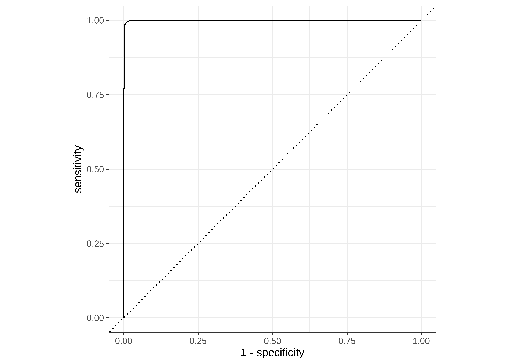
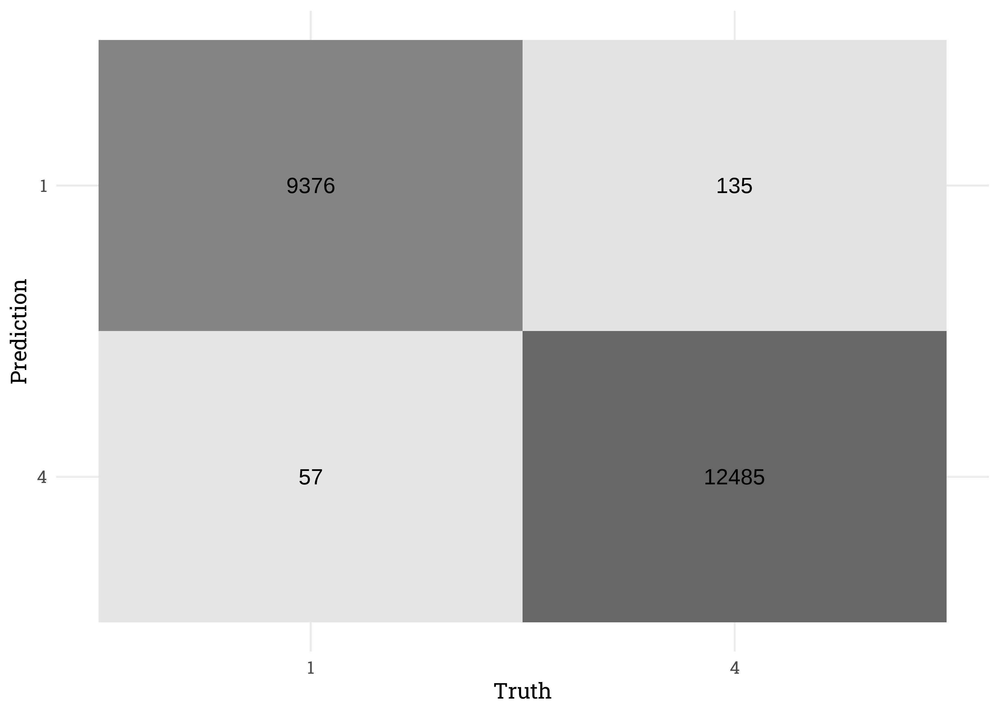

Title
================
Matthew
November 02, 2023

``` r
data <- read_csv("~/DataAnalysis/FilteredAccidents.csv") %>% 
  rename_with(tolower)
```

``` r
data %>% count(severity, sort = TRUE)
```

    ## # A tibble: 4 x 2
    ##   severity       n
    ##      <dbl>   <int>
    ## 1        2 1842918
    ## 2        3   77957
    ## 3        4   50335
    ## 4        1   37875

``` r
set.seed(123)
library(tidymodels)
```

    ## Registered S3 method overwritten by 'tune':
    ##   method                   from   
    ##   required_pkgs.model_spec parsnip

    ## -- Attaching packages -------------------------------------- tidymodels 0.1.4 --

    ## v broom        1.0.1     v rsample      0.1.1
    ## v dials        0.1.0     v tune         0.1.6
    ## v infer        1.0.4     v workflows    0.2.4
    ## v modeldata    1.0.1     v workflowsets 0.2.1
    ## v parsnip      0.2.0     v yardstick    0.0.9
    ## v recipes      0.2.0

    ## -- Conflicts ----------------------------------------- tidymodels_conflicts() --
    ## x scales::discard() masks purrr::discard()
    ## x dplyr::filter()   masks stats::filter()
    ## x recipes::fixed()  masks stringr::fixed()
    ## x dplyr::lag()      masks stats::lag()
    ## x yardstick::spec() masks readr::spec()
    ## x recipes::step()   masks stats::step()
    ## x tune::tune()      masks parsnip::tune()
    ## * Use tidymodels_prefer() to resolve common conflicts.

``` r
library(textrecipes)

splits <- initial_split(data %>% 
                          select(severity, description) %>% 
                          filter(severity %in% c(1,4)) %>% 
                          mutate(severity = factor(severity)))

training(splits) %>% count(severity)
```

    ## # A tibble: 2 x 2
    ##   severity     n
    ##   <fct>    <int>
    ## 1 1        28442
    ## 2 4        37715

``` r
glm_workflow <- 
  recipe(formula = severity ~ description, data = training(splits)) %>% 
  step_tokenize(description) %>%
  step_stopwords(description, custom_stopword_source = stopwords::stopwords()) %>% 
  step_tokenfilter(description, max_tokens = 1e2) %>% 
  step_tfidf(description) %>% 
  workflow(logistic_reg(mode = "classification", engine = "glm"))

glm_fit <- glm_workflow %>% last_fit(splits)
```

    ## ! train/test split: preprocessor 1/1, model 1/1: glm.fit: fitted probabilities numerically 0...

``` r
glm_fit %>% collect_metrics()
```

    ## # A tibble: 2 x 4
    ##   .metric  .estimator .estimate .config             
    ##   <chr>    <chr>          <dbl> <chr>               
    ## 1 accuracy binary         0.991 Preprocessor1_Model1
    ## 2 roc_auc  binary         0.999 Preprocessor1_Model1

``` r
glm_fit %>% 
  collect_predictions() %>% 
  roc_curve(severity, .pred_1) %>% 
  autoplot()
```

<!-- -->

``` r
glm_fit %>% 
  collect_predictions()  %>% 
  conf_mat(severity, .pred_class) %>% 
  autoplot(type = 'heatmap')
```

<!-- -->
