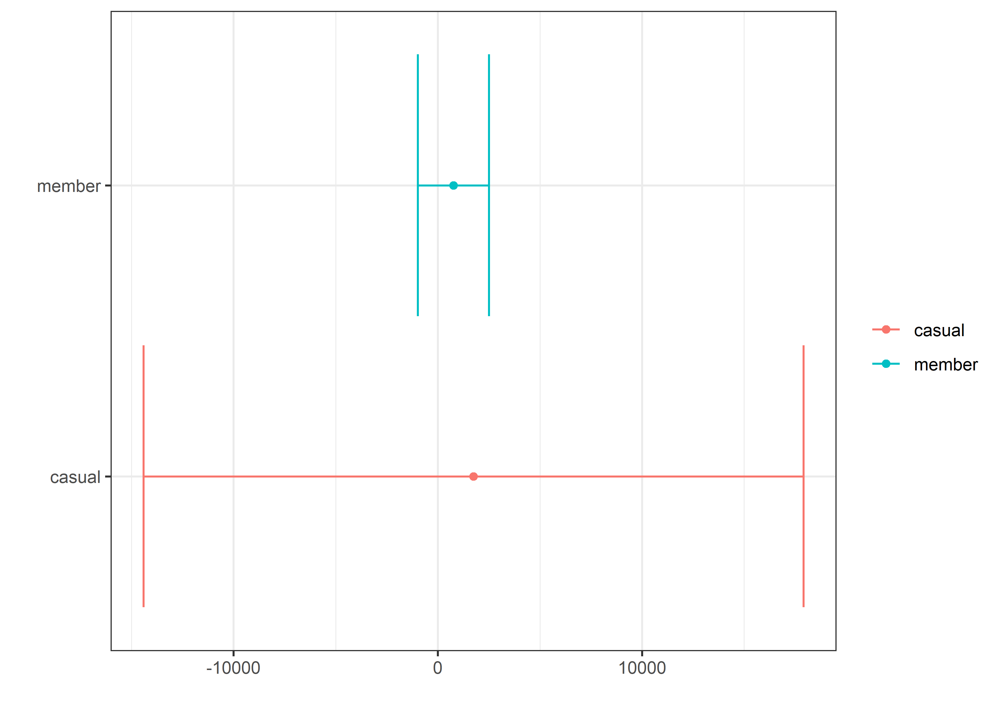
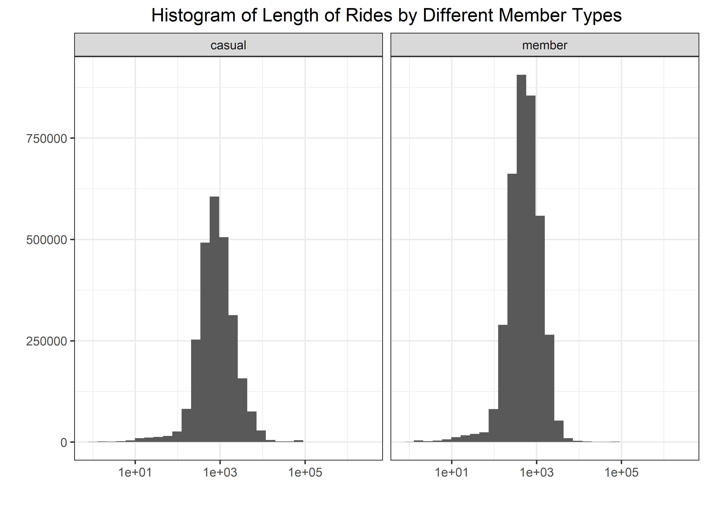

Coursera Case Study: Bikes
================
Matthew
2022-11-10

Multiple data sets (13) were downloaded from a link provided by Coursera
and then was merged into one csv, which was subsequently read into using
the code chunk below. The first chunk uses a for-loop to iterate the
*read_csv* (read data files) and *rbind* (combine data rowwise)
functions till all data files are read; which is then saved as a csv of
its own. Now the csv can be read only once using the following code
chunk.

``` r
files <- list.files("D:/Downloads/Case Study")
bikes <- read_csv("D:/Downloads/Case Study/202110-divvy-tripdata.csv")

for(i in 2:length(files)) {
  bikes <- bikes %>% rbind(read_csv(paste0("D:/Downloads/Case Study/",
                   files[i])))
}

write_csv(bikes, "bikes.csv")
```

``` r
bikes <- read_csv("D:/Downloads/Case Study/Full Data/bikes.csv")
```

    ## Rows: 6386920 Columns: 13
    ## -- Column specification --------------------------------------------------------
    ## Delimiter: ","
    ## chr  (7): ride_id, rideable_type, start_station_name, start_station_id, end_...
    ## dbl  (4): start_lat, start_lng, end_lat, end_lng
    ## dttm (2): started_at, ended_at
    ## 
    ## i Use `spec()` to retrieve the full column specification for this data.
    ## i Specify the column types or set `show_col_types = FALSE` to quiet this message.

Create columns that are the *length* of bike ride (in hours) and
*day_of_week* (1 = Monday, 7 = Sunday).

``` r
bikes$length <- difftime(bikes$ended_at, bikes$started_at, "hours")
bikes$day_of_week <- wday(bikes$started_at)
```

``` r
skimr::skim_without_charts(bikes)
```

|                                                  |         |
|:-------------------------------------------------|:--------|
| Name                                             | bikes   |
| Number of rows                                   | 6386920 |
| Number of columns                                | 15      |
| \_\_\_\_\_\_\_\_\_\_\_\_\_\_\_\_\_\_\_\_\_\_\_   |         |
| Column type frequency:                           |         |
| character                                        | 7       |
| difftime                                         | 1       |
| numeric                                          | 5       |
| POSIXct                                          | 2       |
| \_\_\_\_\_\_\_\_\_\_\_\_\_\_\_\_\_\_\_\_\_\_\_\_ |         |
| Group variables                                  | None    |

Data summary

**Variable type: character**

| skim_variable      | n_missing | complete_rate | min | max | empty | n_unique | whitespace |
|:-------------------|----------:|--------------:|----:|----:|------:|---------:|-----------:|
| ride_id            |         0 |          1.00 |  16 |  16 |     0 |  6386920 |          0 |
| rideable_type      |         0 |          1.00 |  11 |  13 |     0 |        3 |          0 |
| start_station_name |    986387 |          0.85 |   7 |  64 |     0 |     1640 |          0 |
| start_station_id   |    986387 |          0.85 |   3 |  44 |     0 |     1308 |          0 |
| end_station_name   |   1054844 |          0.83 |   9 |  64 |     0 |     1663 |          0 |
| end_station_id     |   1054844 |          0.83 |   3 |  44 |     0 |     1315 |          0 |
| member_casual      |         0 |          1.00 |   6 |   6 |     0 |        2 |          0 |

**Variable type: difftime**

| skim_variable | n_missing | complete_rate | min          | max          | median   | n_unique |
|:--------------|----------:|--------------:|:-------------|:-------------|:---------|---------:|
| length        |         0 |             1 | -621201 secs | 2483235 secs | 621 secs |    23455 |

**Variable type: numeric**

| skim_variable | n_missing | complete_rate |   mean |   sd |     p0 |    p25 |    p50 |    p75 |   p100 |
|:--------------|----------:|--------------:|-------:|-----:|-------:|-------:|-------:|-------:|-------:|
| start_lat     |         0 |             1 |  41.90 | 0.05 |  41.64 |  41.88 |  41.90 |  41.93 |  45.64 |
| start_lng     |         0 |             1 | -87.65 | 0.03 | -87.84 | -87.66 | -87.64 | -87.63 | -73.80 |
| end_lat       |      6319 |             1 |  41.90 | 0.05 |  41.39 |  41.88 |  41.90 |  41.93 |  42.37 |
| end_lng       |      6319 |             1 | -87.65 | 0.03 | -88.97 | -87.66 | -87.64 | -87.63 | -87.30 |
| day_of_week   |         0 |             1 |   4.11 | 2.03 |   1.00 |   2.00 |   4.00 |   6.00 |   7.00 |

**Variable type: POSIXct**

| skim_variable | n_missing | complete_rate | min                 | max                 | median              | n_unique |
|:--------------|----------:|--------------:|:--------------------|:--------------------|:--------------------|---------:|
| started_at    |         0 |             1 | 2021-10-01 00:00:09 | 2022-10-31 23:59:33 | 2022-06-18 23:50:58 |  5349251 |
| ended_at      |         0 |             1 | 2021-10-01 00:03:11 | 2022-11-07 04:53:58 | 2022-06-19 00:17:08 |  5359703 |

``` r
bikes %>% 
  group_by(member_casual) %>% 
  summarize(m = mean(length), sd = sd(length)) %>% 
  ggplot(aes(m, member_casual, color = member_casual)) + geom_point() +
  geom_errorbar(aes(xmax = m + sd, xmin = m - sd)) + labs(y = "", x = "", color = "")
```

    ## Don't know how to automatically pick scale for object of type difftime. Defaulting to continuous.

<!-- -->

``` r
bikes %>% 
  ggplot(aes(as.numeric(length))) + geom_histogram() + scale_x_log10() +
  facet_wrap(~member_casual) + labs(y = "", x = "", title = "Histogram of Length of Rides by Different Member Types")
```

    ## `stat_bin()` using `bins = 30`. Pick better value with `binwidth`.

<!-- -->
