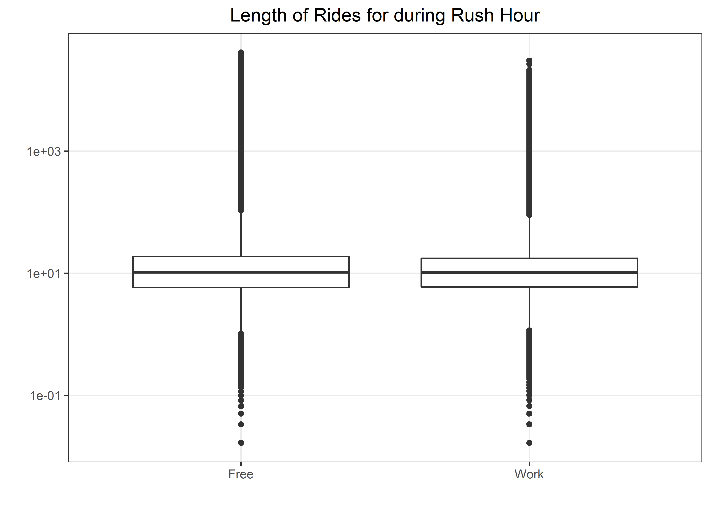

Coursera Case Study: Bikes
================
Matthew
2022-11-10

-   <a href="#google-analytics-case-study-cyclistic"
    id="toc-google-analytics-case-study-cyclistic">Google Analytics Case
    Study: Cyclistic</a>
-   <a href="#data-validation" id="toc-data-validation">Data Validation</a>
-   <a href="#exploratory-data-analysis"
    id="toc-exploratory-data-analysis">Exploratory Data Analysis</a>
    -   <a href="#casuals-vs-members" id="toc-casuals-vs-members">Casuals vs
        Members</a>
        -   <a href="#ride-duration-distributions"
            id="toc-ride-duration-distributions">Ride Duration Distributions</a>
        -   <a href="#weekdays-vs-weekends" id="toc-weekdays-vs-weekends">Weekdays
            vs Weekends</a>
        -   <a href="#type-of-bikes-used" id="toc-type-of-bikes-used">Type of Bikes
            Used</a>
        -   <a href="#popular-start-stations"
            id="toc-popular-start-stations">Popular Start Stations</a>
        -   <a href="#map" id="toc-map">Map</a>
-   <a href="#conclusion" id="toc-conclusion">Conclusion</a>
-   <a href="#data-dictionary" id="toc-data-dictionary">Data Dictionary</a>

# Google Analytics Case Study: Cyclistic

The purpose of this case study is the dive into the data and find
differences between members and casuals, with the hopes of converting
casuals to members. Members are individuals that buy an annual
subscription service, while casuals are individuals that buy single ride
passes.

Multiple data sets (13) were downloaded from a link provided by
[Coursera](https://divvy-tripdata.s3.amazonaws.com/index.html) and then
was merged into one csv, which was subsequently read using the code
chunk below. The first chunk uses a for-loop to iterate the *read_csv*
(read data files) and *rbind* (combine data rowwise) functions till all
data files are read; which is then saved as a csv of its own. Now the
csv can be read only once using the following code chunk without going
through the iteration process.

``` r
files <- list.files("D:/Downloads/Case Study")
bikes <- read_csv("D:/Downloads/Case Study/202110-divvy-tripdata.csv")

for(i in 2:length(files)) {
  bikes <- bikes %>% rbind(read_csv(paste0("D:/Downloads/Case Study/",
                   files[i])))
}

write_csv(bikes, "bikes.csv")
```

``` r
bikes <- read_csv("D:/Downloads/Case Study/Full Data/bikes.csv")
```

    ## Rows: 6386920 Columns: 13
    ## -- Column specification --------------------------------------------------------
    ## Delimiter: ","
    ## chr  (7): ride_id, rideable_type, start_station_name, start_station_id, end_...
    ## dbl  (4): start_lat, start_lng, end_lat, end_lng
    ## dttm (2): started_at, ended_at
    ## 
    ## i Use `spec()` to retrieve the full column specification for this data.
    ## i Specify the column types or set `show_col_types = FALSE` to quiet this message.

Create columns that are the *length* of bike ride (in minutes) and
*day_of_week* (1 = Sunday, 7 = Saturday).

``` r
bikes$length <- difftime(bikes$ended_at, bikes$started_at, unit = "mins")
bikes$day_of_week <- wday(bikes$started_at)
bikes$day_label <- wday(bikes$started_at, label = TRUE)
```

``` r
s_bikes <- bikes %>% sample_n(500000)  # sample data set only for the purpose of quicker computations during analysis
```

# Data Validation

There are some instances where the data suggests that an individual
started a ride after they ended it. This will be assumed to be faulty
and the values will be converted to their absolute values. The faulty
data consists of only **0.00175%** (112 out of 6.3m) of the total data.

``` r
bikes %>% 
  summarize(neg_time = mean(length < 0) * 100)
```

    ## # A tibble: 1 x 1
    ##   neg_time
    ##      <dbl>
    ## 1  0.00175

``` r
bikes %>% 
  filter(length < 0) %>% 
  select(started_at, ended_at)
```

    ## # A tibble: 112 x 2
    ##    started_at          ended_at           
    ##    <dttm>              <dttm>             
    ##  1 2021-11-07 01:40:02 2021-11-07 01:05:46
    ##  2 2021-11-07 01:52:53 2021-11-07 01:05:22
    ##  3 2021-11-07 01:40:13 2021-11-07 01:00:29
    ##  4 2021-11-07 01:34:03 2021-11-07 01:17:13
    ##  5 2021-11-07 01:54:25 2021-11-07 01:03:44
    ##  6 2021-11-07 01:54:04 2021-11-07 01:25:57
    ##  7 2021-11-07 01:51:52 2021-11-07 01:22:53
    ##  8 2021-11-07 01:54:12 2021-11-07 01:05:09
    ##  9 2021-11-07 01:54:36 2021-11-07 01:03:11
    ## 10 2021-11-07 01:51:21 2021-11-07 01:07:59
    ## # ... with 102 more rows

``` r
bikes$length <- abs(bikes$length)
s_bikes$length <- abs(s_bikes$length)
```

``` r
clrs <- c("blue", "green4") # vector of colors to be used
```

``` r
skimr::skim_without_charts(bikes %>% select(-matches("lng|lat")))
```

|                                                  |                             |
|:-------------------------------------------------|:----------------------------|
| Name                                             | bikes %\>% select(-matches… |
| Number of rows                                   | 6386920                     |
| Number of columns                                | 12                          |
| \_\_\_\_\_\_\_\_\_\_\_\_\_\_\_\_\_\_\_\_\_\_\_   |                             |
| Column type frequency:                           |                             |
| character                                        | 7                           |
| difftime                                         | 1                           |
| factor                                           | 1                           |
| numeric                                          | 1                           |
| POSIXct                                          | 2                           |
| \_\_\_\_\_\_\_\_\_\_\_\_\_\_\_\_\_\_\_\_\_\_\_\_ |                             |
| Group variables                                  | None                        |

Data summary

**Variable type: character**

| skim_variable      | n_missing | complete_rate | min | max | empty | n_unique | whitespace |
|:-------------------|----------:|--------------:|----:|----:|------:|---------:|-----------:|
| ride_id            |         0 |          1.00 |  16 |  16 |     0 |  6386920 |          0 |
| rideable_type      |         0 |          1.00 |  11 |  13 |     0 |        3 |          0 |
| start_station_name |    986387 |          0.85 |   7 |  64 |     0 |     1640 |          0 |
| start_station_id   |    986387 |          0.85 |   3 |  44 |     0 |     1308 |          0 |
| end_station_name   |   1054844 |          0.83 |   9 |  64 |     0 |     1663 |          0 |
| end_station_id     |   1054844 |          0.83 |   3 |  44 |     0 |     1315 |          0 |
| member_casual      |         0 |          1.00 |   6 |   6 |     0 |        2 |          0 |

**Variable type: difftime**

| skim_variable | n_missing | complete_rate | min    | max           | median     | n_unique |
|:--------------|----------:|--------------:|:-------|:--------------|:-----------|---------:|
| length        |         0 |             1 | 0 mins | 41387.25 mins | 10.35 mins |    23350 |

**Variable type: factor**

| skim_variable | n_missing | complete_rate | ordered | n_unique | top_counts                                          |
|:--------------|----------:|--------------:|:--------|---------:|:----------------------------------------------------|
| day_label     |         0 |             1 | TRUE    |        7 | Sat: 1068394, Fri: 914981, Thu: 909070, Sun: 893711 |

**Variable type: numeric**

| skim_variable | n_missing | complete_rate | mean |   sd |  p0 | p25 | p50 | p75 | p100 |
|:--------------|----------:|--------------:|-----:|-----:|----:|----:|----:|----:|-----:|
| day_of_week   |         0 |             1 | 4.11 | 2.03 |   1 |   2 |   4 |   6 |    7 |

**Variable type: POSIXct**

| skim_variable | n_missing | complete_rate | min                 | max                 | median              | n_unique |
|:--------------|----------:|--------------:|:--------------------|:--------------------|:--------------------|---------:|
| started_at    |         0 |             1 | 2021-10-01 00:00:09 | 2022-10-31 23:59:33 | 2022-06-18 23:50:58 |  5349251 |
| ended_at      |         0 |             1 | 2021-10-01 00:03:11 | 2022-11-07 04:53:58 | 2022-06-19 00:17:08 |  5359703 |

# Exploratory Data Analysis

## Casuals vs Members

**Summary**

-   There are *3.77* million rides by members and *2.61* million rides
    by casuals, accounting for *59.1%* and *40.9%* of the data,
    respectively.
-   Members and casuals have approximately equal duration distributions,
    with casuals having a slightly longer rides.
-   Members tend to use rides during the weekday while casuals tend to
    use rides during the weekend.
-   Casuals disproportionately prefer specific bike stations.
-   Number of rides peak at both 8:00 am and 5:00 pm for members, while
    rides for casuals peak only at 5:00 pm.
-   Members used both *classic* and *electric* bikes approximately
    equally, while casuals disproportionately used *electric* bikes.
    Furthermore, there is no data of members using *docked* bikes in the
    last 12 months.
    -   Members: **51.7%** Classic, **48.3%** Electric

    -   Casual: **53.7%** Electric, **38.4%** Classic, **7.9%** Docked
-   Most popular stations
    -   Casuals: Streeter Dr & Grand Ave

    -   Members: Kingsbury St & Kinzie St
-   Both members and casuals prefer stations along the lake shore of
    Chicago.

``` r
bikes %>% 
  count(member_casual, sort = TRUE) %>% 
  mutate(percent = n/sum(n)*100)
```

    ## # A tibble: 2 x 3
    ##   member_casual       n percent
    ##   <chr>           <int>   <dbl>
    ## 1 member        3776645    59.1
    ## 2 casual        2610275    40.9

### Ride Duration Distributions

``` r
(bikes %>% 
  ggplot(aes(as.numeric(length), member_casual, fill = member_casual)) + 
  geom_boxplot() +
  scale_x_log10(label = comma_format()) + labs(y = "", x = "", fill = "") + scale_fill_manual(values = clrs))/
(bikes %>% 
   ggplot(aes(as.numeric(length), fill = member_casual)) + 
   geom_density(alpha = 0.5) + theme(legend.position = "none") +
   scale_x_log10(label = comma_format()) + labs(y = "", x = "") + scale_fill_manual(values = c("blue", "green4"))) +
  plot_annotation(title = "Ride Duration Distributions") + plot_layout(guides = "collect")
```

<!-- -->

### Weekdays vs Weekends

Members and casuals appear to use rides for different reasons.

-   Members tend to use rides on weekdays, which implies its used to
    commute to and from work; while casuals tend to use rides on the
    weekend, which implies that the main purpose of use is leisure.

``` r
(bikes %>% 
  ggplot(aes(fct_reorder(day_label, day_of_week), fill = member_casual)) + 
  geom_bar(position = position_dodge2()) + 
  scale_fill_manual(values = clrs) +
  scale_y_continuous(labels = comma_format()) +
  labs(y = "", x = "", 
       title = "Days Members and Casuals Use Rides",
       fill = "")) /
bikes %>% 
  mutate(wend = ifelse(day_label %in% c("Sat", "Sun"), "Weekend", "Weekday")) %>% 
  group_by(member_casual) %>% 
  count(wend, sort = TRUE) %>% 
  mutate(percent = n/sum(n)) %>% 
  ggplot(aes(x = member_casual, y = percent, fill = wend)) + 
  geom_bar(position="fill", stat = "identity") +
  geom_text(aes(y = ifelse(percent > 0.50, 0.65, 0.15), label = paste0(round(percent, 3)*100,"%"))) +
  scale_fill_brewer(palette = "Accent", direction = -1) + 
  theme(axis.ticks = element_blank(), axis.text.y = element_blank()) +
  scale_y_continuous(label = percent_format()) +
  labs(y = "", x = "", fill = "", title = "Percentage of Rides Used on Weekdays or Weekends")
```

<!-- -->

### Type of Bikes Used

``` r
bikes %>% 
  group_by(member_casual) %>% 
  count(rideable_type, sort = TRUE) %>% 
  mutate(total = sum(n), pct = n/total) %>% 
  ggplot(aes(pct, member_casual, fill = rideable_type)) + 
  geom_col(position = position_dodge2()) +
  scale_x_continuous(label = percent_format()) + 
  geom_text(aes(label = paste0(round(pct, 3)*100, "%")), position = position_dodge2(0.9), hjust = 1.1) +
  labs(title = "Proportion of Bikes Used by Membership", y = "", x = "", fill = "") +
  scale_fill_brewer(palette = "Set2", direction = -1)
```

<!-- -->

### Popular Start Stations

``` r
(bikes %>% 
  filter(!is.na(start_station_name)) %>% 
  group_by(member_casual) %>% 
  count(start_station_name, sort = TRUE) %>% 
  top_n(5) %>% 
  ggplot(aes(n, fct_reorder(start_station_name, n), fill = member_casual)) + 
  geom_col() +
  geom_text(aes(label = n), color = "white", fontface = "bold", hjust = 1.2) +
  labs(y = "", x = "", fill = "", title = "Start Stations") + theme(plot.title = element_text(hjust = 0)) +
  scale_fill_manual(values = clrs)) /
bikes %>% 
  filter(!is.na(end_station_name)) %>% 
  group_by(member_casual) %>% 
  count(end_station_name, sort = TRUE) %>% 
  top_n(5) %>% 
  ggplot(aes(n, fct_reorder(end_station_name, n), fill = member_casual)) + 
  geom_col() +
  geom_text(aes(label = n), color = "white", fontface = "bold", hjust = 1.2) +
  labs(y = "", x = "", fill = "", title = "End Stations") +
  scale_fill_manual(values = clrs) + theme(plot.title = element_text(hjust = 0)) +
  plot_layout(guides = "collect") + plot_annotation(title = "Top 10 Stations")
```

    ## Selecting by n
    ## Selecting by n

<!-- -->

The number of rides started, locally peak at 8:00 am and 5:00 pm for
members, which further reinforces the hypothesis that members use rides
to go and come back from work. This assumption is based on the fact that
the typical work hours are from 9am-5pm, which would lead people start
rides at 8am to get to work, and then pick up a ride again after work at
5pm. Furthermore, this pattern is not observed on *Weekends*.

``` r
bikes %>% 
  mutate(hour = hour(started_at)) %>% 
  group_by(member_casual, hour) %>% 
  count(hour, sort = TRUE) %>% 
  ggplot(aes(hour, n, color = member_casual)) + 
  geom_line() + scale_color_manual(values = clrs) +
  scale_x_continuous(breaks = seq(0,24,4), labels = function(x) paste0(x, ":00")) +
  labs(y = "", x = "", title = "Number of Rides per Hour", color = "")
```

<!-- -->

``` r
bikes %>% 
  filter(day_label %in% c("Sat", "Sun")) %>% 
  mutate(hour = hour(started_at)) %>% 
  group_by(member_casual, hour) %>% 
  count(hour, sort = TRUE) %>% 
  ggplot(aes(hour, n, color = member_casual)) + 
  geom_line() + scale_color_manual(values = clrs) +
  scale_x_continuous(breaks = seq(0,24,4), labels = function(x) paste0(x, ":00")) +
  labs(y = "", x = "", title = "Number of Rides per Hour only Weekends", 
       subtitle = "Saturday and Sunday", color = "") +
  theme(plot.subtitle = element_text(hjust = 0.5))
```

<!-- -->

The function below will provide a quick and easy way to join a data
frame to the original, containing information on which group found
certain stations more popular than others.

``` r
wide_fun <- function(data){
  data %>% 
    group_by(member_casual) %>% 
    filter(!is.na(start_station_name)) %>% 
    count(start_station_name) %>% 
    pivot_wider(names_from = member_casual, values_from = n) %>% 
    mutate(casual = ifelse(is.na(casual), 0, casual),
           member = ifelse(is.na(member), 0, member),
           pct_casual = casual/sum(casual),
           pct_member = member/sum(member),
           membership = ifelse(pct_casual > pct_member, "casual", "member"),
           the_largest = ifelse(pct_casual > pct_member, -pct_casual, pct_member)) %>% 
    select(start_station_name, the_largest, membership)
}
```

### Map

``` r
chi_map <- sf::read_sf("https://raw.githubusercontent.com/thisisdaryn/data/master/geo/chicago/Comm_Areas.geojson") 
wide_bikes <- wide_fun(bikes) %>% 
  inner_join(bikes %>% 
                filter(!is.na(start_station_name)) %>% 
                select(start_station_name, start_lng, start_lat) %>% 
                group_by(start_station_name) %>% 
                slice(1)) %>% 
  filter(start_lng < -80, start_lat < 42)
```

    ## Joining, by = "start_station_name"

``` r
lng <- wide_bikes %>% top_n(1,abs(the_largest)) %>% pull(start_lng)
lat <- wide_bikes %>% top_n(1,abs(the_largest)) %>% pull(start_lat)
```

The map below shows stations where members or casuals prefer to start
their ride. The hue of the color (how green or how blue) indicates how
much this group prefers to use that station with respect to other
stations, with blue = casual and green = member. For instance, if rides
started at station “**A**” account for **10%** of members’ rides, but
**15%** for casuals’ rides, it will then be colored blue to indicate
that casuals have a stronger preference for that station. As we can see
from the map, both members and casuals prefer to start their rides along
the lake shore of Chicago.

``` r
ggplot() +
  geom_sf(data = chi_map, fill = "black") + 
  geom_point(data = wide_bikes, aes(start_lng, start_lat, color = the_largest),
             size = 1) +
  geom_segment(data = wide_bikes, 
               x = lng + 0.04, y = lat + 0.055, 
               xend = lng + 0.01, yend = lat + 0.01, 
               color = "blue",
               arrow = arrow(length = unit(0.3, "cm"))) +
  annotate("text", x = lng + 0.04, y = lat + 0.07, 
    label = "Station:\nStreeter Dr & Grand Ave",
    size = 2,
    color = "blue") +
  scale_color_gradient2(midpoint = 0, high = "green", mid = "black", 
                        low = "blue") +
  labs(y = "Latitude", x = "Longitude", title = "Map of Preferred Stations",
       subtitle = "Colored by which Group Disproportionally Prefers that Station",
       color = "Green = Member \nBlue = Casual") +
  theme_classic()
```

<!-- -->

# Conclusion

I would suggest retrieving more information on Cyclistic users in order
to provide options to improve the number of members. The current data
only contained information on **where** and **when** rides *began* and
*ended*, **what** type of bike was used and whether it was a *member* or
a *casual*.

-   **When**: We saw that *members* used Cyclistic more for traveling to
    and from work. This implied that *members* and *casuals* were using
    rides for different reasons. Without more information on different
    variables such as single ride pricing vs membership, income levels,
    age and more; it is not possible to say whether there is a way to
    convince casuals to convert to members by appealing to the option of
    using rides for traveling to and from work. For instance, it may be
    the case that the majority of casuals drive to work and would never
    need to use a bike to go to work, and thus members are individuals
    that either do not own a vehicle or find it preferable because of
    their relative distance to their work place or lack of access to
    parking.

-   **Where**: We learned which stations were preferable to certain
    users. It showed us that both *members* and *casuals* prefer
    stations along the lake shore of Chicago. There is an outlier
    station that casuals prefer disproportionately that is located right
    on the lake shore of Chicago, and this reinforced the hypothesis
    that casuals used Cyclistic for different purposes, namely leisure.

-   **What**: What bike was used did not provide much information. There
    were differences in the two groups but there is no way to quantify
    how that difference could improve memberships. Unfortunately,
    Cyclistic provides no information on the differences between the
    different bikes. Casuals are the only ones that were found to use
    *docked* bikes over the past year but it is unclear how this may
    relate to membership conversion.

Finally, we are left with a few possible speculations.

1.  **Price**:

# Data Dictionary

#### Length of Rides during Rush Hour

``` r
bikes %>%
  mutate(h = hour(started_at),
         work_hours = ifelse(h %in% c(8,17), "Work", "Free")) %>% 
  ggplot(aes(work_hours, as.numeric(length))) + 
  geom_boxplot() + scale_y_log10() +
  labs(y = "", x = "", title = "Length of Rides for during Rush Hour")
```

<!-- -->

``` r
bikes %>%
  mutate(h = hour(started_at),
         work_hours = ifelse(h %in% c(8,17), "Work", "Free"),
         length = as.numeric(length)) %>% 
  select(work_hours, length) %>% 
  split(.$work_hours) %>% 
  map(summary)
```

    ## $Free
    ##   work_hours            length        
    ##  Length:5444288     Min.   :    0.00  
    ##  Class :character   1st Qu.:    5.85  
    ##  Mode  :character   Median :   10.37  
    ##                     Mean   :   19.82  
    ##                     3rd Qu.:   18.77  
    ##                     Max.   :41387.25  
    ## 
    ## $Work
    ##   work_hours            length         
    ##  Length:942632      Min.   :    0.000  
    ##  Class :character   1st Qu.:    5.917  
    ##  Mode  :character   Median :   10.183  
    ##                     Mean   :   17.031  
    ##                     3rd Qu.:   17.600  
    ##                     Max.   :30400.550

#### Seasonal changes during Rush Hour

``` r
bikes %>% 
  mutate(h = hour(started_at),
         work_hours = ifelse(h %in% c(8,17), "Work", "Free"),
         month = month(started_at, label = TRUE)) %>% 
  group_by(month) %>% 
  summarize(m = mean(work_hours == "Work")) %>% 
  ggplot(aes(month, m, group = 1)) +
  geom_line() + scale_y_continuous(label = percent_format())
```

<!-- -->
