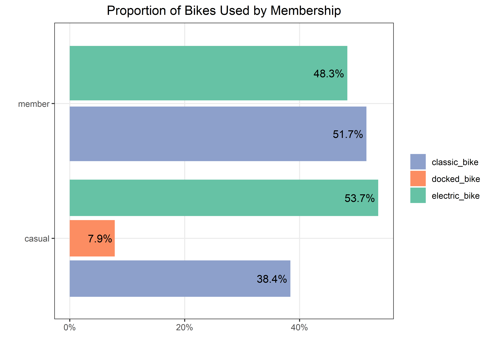

Coursera Case Study: Bikes
================
Matthew
2022-11-10

-   <a href="#data-validation" id="toc-data-validation">Data Validation</a>
-   <a href="#eda" id="toc-eda">EDA</a>
    -   <a href="#casuals-vs-members" id="toc-casuals-vs-members">Casuals vs
        Members</a>

Multiple data sets (13) were downloaded from a link provided by Coursera
and then was merged into one csv, which was subsequently read into using
the code chunk below. The first chunk uses a for-loop to iterate the
*read_csv* (read data files) and *rbind* (combine data rowwise)
functions till all data files are read; which is then saved as a csv of
its own. Now the csv can be read only once using the following code
chunk.

``` r
files <- list.files("D:/Downloads/Case Study")
bikes <- read_csv("D:/Downloads/Case Study/202110-divvy-tripdata.csv")

for(i in 2:length(files)) {
  bikes <- bikes %>% rbind(read_csv(paste0("D:/Downloads/Case Study/",
                   files[i])))
}

write_csv(bikes, "bikes.csv")
```

``` r
bikes <- read_csv("D:/Downloads/Case Study/Full Data/bikes.csv")
```

    ## Rows: 6386920 Columns: 13
    ## -- Column specification --------------------------------------------------------
    ## Delimiter: ","
    ## chr  (7): ride_id, rideable_type, start_station_name, start_station_id, end_...
    ## dbl  (4): start_lat, start_lng, end_lat, end_lng
    ## dttm (2): started_at, ended_at
    ## 
    ## i Use `spec()` to retrieve the full column specification for this data.
    ## i Specify the column types or set `show_col_types = FALSE` to quiet this message.

``` r
s_bikes <- bikes %>% sample_n(500000)  # sample data set only for the purpose of quicker computations during analysis
```

Create columns that are the *length* of bike ride (in seconds) and
*day_of_week* (1 = Sunday, 7 = Saturday).

``` r
bikes$length <- difftime(bikes$ended_at, bikes$started_at)
bikes$day_of_week <- wday(bikes$started_at)
bikes$day_label <- wday(bikes$started_at, label = TRUE)
```

# Data Validation

There are some instances where the data suggests that an individual
started a ride after they ended it. This will be assumed to be faulty
and the roles will be reversed. The faulty data consists of only
**0.00175%** (112 out of 6.3m) of the total data.

``` r
bikes %>% 
  summarize(neg_time = mean(length < 0) * 100)
```

    ## # A tibble: 1 x 1
    ##   neg_time
    ##      <dbl>
    ## 1  0.00175

``` r
bikes %>% 
  filter(length < 0) %>% 
  select(started_at, ended_at)
```

    ## # A tibble: 112 x 2
    ##    started_at          ended_at           
    ##    <dttm>              <dttm>             
    ##  1 2021-11-07 01:40:02 2021-11-07 01:05:46
    ##  2 2021-11-07 01:52:53 2021-11-07 01:05:22
    ##  3 2021-11-07 01:40:13 2021-11-07 01:00:29
    ##  4 2021-11-07 01:34:03 2021-11-07 01:17:13
    ##  5 2021-11-07 01:54:25 2021-11-07 01:03:44
    ##  6 2021-11-07 01:54:04 2021-11-07 01:25:57
    ##  7 2021-11-07 01:51:52 2021-11-07 01:22:53
    ##  8 2021-11-07 01:54:12 2021-11-07 01:05:09
    ##  9 2021-11-07 01:54:36 2021-11-07 01:03:11
    ## 10 2021-11-07 01:51:21 2021-11-07 01:07:59
    ## # ... with 102 more rows

``` r
bikes$length <- abs(bikes$length)
```

# EDA

``` r
skimr::skim_without_charts(bikes)
```

|                                                  |         |
|:-------------------------------------------------|:--------|
| Name                                             | bikes   |
| Number of rows                                   | 6386920 |
| Number of columns                                | 16      |
| \_\_\_\_\_\_\_\_\_\_\_\_\_\_\_\_\_\_\_\_\_\_\_   |         |
| Column type frequency:                           |         |
| character                                        | 7       |
| difftime                                         | 1       |
| factor                                           | 1       |
| numeric                                          | 5       |
| POSIXct                                          | 2       |
| \_\_\_\_\_\_\_\_\_\_\_\_\_\_\_\_\_\_\_\_\_\_\_\_ |         |
| Group variables                                  | None    |

Data summary

**Variable type: character**

| skim_variable      | n_missing | complete_rate | min | max | empty | n_unique | whitespace |
|:-------------------|----------:|--------------:|----:|----:|------:|---------:|-----------:|
| ride_id            |         0 |          1.00 |  16 |  16 |     0 |  6386920 |          0 |
| rideable_type      |         0 |          1.00 |  11 |  13 |     0 |        3 |          0 |
| start_station_name |    986387 |          0.85 |   7 |  64 |     0 |     1640 |          0 |
| start_station_id   |    986387 |          0.85 |   3 |  44 |     0 |     1308 |          0 |
| end_station_name   |   1054844 |          0.83 |   9 |  64 |     0 |     1663 |          0 |
| end_station_id     |   1054844 |          0.83 |   3 |  44 |     0 |     1315 |          0 |
| member_casual      |         0 |          1.00 |   6 |   6 |     0 |        2 |          0 |

**Variable type: difftime**

| skim_variable | n_missing | complete_rate | min    | max          | median   | n_unique |
|:--------------|----------:|--------------:|:-------|:-------------|:---------|---------:|
| length        |         0 |             1 | 0 secs | 2483235 secs | 621 secs |    23350 |

**Variable type: factor**

| skim_variable | n_missing | complete_rate | ordered | n_unique | top_counts                                          |
|:--------------|----------:|--------------:|:--------|---------:|:----------------------------------------------------|
| day_label     |         0 |             1 | TRUE    |        7 | Sat: 1068394, Fri: 914981, Thu: 909070, Sun: 893711 |

**Variable type: numeric**

| skim_variable | n_missing | complete_rate |   mean |   sd |     p0 |    p25 |    p50 |    p75 |   p100 |
|:--------------|----------:|--------------:|-------:|-----:|-------:|-------:|-------:|-------:|-------:|
| start_lat     |         0 |             1 |  41.90 | 0.05 |  41.64 |  41.88 |  41.90 |  41.93 |  45.64 |
| start_lng     |         0 |             1 | -87.65 | 0.03 | -87.84 | -87.66 | -87.64 | -87.63 | -73.80 |
| end_lat       |      6319 |             1 |  41.90 | 0.05 |  41.39 |  41.88 |  41.90 |  41.93 |  42.37 |
| end_lng       |      6319 |             1 | -87.65 | 0.03 | -88.97 | -87.66 | -87.64 | -87.63 | -87.30 |
| day_of_week   |         0 |             1 |   4.11 | 2.03 |   1.00 |   2.00 |   4.00 |   6.00 |   7.00 |

**Variable type: POSIXct**

| skim_variable | n_missing | complete_rate | min                 | max                 | median              | n_unique |
|:--------------|----------:|--------------:|:--------------------|:--------------------|:--------------------|---------:|
| started_at    |         0 |             1 | 2021-10-01 00:00:09 | 2022-10-31 23:59:33 | 2022-06-18 23:50:58 |  5349251 |
| ended_at      |         0 |             1 | 2021-10-01 00:03:11 | 2022-11-07 04:53:58 | 2022-06-19 00:17:08 |  5359703 |

The task of this case study is to identify the difference between casual
riders and members, with the goal of converting casuals to members.
Casual riders are individuals that purchase single rides or full day
passes, while members are individuals that purchase an annual
subscription.

## Casuals vs Members

There are more than 1 million more members than casuals.

``` r
bikes %>% 
  count(member_casual, sort = TRUE)
```

    ## # A tibble: 2 x 2
    ##   member_casual       n
    ##   <chr>           <int>
    ## 1 member        3776645
    ## 2 casual        2610275

Both members and casuals have the same distribution in their ridership
duration.

``` r
(bikes %>% 
  ggplot(aes(as.numeric(length/60))) + geom_histogram() + scale_x_log10(labels = comma_format()) +
  facet_wrap(~member_casual) +
  labs(y = "", x = "")) /
(bikes %>% 
  ggplot(aes(as.numeric(length/60))) + geom_density() + scale_x_log10(labels = comma_format()) +
  facet_wrap(~member_casual) +
  labs(y = "", x = "")) +
  plot_annotation(title = "Duration Distribution of Rides")
```

    ## `stat_bin()` using `bins = 30`. Pick better value with `binwidth`.

<!-- -->

``` r
bikes %>% 
  ggplot(aes(as.numeric(length/60), member_casual)) + geom_boxplot() +
  scale_x_log10()
```

<!-- -->

``` r
bikes %>% 
  ggplot(aes(fct_reorder(day_label, day_of_week), fill = member_casual)) + 
  geom_bar(position = position_dodge2()) + 
  scale_fill_manual(values = c("blue", "green4")) +
  scale_y_continuous(labels = comma_format()) +
  labs(y = "", x = "", 
       title = "Days Members and Casuals Use Cyclistic",
       fill = "")
```

<!-- -->

``` r
bikes %>% 
  group_by(member_casual) %>% 
  count(rideable_type, sort = TRUE) %>% 
  mutate(total = sum(n), pct = n/total) %>% 
  ggplot(aes(pct, member_casual, fill = rideable_type)) + geom_col(position = position_dodge2()) +
  scale_x_continuous(label = percent_format()) + 
  geom_text(aes(label = paste0(round(pct, 3)*100, "%")), position = position_dodge2(0.9), hjust = 1.1) +
  labs(title = "Proportion of Bikes Used by Membership", y = "", x = "", fill = "") +
  scale_fill_brewer(palette = "Set2", direction = -1)
```

<!-- -->

``` r
bikes %>% 
  filter(!is.na(start_station_name)) %>% 
  group_by(member_casual) %>% 
  count(start_station_name, sort = TRUE) %>% 
  top_n(5) %>% 
  ggplot(aes(n, fct_reorder(start_station_name, n), fill = member_casual)) + geom_col() +
  labs(y = "", x = "", fill = "", ) + geom_text(aes(label = n), color = "white", hjust = 1.2) +
  scale_fill_manual(values = c("blue", "green4")) + theme(legend.position = "bottom")
```

    ## Selecting by n

<!-- -->
