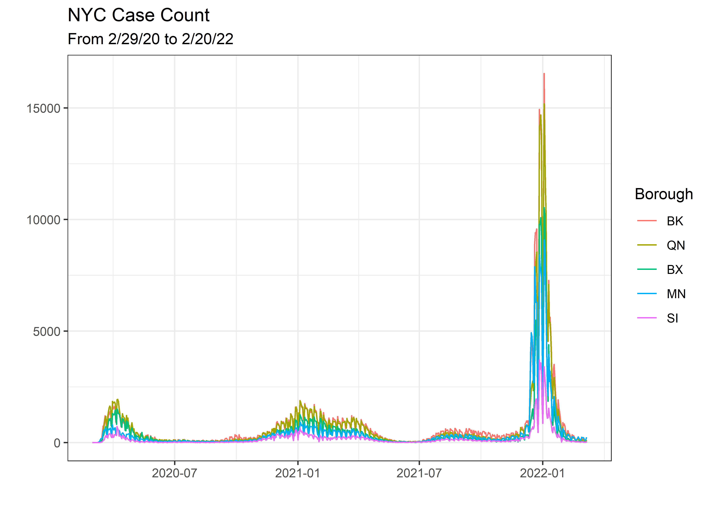
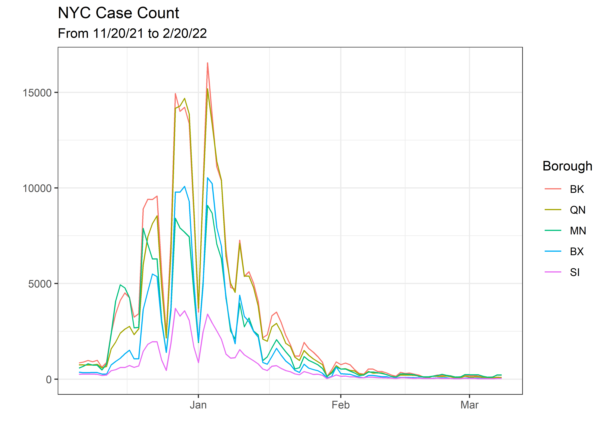
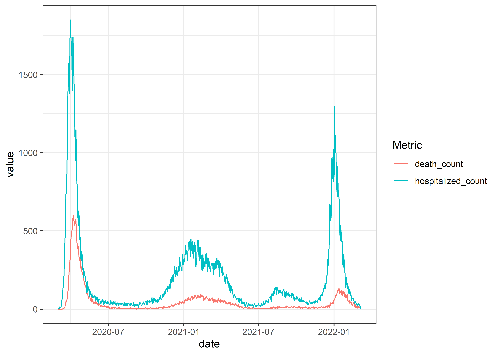
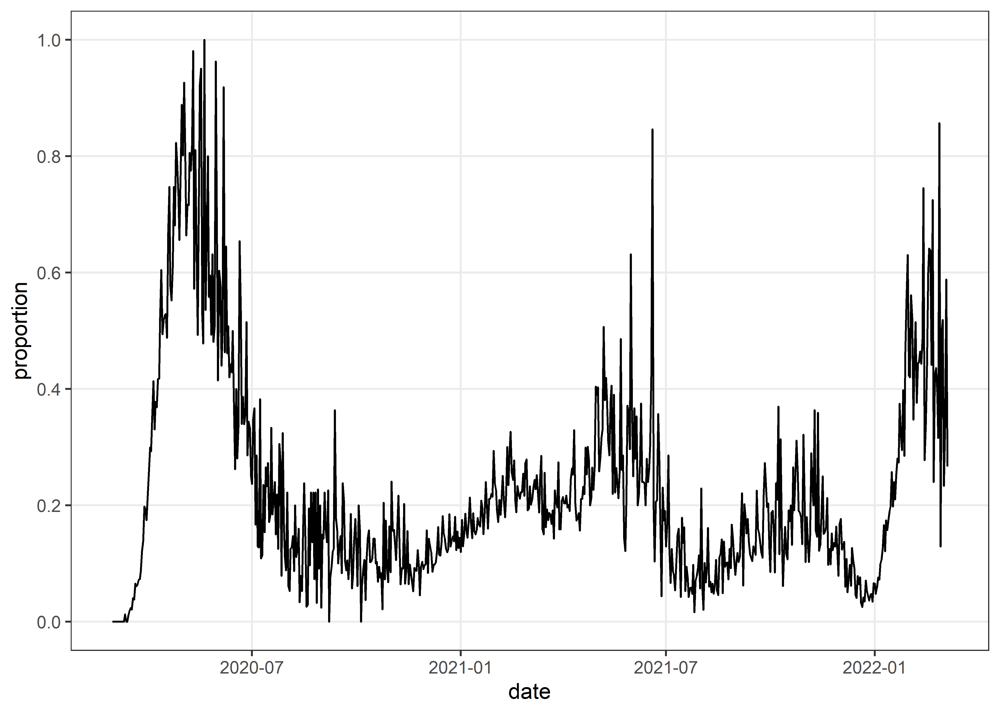

Covid
================
Matthew
2/24/2022

``` r
df <- read_csv("https://data.cityofnewyork.us/resource/rc75-m7u3.csv")
```

    ## 
    ## -- Column specification --------------------------------------------------------
    ## cols(
    ##   .default = col_double(),
    ##   date_of_interest = col_datetime(format = "")
    ## )
    ## i Use `spec()` for the full column specifications.

``` r
df <- df %>%
  rename(date = date_of_interest)
```

## Case Count per Borough

``` r
df %>%
  select(date, matches("^[[:alpha:]]{2}_case_count$")) %>%
  pivot_longer(names_to = "Borough",-date) %>%
  mutate(Borough = toupper(str_sub(Borough,1,2)),
         Borough = fct_reorder(Borough, -value, mean)) %>%
  ggplot(aes(date, value, color = Borough)) + geom_line() +
  labs(y = "", x = "", title = "NYC Case Count", subtitle = "From 2/29/20 to 2/20/22")
```

<!-- -->

``` r
df %>%
  tail(93) %>% 
  select(date, matches("^[[:alpha:]]{2}_case_count$")) %>%
  pivot_longer(names_to = "Borough",-date) %>%
  mutate(Borough = toupper(str_sub(Borough,1,2)),
         Borough = fct_reorder(Borough, -value, mean)) %>%
  ggplot(aes(date, value, color = Borough)) + geom_line() +
  labs(y = "", x = "", title = "NYC Case Count", subtitle = "From 11/20/21 to 2/20/22")
```

<!-- -->

## Line plot of case count and hospitalization over time

``` r
df %>%
  pivot_longer(names_to = "Metric", 
               c("hospitalized_count", "death_count")) %>%
  ggplot(aes(date, value, color = Metric)) + geom_line()
```

<!-- -->

## Proportion of dead over hospitalized per year

``` r
df %>%
  filter(hospitalized_count > 0) %>%
  mutate(total = death_count/hospitalized_count) %>%
  ggplot(aes(date, total)) + geom_line()
```

<!-- -->

## Death count by borough

``` r
df %>%
  select(date, bk_death_count, bx_death_count,
         mn_death_count, si_death_count, qn_death_count) %>%
  pivot_longer(!date) %>%
  ggplot(aes(date, value, color = name)) + geom_line()
```

<!-- -->

### Last 100 days

``` r
df %>%
  select(date, bk_death_count, bx_death_count,
         mn_death_count, si_death_count, qn_death_count) %>%
  arrange(desc(date)) %>%
  head(100) %>%
  pivot_longer(!date) %>%
  ggplot(aes(date, value, color = name)) + geom_line()
```

<!-- -->
