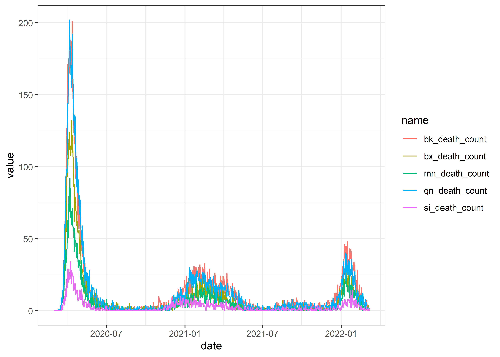
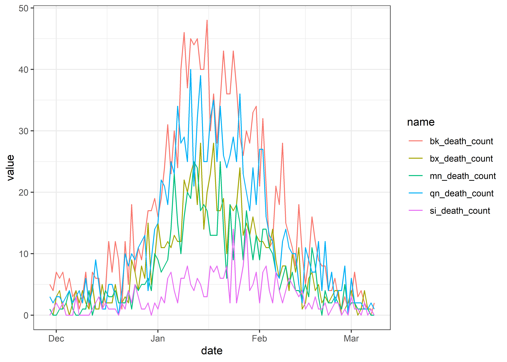
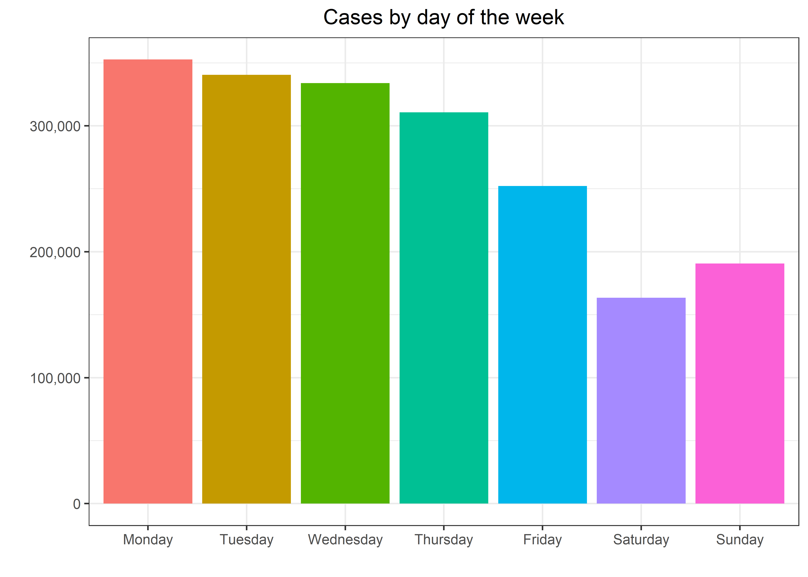

Covid
================
Matthew
2/24/2022

``` r
df <- read_csv("https://data.cityofnewyork.us/resource/rc75-m7u3.csv")
```

    ## 
    ## -- Column specification --------------------------------------------------------
    ## cols(
    ##   .default = col_double(),
    ##   date_of_interest = col_datetime(format = "")
    ## )
    ## i Use `spec()` for the full column specifications.

``` r
df <- df %>%
  rename(date = date_of_interest)
```

# EDA

## Case Count per Borough

``` r
df %>%
  select(date, matches("^[[:alpha:]]{2}_case_count$")) %>%
  pivot_longer(names_to = "Borough",-date) %>%
  mutate(Borough = toupper(str_sub(Borough,1,2)),
         Borough = fct_reorder(Borough, -value, mean)) %>%
  ggplot(aes(date, value, color = Borough)) + geom_line() +
  labs(y = "", x = "", title = "NYC Case Count", subtitle = "From 2/29/20 to 2/20/22")
```

<!-- -->

``` r
df %>%
  tail(93) %>% 
  select(date, matches("^[[:alpha:]]{2}_case_count$")) %>%
  pivot_longer(names_to = "Borough",-date) %>%
  mutate(Borough = toupper(str_sub(Borough,1,2)),
         Borough = fct_reorder(Borough, -value, mean)) %>%
  ggplot(aes(date, value, color = Borough)) + geom_line() +
  labs(y = "", x = "", title = "NYC Case Count", subtitle = "From 11/20/21 to 2/20/22")
```

<!-- -->

## Line plot of case count and hospitalization over time

``` r
df %>%
  pivot_longer(names_to = "Metric", 
               c("hospitalized_count", "death_count")) %>%
  ggplot(aes(date, value, color = Metric)) + geom_line()
```

<!-- -->

## Proportion of dead over hospitalized per year

``` r
df %>%
  filter(hospitalized_count > 0) %>%
  mutate(proportion = death_count/hospitalized_count) %>% 
  filter(proportion <= 1) %>%
  ggplot(aes(date, proportion)) + geom_line() +
  scale_y_continuous(breaks = seq(0,1,0.2)) +
  theme(panel.grid.minor = element_blank())
```

<!-- -->

``` r
df %>%
  select(date, death_count, hospitalized_count) %>%
  filter(hospitalized_count > 0) %>%
  mutate(proportion = death_count/hospitalized_count) %>%
  filter(proportion > 1) 
```

    ## # A tibble: 2 x 4
    ##   date                death_count hospitalized_count proportion
    ##   <dttm>                    <dbl>              <dbl>      <dbl>
    ## 1 2022-02-26 00:00:00           5                  3       1.67
    ## 2 2022-02-27 00:00:00           7                  4       1.75

The 3 most recent dates have proportions &gt; 1. Could be a new trend or
hospitalized counts have not been updated.

### Death count

``` r
df %>%
  head(60) %>%
  ggplot(aes(date, death_count)) + geom_line() +
  labs(title = "Last 90 days", y = "Deaths", x = "")
```

<!-- -->

## Death count by borough

``` r
df %>%
  select(date, bk_death_count, bx_death_count,
         mn_death_count, si_death_count, qn_death_count) %>%
  pivot_longer(!date) %>%
  ggplot(aes(date, value, color = name)) + geom_line()
```

<!-- -->

### Last 100 days

``` r
df %>%
  select(date, bk_death_count, bx_death_count,
         mn_death_count, si_death_count, qn_death_count) %>%
  arrange(desc(date)) %>%
  head(100) %>%
  pivot_longer(!date) %>%
  ggplot(aes(date, value, color = name)) + geom_line()
```

<!-- -->

``` r
df %>%
  mutate(dow = weekdays(date),
         dow = fct_relevel(dow, "Monday", "Tuesday", "Wednesday", "Thursday", "Friday", "Saturday", "Sunday")) %>%
  filter(!is.na(dow)) %>%
  group_by(dow) %>%
  ggplot(aes(dow, case_count, fill = dow)) + geom_col() + 
  labs(y = "", x = "", title = "Cases by day of the week") +
  theme(legend.position = "", plot.title = element_text(hjust = 0.5)) + 
  scale_y_continuous(labels = scales::label_comma())
```

<!-- -->
