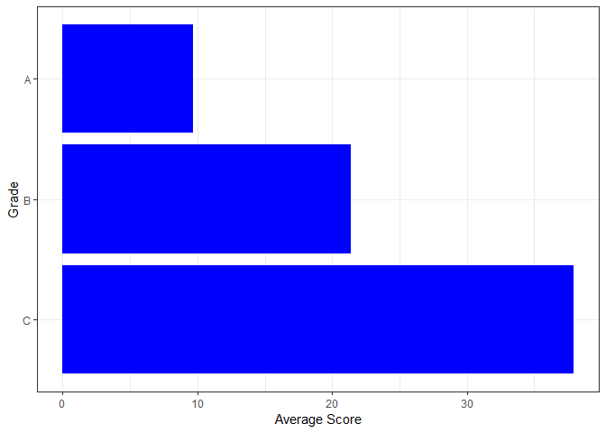

Inspections
================
Matthew
3/16/2022

``` r
inspections <- read_csv("https://data.cityofnewyork.us/resource/43nn-pn8j.csv")
```

    ## Rows: 1000 Columns: 26
    ## -- Column specification --------------------------------------------------------
    ## Delimiter: ","
    ## chr  (15): dba, boro, building, street, phone, cuisine_description, action, ...
    ## dbl   (8): camis, zipcode, score, latitude, longitude, community_board, bin,...
    ## dttm  (3): inspection_date, grade_date, record_date
    ## 
    ## i Use `spec()` to retrieve the full column specification for this data.
    ## i Specify the column types or set `show_col_types = FALSE` to quiet this message.

``` r
inspections <- inspections %>%
  rename(id = camis, name = dba)
```

# EDA

``` r
inspections %>%
  filter(!is.na(score)) %>%
  summarize(min(score), max(score))
```

    ## # A tibble: 1 x 2
    ##   `min(score)` `max(score)`
    ##          <dbl>        <dbl>
    ## 1            0          116

``` r
inspections %>%
  count(score, sort = TRUE)
```

    ## # A tibble: 78 x 2
    ##    score     n
    ##    <dbl> <int>
    ##  1    12    85
    ##  2    13    82
    ##  3    10    74
    ##  4     9    54
    ##  5    NA    40
    ##  6    11    38
    ##  7     7    36
    ##  8    23    30
    ##  9    19    26
    ## 10    20    23
    ## # ... with 68 more rows

## Analysis of Boroughs

``` r
inspections %>%
  filter(!is.na(score), boro != 0) %>%
  group_by(boro) %>%
  summarize(m = mean(score)) %>%
  ggplot(aes(m, fct_reorder(boro, m), fill = boro)) + geom_col() +
  labs(y = "", x = "Average Score", fill = "", title = "Average Score by Borough")
```

<!-- -->

``` r
inspections %>%
  filter(grade %in% c("A", "B", "C")) %>%
  group_by(boro) %>%
  count(grade, sort = TRUE) %>%
  ggplot(aes(n, fct_rev(grade), fill = boro)) + geom_col(position = "dodge") +
  labs(y = "", x = "Count", title = "The Number of Restaurants by Borough and Grade")
```

<!-- -->

``` r
(inspections %>%
  filter(grade %in% c("A", "B", "C")) %>%
  group_by(boro) %>%
  summarize(A = mean(grade == "A"),
            B = mean(grade == "B"),
            C = mean(grade == "C")) %>%
  pivot_longer(-boro) %>%
  ggplot(aes(value, fct_rev(name), fill = boro)) + geom_col(position = "dodge") +
  labs(y = "", x = "", fill = "") + 
  scale_x_continuous(breaks = seq(0,1,0.1),
                     labels = scales::percent_format())) /
  (inspections %>%
    filter(grade %in% c("A", "B", "C")) %>%
    group_by(boro) %>%
    summarize(A = mean(grade == "A"),
              B = mean(grade == "B"),
              C = mean(grade == "C")) %>%
    pivot_longer(-boro) %>%
    ggplot(aes(value, fct_reorder(boro, value, .fun = max), fill = fct_rev(name))) + geom_col() +
    labs(y = "", x = "", fill = "") +
    scale_x_continuous(labels = scales::percent_format())) + 
  plot_annotation(title = "Percent of Restaurants by Grade and Borough",
                  theme = theme(plot.title = element_text(hjust = 0.5)))
```

<!-- -->

``` r
borofun <- function(x){
  inspections %>%
    filter(boro == {{x}}, !is.na(score)) %>%
    group_by(cuisine_description) %>%
    summarize(max_score = max(score)) %>%
    arrange(-max_score) 
}


tablefun <- function(x) {
  borofun({{x}}) %>% 
    head(5) %>%
    mutate(Borough = paste({{x}}, " (Top)")) %>%
    bind_rows(borofun({{x}}) %>%
    tail(5) %>%
    mutate(Borough = paste({{x}}, " (Bottom)")))
}
table <- tablefun("Bronx") %>%
  bind_rows(tablefun("Brooklyn")) %>%
  bind_rows(tablefun("Manhattan")) %>%
  bind_rows(tablefun("Queens")) %>%
  bind_rows(tablefun("Staten Island"))
```

### Table of Top 5 and Bottom 5 Cuisine Types for each Borough

``` r
table[,c(3,1,2)] %>% knitr::kable()
```

| Borough                | cuisine\_description           | max\_score |
|:-----------------------|:-------------------------------|-----------:|
| Bronx (Top)            | Chicken                        |         75 |
| Bronx (Top)            | Donuts                         |         68 |
| Bronx (Top)            | Spanish                        |         65 |
| Bronx (Top)            | Chinese                        |         57 |
| Bronx (Top)            | Latin American                 |         53 |
| Bronx (Bottom)         | Seafood                        |         13 |
| Bronx (Bottom)         | Japanese                       |         12 |
| Bronx (Bottom)         | Sandwiches                     |         12 |
| Bronx (Bottom)         | Asian/Asian Fusion             |          9 |
| Bronx (Bottom)         | Sandwiches/Salads/Mixed Buffet |          7 |
| Brooklyn (Top)         | Hamburgers                     |         75 |
| Brooklyn (Top)         | Caribbean                      |         60 |
| Brooklyn (Top)         | Jewish/Kosher                  |         60 |
| Brooklyn (Top)         | Thai                           |         60 |
| Brooklyn (Top)         | Chicken                        |         59 |
| Brooklyn (Bottom)      | Middle Eastern                 |         10 |
| Brooklyn (Bottom)      | Australian                     |          9 |
| Brooklyn (Bottom)      | Soups/Salads/Sandwiches        |          9 |
| Brooklyn (Bottom)      | Vegan                          |          9 |
| Brooklyn (Bottom)      | Juice, Smoothies, Fruit Salads |          7 |
| Manhattan (Top)        | Chinese                        |        116 |
| Manhattan (Top)        | American                       |        102 |
| Manhattan (Top)        | Greek                          |         73 |
| Manhattan (Top)        | Italian                        |         71 |
| Manhattan (Top)        | African                        |         67 |
| Manhattan (Bottom)     | Bagels/Pretzels                |          8 |
| Manhattan (Bottom)     | Barbecue                       |          8 |
| Manhattan (Bottom)     | Middle Eastern                 |          7 |
| Manhattan (Bottom)     | Caribbean                      |          4 |
| Manhattan (Bottom)     | Hotdogs/Pretzels               |          2 |
| Queens (Top)           | Latin American                 |         94 |
| Queens (Top)           | Peruvian                       |         93 |
| Queens (Top)           | Mediterranean                  |         71 |
| Queens (Top)           | Caribbean                      |         69 |
| Queens (Top)           | Chinese                        |         67 |
| Queens (Bottom)        | Donuts                         |          9 |
| Queens (Bottom)        | Hamburgers                     |          9 |
| Queens (Bottom)        | Polish                         |          9 |
| Queens (Bottom)        | Pancakes/Waffles               |          5 |
| Queens (Bottom)        | Soups/Salads/Sandwiches        |          3 |
| Staten Island (Top)    | Caribbean                      |         63 |
| Staten Island (Top)    | American                       |         49 |
| Staten Island (Top)    | Pizza                          |         40 |
| Staten Island (Top)    | Mexican                        |         31 |
| Staten Island (Top)    | Italian                        |         30 |
| Staten Island (Bottom) | Frozen Desserts                |         20 |
| Staten Island (Bottom) | Soul Food                      |         20 |
| Staten Island (Bottom) | Japanese                       |         19 |
| Staten Island (Bottom) | Asian/Asian Fusion             |         12 |
| Staten Island (Bottom) | Donuts                         |         12 |

``` r
inspections %>%
  filter(grade %in% c("A", "B", "C")) %>%
  group_by(grade) %>%
  summarize(n = mean(score)) %>%
  ggplot(aes(n, fct_rev(grade))) + geom_col(fill = "blue") +
  labs(y = "Grade", x = "Average Score")
```

<!-- -->
