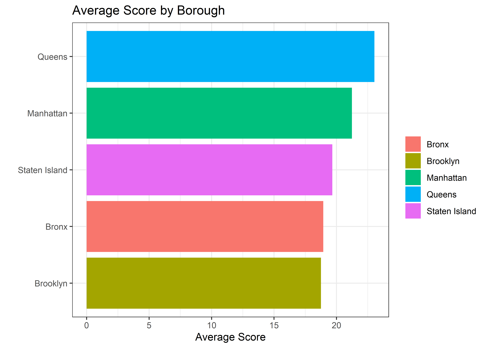
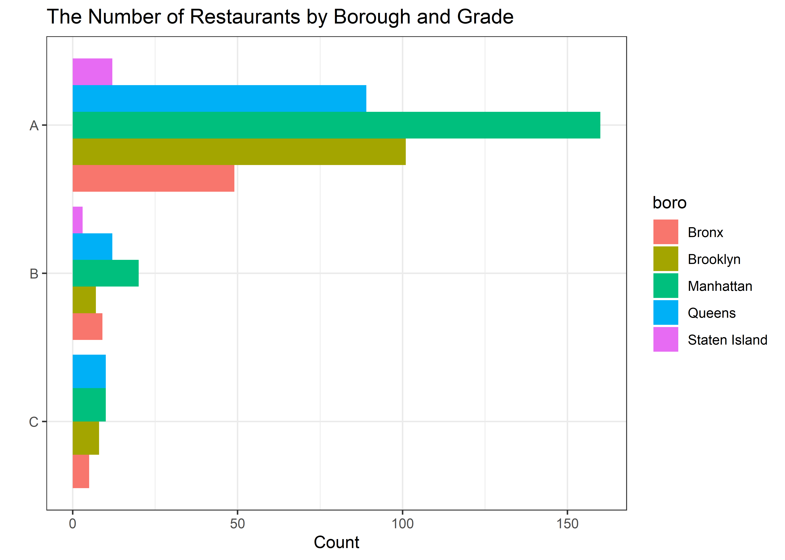
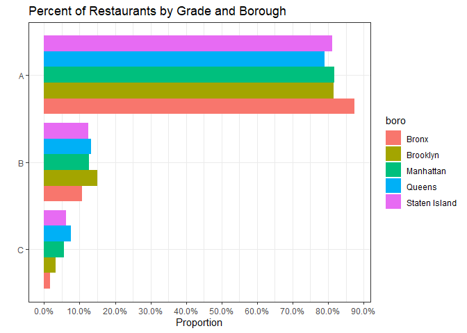

Inspections
================
Matthew
3/16/2022

``` r
inspections <- read_csv("https://data.cityofnewyork.us/resource/43nn-pn8j.csv")
```

    ## Rows: 1000 Columns: 26
    ## -- Column specification --------------------------------------------------------
    ## Delimiter: ","
    ## chr  (15): dba, boro, building, street, phone, cuisine_description, action, ...
    ## dbl   (8): camis, zipcode, score, latitude, longitude, community_board, bin,...
    ## dttm  (3): inspection_date, grade_date, record_date
    ## 
    ## i Use `spec()` to retrieve the full column specification for this data.
    ## i Specify the column types or set `show_col_types = FALSE` to quiet this message.

``` r
inspections <- inspections %>%
  rename(id = camis, name = dba)
```

# EDA

``` r
inspections %>%
  filter(!is.na(score)) %>%
  summarize(min(score), max(score))
```

    ## # A tibble: 1 x 2
    ##   `min(score)` `max(score)`
    ##          <dbl>        <dbl>
    ## 1            0           97

``` r
inspections %>%
  count(score, sort = TRUE)
```

    ## # A tibble: 76 x 2
    ##    score     n
    ##    <dbl> <int>
    ##  1    12    95
    ##  2    13    78
    ##  3    10    68
    ##  4     9    54
    ##  5    11    49
    ##  6    NA    45
    ##  7    21    31
    ##  8    19    29
    ##  9    22    27
    ## 10    20    26
    ## # ... with 66 more rows

## Analysis of Boroughs

``` r
inspections %>%
  filter(!is.na(score), boro != 0) %>%
  group_by(boro) %>%
  summarize(m = mean(score)) %>%
  ggplot(aes(m, fct_reorder(boro, m), fill = boro)) + geom_col() +
  labs(y = "", x = "Average Score", fill = "", title = "Average Score by Borough")
```

<!-- -->

``` r
inspections %>%
  filter(grade %in% c("A", "B", "C")) %>%
  group_by(boro) %>%
  count(grade, sort = TRUE) %>%
  ggplot(aes(n, fct_rev(grade), fill = boro)) + geom_col(position = "dodge") +
  labs(y = "", x = "Count", title = "The Number of Restaurants by Borough and Grade")
```

<!-- -->

``` r
(inspections %>%
  filter(grade %in% c("A", "B", "C")) %>%
  group_by(boro) %>%
  summarize(A = mean(grade == "A"),
            B = mean(grade == "B"),
            C = mean(grade == "C")) %>%
  pivot_longer(-boro) %>%
  ggplot(aes(value, fct_rev(name), fill = boro)) + geom_col(position = "dodge") +
  labs(y = "", x = "", fill = "") + 
  scale_x_continuous(breaks = seq(0,1,0.1),
                     labels = scales::percent_format())) /
  (inspections %>%
    filter(grade %in% c("A", "B", "C")) %>%
    group_by(boro) %>%
    summarize(A = mean(grade == "A"),
              B = mean(grade == "B"),
              C = mean(grade == "C")) %>%
    pivot_longer(-boro) %>%
    ggplot(aes(value, fct_reorder(boro, value, .fun = max), fill = fct_rev(name))) + geom_col() +
    labs(y = "", x = "", fill = "") +
    scale_x_continuous(labels = scales::percent_format())) + 
  plot_annotation(title = "Percent of Restaurants by Grade and Borough",
                  theme = theme(plot.title = element_text(hjust = 0.5)))
```

<!-- -->

``` r
inspections %>%
  filter(boro != 0, !is.na(score)) %>%
  group_by(boro, cuisine_description) %>%
  summarize(max_score = max(score)) %>%
  arrange(boro, -max_score) %>% knitr::kable()
```

    ## `summarise()` has grouped output by 'boro'. You can override using the
    ## `.groups` argument.

| boro          | cuisine\_description           | max\_score |
|:--------------|:-------------------------------|-----------:|
| Bronx         | Donuts                         |         69 |
| Bronx         | Coffee/Tea                     |         68 |
| Bronx         | Chinese                        |         63 |
| Bronx         | Latin American                 |         52 |
| Bronx         | Pizza                          |         47 |
| Bronx         | Tex-Mex                        |         46 |
| Bronx         | Mexican                        |         40 |
| Bronx         | Chicken                        |         38 |
| Bronx         | Seafood                        |         35 |
| Bronx         | Indian                         |         31 |
| Bronx         | American                       |         30 |
| Bronx         | Asian/Asian Fusion             |         30 |
| Bronx         | Sandwiches                     |         30 |
| Bronx         | Spanish                        |         27 |
| Bronx         | Bagels/Pretzels                |         24 |
| Bronx         | Middle Eastern                 |         24 |
| Bronx         | Caribbean                      |         23 |
| Bronx         | Greek                          |         21 |
| Bronx         | African                        |         19 |
| Bronx         | Steakhouse                     |         18 |
| Bronx         | Bakery Products/Desserts       |         17 |
| Bronx         | Hamburgers                     |         13 |
| Bronx         | Japanese                       |         13 |
| Bronx         | Frozen Desserts                |          7 |
| Brooklyn      | Bakery Products/Desserts       |         75 |
| Brooklyn      | Caribbean                      |         63 |
| Brooklyn      | American                       |         57 |
| Brooklyn      | Indian                         |         57 |
| Brooklyn      | Asian/Asian Fusion             |         54 |
| Brooklyn      | Italian                        |         53 |
| Brooklyn      | Pizza                          |         52 |
| Brooklyn      | Middle Eastern                 |         50 |
| Brooklyn      | Juice, Smoothies, Fruit Salads |         42 |
| Brooklyn      | Tex-Mex                        |         42 |
| Brooklyn      | Chinese                        |         40 |
| Brooklyn      | Coffee/Tea                     |         40 |
| Brooklyn      | Jewish/Kosher                  |         39 |
| Brooklyn      | Chicken                        |         38 |
| Brooklyn      | Mediterranean                  |         37 |
| Brooklyn      | Mexican                        |         34 |
| Brooklyn      | Latin American                 |         29 |
| Brooklyn      | Vegan                          |         29 |
| Brooklyn      | Afghan                         |         27 |
| Brooklyn      | Bagels/Pretzels                |         27 |
| Brooklyn      | Spanish                        |         27 |
| Brooklyn      | Turkish                        |         27 |
| Brooklyn      | Vegetarian                     |         27 |
| Brooklyn      | Chinese/Japanese               |         24 |
| Brooklyn      | Peruvian                       |         24 |
| Brooklyn      | Russian                        |         24 |
| Brooklyn      | Bangladeshi                    |         23 |
| Brooklyn      | Sandwiches                     |         22 |
| Brooklyn      | Korean                         |         21 |
| Brooklyn      | Southeast Asian                |         21 |
| Brooklyn      | Steakhouse                     |         21 |
| Brooklyn      | Frozen Desserts                |         20 |
| Brooklyn      | German                         |         17 |
| Brooklyn      | Donuts                         |         13 |
| Brooklyn      | Japanese                       |         12 |
| Brooklyn      | Other                          |         12 |
| Brooklyn      | Seafood                        |         12 |
| Brooklyn      | Eastern European               |         11 |
| Brooklyn      | Hamburgers                     |         11 |
| Brooklyn      | African                        |         10 |
| Brooklyn      | French                         |         10 |
| Brooklyn      | Greek                          |         10 |
| Brooklyn      | Soul Food                      |          7 |
| Manhattan     | Pizza                          |         97 |
| Manhattan     | Chinese                        |         85 |
| Manhattan     | Italian                        |         78 |
| Manhattan     | American                       |         70 |
| Manhattan     | African                        |         67 |
| Manhattan     | Coffee/Tea                     |         67 |
| Manhattan     | Thai                           |         67 |
| Manhattan     | New American                   |         65 |
| Manhattan     | Bagels/Pretzels                |         60 |
| Manhattan     | Japanese                       |         58 |
| Manhattan     | Sandwiches/Salads/Mixed Buffet |         53 |
| Manhattan     | Middle Eastern                 |         52 |
| Manhattan     | Chicken                        |         49 |
| Manhattan     | Irish                          |         49 |
| Manhattan     | Soups/Salads/Sandwiches        |         46 |
| Manhattan     | Indian                         |         45 |
| Manhattan     | Polish                         |         45 |
| Manhattan     | Mediterranean                  |         44 |
| Manhattan     | Spanish                        |         42 |
| Manhattan     | Steakhouse                     |         41 |
| Manhattan     | Asian/Asian Fusion             |         40 |
| Manhattan     | Mexican                        |         40 |
| Manhattan     | Korean                         |         38 |
| Manhattan     | Salads                         |         38 |
| Manhattan     | Australian                     |         37 |
| Manhattan     | Soul Food                      |         35 |
| Manhattan     | Latin American                 |         34 |
| Manhattan     | Hawaiian                       |         31 |
| Manhattan     | Bakery Products/Desserts       |         30 |
| Manhattan     | French                         |         30 |
| Manhattan     | Sandwiches                     |         30 |
| Manhattan     | Vegan                          |         30 |
| Manhattan     | Moroccan                       |         29 |
| Manhattan     | Juice, Smoothies, Fruit Salads |         27 |
| Manhattan     | Jewish/Kosher                  |         26 |
| Manhattan     | Other                          |         22 |
| Manhattan     | English                        |         20 |
| Manhattan     | Seafood                        |         19 |
| Manhattan     | Greek                          |         18 |
| Manhattan     | Bottled Beverages              |         13 |
| Manhattan     | Caribbean                      |         13 |
| Manhattan     | Chinese/Japanese               |         12 |
| Manhattan     | Vegetarian                     |         12 |
| Manhattan     | Hamburgers                     |         11 |
| Manhattan     | Peruvian                       |         11 |
| Manhattan     | Frozen Desserts                |          9 |
| Manhattan     | Donuts                         |          6 |
| Queens        | Sandwiches/Salads/Mixed Buffet |         91 |
| Queens        | Chinese                        |         88 |
| Queens        | Latin American                 |         83 |
| Queens        | Sandwiches                     |         83 |
| Queens        | American                       |         79 |
| Queens        | Japanese                       |         71 |
| Queens        | Caribbean                      |         65 |
| Queens        | Chicken                        |         63 |
| Queens        | Asian/Asian Fusion             |         60 |
| Queens        | Italian                        |         54 |
| Queens        | Spanish                        |         50 |
| Queens        | Tex-Mex                        |         48 |
| Queens        | Afghan                         |         43 |
| Queens        | Korean                         |         40 |
| Queens        | Mexican                        |         38 |
| Queens        | Juice, Smoothies, Fruit Salads |         35 |
| Queens        | Bagels/Pretzels                |         33 |
| Queens        | Pizza                          |         33 |
| Queens        | Indian                         |         32 |
| Queens        | Coffee/Tea                     |         29 |
| Queens        | Mediterranean                  |         29 |
| Queens        | Peruvian                       |         29 |
| Queens        | Filipino                       |         26 |
| Queens        | Barbecue                       |         25 |
| Queens        | Thai                           |         23 |
| Queens        | Hamburgers                     |         22 |
| Queens        | Bakery Products/Desserts       |         21 |
| Queens        | Hotdogs/Pretzels               |         21 |
| Queens        | Middle Eastern                 |         19 |
| Queens        | Soul Food                      |         14 |
| Queens        | Bangladeshi                    |         13 |
| Queens        | Greek                          |         13 |
| Queens        | Creole                         |         12 |
| Queens        | Irish                          |         12 |
| Queens        | Southeast Asian                |         12 |
| Queens        | Continental                    |         11 |
| Queens        | Frozen Desserts                |         11 |
| Queens        | Seafood                        |          9 |
| Queens        | Donuts                         |          8 |
| Staten Island | American                       |         76 |
| Staten Island | Chinese                        |         44 |
| Staten Island | Mexican                        |         36 |
| Staten Island | Russian                        |         32 |
| Staten Island | Chicken                        |         28 |
| Staten Island | Donuts                         |         26 |
| Staten Island | Pizza                          |         26 |
| Staten Island | Bakery Products/Desserts       |         17 |
| Staten Island | Italian                        |         15 |
| Staten Island | Hamburgers                     |         13 |
| Staten Island | Sandwiches                     |         12 |
| Staten Island | Japanese                       |          9 |
| Staten Island | Spanish                        |          9 |
| Staten Island | Coffee/Tea                     |          7 |
