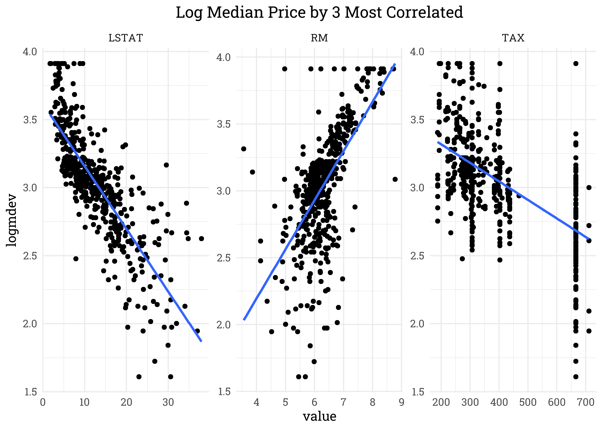

Lasso-Ridge Regression
================
Matthew
May 17, 2023

- <a href="#read-data" id="toc-read-data">Read Data</a>
- <a href="#explore" id="toc-explore">Explore</a>
- <a href="#split-data" id="toc-split-data">Split Data</a>
- <a href="#linear-regression" id="toc-linear-regression">Linear
  Regression</a>

# Read Data

``` r
col_names <- c(
 "CRIM", 
 "ZN", 
 "INDUS",
 "CHAS",
 "NOX",
 "RM",
 "AGE",
 "DIS",
 "RAD",
 "TAX",
 "PTRATIO",
 "B",
 "LSTAT",
 "MEDV")

data <- read.table("C:/Users/Matthew Hondrakis/OneDrive/Documents/data.txt", col.names = col_names)
```

``` r
data_description <- data.frame(
  Variable = c("CRIM", "ZN", "INDUS", "CHAS", "NOX", "RM", "AGE", "DIS", "RAD", "TAX", "PTRATIO", "B", "LSTAT", "MEDV"),
  Description = c(
    "per capita crime rate by town",
    "proportion of residential land zoned for lots over 25,000 sq.ft.",
    "proportion of non-retail business acres per town",
    "Charles River dummy variable (= 1 if tract bounds river; 0 otherwise)",
    "nitric oxides concentration (parts per 10 million)",
    "average number of rooms per dwelling",
    "proportion of owner-occupied units built prior to 1940",
    "weighted distances to five Boston employment centres",
    "index of accessibility to radial highways",
    "full-value property-tax rate per $10,000",
    "pupil-teacher ratio by town",
    "1000(Bk - 0.63)^2 where Bk is the proportion of blacks by town",
    "% lower status of the population",
    "Median value of owner-occupied homes in $1000's")
)

knitr::kable(data_description)
```

| Variable | Description                                                           |
|:---------|:----------------------------------------------------------------------|
| CRIM     | per capita crime rate by town                                         |
| ZN       | proportion of residential land zoned for lots over 25,000 sq.ft.      |
| INDUS    | proportion of non-retail business acres per town                      |
| CHAS     | Charles River dummy variable (= 1 if tract bounds river; 0 otherwise) |
| NOX      | nitric oxides concentration (parts per 10 million)                    |
| RM       | average number of rooms per dwelling                                  |
| AGE      | proportion of owner-occupied units built prior to 1940                |
| DIS      | weighted distances to five Boston employment centres                  |
| RAD      | index of accessibility to radial highways                             |
| TAX      | full-value property-tax rate per \$10,000                             |
| PTRATIO  | pupil-teacher ratio by town                                           |
| B        | 1000(Bk - 0.63)^2 where Bk is the proportion of blacks by town        |
| LSTAT    | % lower status of the population                                      |
| MEDV     | Median value of owner-occupied homes in \$1000’s                      |

# Explore

``` r
data %>% 
  pivot_longer(-MEDV) %>% 
  group_by(name) %>% 
  summarize(corr = cor(log(MEDV), value)) %>% 
  arrange(-abs(corr)) %>% 
  ggplot(aes(abs(corr), fct_reorder(name, abs(corr)), fill = corr>0)) +
  geom_col(color = "black") +
  geom_text(aes(label = round(abs(corr), 2)), hjust = 1.2) +
  labs(y = "Variable", x = "Correlation",
       title = "Variables Correlated with Log(Price)")
```

<!-- -->

``` r
data %>% 
  mutate(logmdev = log(MEDV)) %>% 
  select(logmdev, LSTAT, RM, TAX) %>% 
  pivot_longer(-logmdev) %>% 
  ggplot(aes(logmdev, value)) + 
  geom_point() +
  geom_smooth(method = "lm", se = FALSE) +
  facet_wrap(~name, scales = "free") +
  labs(title = "Log Median Price by 3 Most Correlated") 
```

    ## `geom_smooth()` using formula 'y ~ x'

<!-- -->

# Split Data

``` r
library(tidymodels)
```

    ## Registered S3 method overwritten by 'tune':
    ##   method                   from   
    ##   required_pkgs.model_spec parsnip

    ## -- Attaching packages -------------------------------------- tidymodels 0.1.4 --

    ## v broom        1.0.1     v rsample      0.1.1
    ## v dials        0.1.0     v tune         0.1.6
    ## v infer        1.0.4     v workflows    0.2.4
    ## v modeldata    1.0.1     v workflowsets 0.2.1
    ## v parsnip      0.2.0     v yardstick    0.0.9
    ## v recipes      0.2.0

    ## -- Conflicts ----------------------------------------- tidymodels_conflicts() --
    ## x scales::discard() masks purrr::discard()
    ## x dplyr::filter()   masks stats::filter()
    ## x recipes::fixed()  masks stringr::fixed()
    ## x dplyr::lag()      masks stats::lag()
    ## x yardstick::spec() masks readr::spec()
    ## x recipes::step()   masks stats::step()
    ## x tune::tune()      masks parsnip::tune()
    ## * Use tidymodels_prefer() to resolve common conflicts.

``` r
data_split <- initial_split(data, 1/2)
data_train <- training(data_split)
data_testing <- testing(data_split)
```

# Linear Regression
