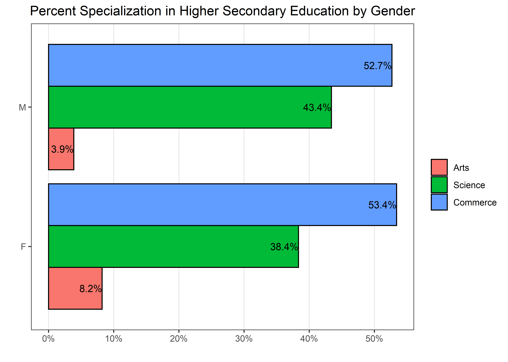

Masters Project: Job Placement
================
Matthew
2022-12-07

-   <a href="#intro" id="toc-intro">Intro</a>
    -   <a href="#data-dictionary" id="toc-data-dictionary">Data Dictionary</a>
-   <a href="#cleanse" id="toc-cleanse">Cleanse</a>
-   <a href="#outliers" id="toc-outliers">Outliers</a>
-   <a href="#who-are-these-graduates" id="toc-who-are-these-graduates">Who
    are these graduates?</a>
    -   <a href="#1-salary-distribution-by-gender"
        id="toc-1-salary-distribution-by-gender">1. Salary Distribution by
        Gender</a>
    -   <a
        href="#2-percent-specialization-in-higher-secondary-education-by-gender"
        id="toc-2-percent-specialization-in-higher-secondary-education-by-gender">2.
        Percent Specialization in Higher Secondary Education by Gender</a>
-   <a href="#who-are-most-likely-to-get-placed"
    id="toc-who-are-most-likely-to-get-placed">Who are most likely to get
    placed?</a>

``` r
fall <- read_csv("C:/Users/Matthew Hondrakis/OneDrive/Documents/DataAnalysis/Masters Project Fall Placement/fall2022Placement.csv")
```

    ## Rows: 215 Columns: 15
    ## -- Column specification --------------------------------------------------------
    ## Delimiter: ","
    ## chr (8): gender, ssc_b, hsc_b, hsc_s, degree_t, workex, specialisation, status
    ## dbl (7): sl_no, ssc_p, hsc_p, degree_p, etest_p, mba_p, salary
    ## 
    ## i Use `spec()` to retrieve the full column specification for this data.
    ## i Specify the column types or set `show_col_types = FALSE` to quiet this message.

# Intro

This is a structured analysis guided by the assignment provided by my
friends professor. The task is as follows.

-   **Cleanse**: Look for null data in the table, and use the
    appropriate strategy to handle null data for each column. Explain
    why this was the strategy that you used.

-   **Outliers**: Search the data for outliers and remove them. Use the
    appropriate outlier method(s). Show all work.

-   **Who are these graduates?**: Create 4-5 visualizations providing
    useful and explanatory information about these graduates. The
    visualizations should show trends, correlations, and other useful
    patterns that the data provides.  
    Remember, we are dealing with senior management. The charts must be
    readable, meaningful and at a summary level.  
    Use at least one group/by or bin in your analysis.

-   **Who are most likely to get placed?**: Create visualizations to
    show management qualities specific to those who are likely to get
    placed at jobs. Show three meaningful visualizations.  
    Use at least one group/by or bin in your analysis.

-   **Prepare the data for a regression analysis**: The XYZ management
    company team has heard that it might be possible to use their data
    to make predictions. They don’t know much about data analytics. We
    are hoping that an example of what is possible will help them
    understand better.  
    Prepare the data file to run with a regression analysis. Use the
    techniques and methods discussed in class. (*I’m not a student, so
    I’m unfamiliar with what methods were discussed in class*)

-   **Run the regression analysis**: Show the regression scoring. Split
    the data into training and test sets. Show a confusion matrix for
    both.

## Data Dictionary

``` r
knitr::kable(readxl::read_excel("C:/Users/Matthew Hondrakis/OneDrive/Documents/DataAnalysis/Masters Project Fall Placement/Data dictionary.xlsx"))
```

| Column         | Explanation                                  |
|:---------------|:---------------------------------------------|
| sl_no          | Serial Number                                |
| gender         | Gender (M/F)                                 |
| ssc_p          | Secondary Education percentile               |
| ssc_b          | Board of Education                           |
| hsc_p          | Higher Secondary Education percentile        |
| hsc_b          | Board of Education- Central/ Others          |
| hsc_s          | Specialization in Higher Secondary Education |
| degree_p       | Degree Percentile                            |
| degree_t       | Under Graduation(Degree type)                |
| workex         | Work Experience                              |
| etest_p        | Employability test percentile                |
| specialisation | Area of speciality                           |
| mba_p          | MBA percentile                               |
| Salary         | Salary of job offered                        |
| status         | placed or not placed (target variable)       |

# Cleanse

``` r
skimr::skim(fall) %>% select(skim_type, skim_variable, n_missing)
```

|                                                  |      |
|:-------------------------------------------------|:-----|
| Name                                             | fall |
| Number of rows                                   | 215  |
| Number of columns                                | 15   |
| \_\_\_\_\_\_\_\_\_\_\_\_\_\_\_\_\_\_\_\_\_\_\_   |      |
| Column type frequency:                           |      |
| character                                        | 8    |
| numeric                                          | 7    |
| \_\_\_\_\_\_\_\_\_\_\_\_\_\_\_\_\_\_\_\_\_\_\_\_ |      |
| Group variables                                  | None |

Data summary

**Variable type: character**

| skim_variable  | n_missing |
|:---------------|----------:|
| gender         |         0 |
| ssc_b          |         0 |
| hsc_b          |         0 |
| hsc_s          |         1 |
| degree_t       |         0 |
| workex         |         0 |
| specialisation |         1 |
| status         |         0 |

**Variable type: numeric**

| skim_variable | n_missing |
|:--------------|----------:|
| sl_no         |         0 |
| ssc_p         |         0 |
| hsc_p         |         2 |
| degree_p      |         0 |
| etest_p       |         0 |
| mba_p         |         0 |
| salary        |        67 |

As we can see, we have *N/A* values for:

-   *hsc_s* (Specialization in Higher Secondary Education): **1**

-   *specialisation* (Area of speciality): **1**

-   *hsc_p* (Higher Secondary Education percentile): **2**

-   *salary* (Salary of job offered): **67**

``` r
fall %>% 
  count(hsc_s, sort = TRUE)
```

    ## # A tibble: 4 x 2
    ##   hsc_s        n
    ##   <chr>    <int>
    ## 1 Commerce   112
    ## 2 Science     91
    ## 3 Arts        11
    ## 4 <NA>         1

``` r
fall %>% 
  count(specialisation, sort = TRUE)
```

    ## # A tibble: 4 x 2
    ##   specialisation     n
    ##   <chr>          <int>
    ## 1 Mkt&Fin          119
    ## 2 Mkt&HR            94
    ## 3 Mt&HR              1
    ## 4 <NA>               1

I am going to make a few assumptions. I will take “Mkt” to mean
“Marketing”, “Fin” to mean “Finance”, “HR” to mean “Human Resources”. We
see only one variable having the value of “Mt”, which we may assume is a
typo or just an outlier. For now, I will consider this a valid data
point, assume it means something like “Management or Math” and wont
change it to “Mkt”.

``` r
fall %>% 
  filter(is.na(hsc_s)) %>% 
  select(salary)
```

    ## # A tibble: 1 x 1
    ##   salary
    ##    <dbl>
    ## 1     NA

``` r
fall %>% 
  filter(is.na(specialisation)) %>% 
  select(salary)
```

    ## # A tibble: 1 x 1
    ##   salary
    ##    <dbl>
    ## 1 250000

The row that has a missing value for *hsc_s* (Specialization in Higher
Secondary Education) also contains a missing value for *salary*; this is
not the case for when specialisation is NA.

``` r
fall %>% 
  group_by(specialisation) %>% 
  count(hsc_s) %>% 
  mutate(prop = n/sum(n)) %>% 
  arrange(specialisation, -n)
```

    ## # A tibble: 9 x 4
    ## # Groups:   specialisation [4]
    ##   specialisation hsc_s        n   prop
    ##   <chr>          <chr>    <int>  <dbl>
    ## 1 Mkt&Fin        Commerce    69 0.580 
    ## 2 Mkt&Fin        Science     42 0.353 
    ## 3 Mkt&Fin        Arts         8 0.0672
    ## 4 Mkt&HR         Science     48 0.511 
    ## 5 Mkt&HR         Commerce    42 0.447 
    ## 6 Mkt&HR         Arts         3 0.0319
    ## 7 Mkt&HR         <NA>         1 0.0106
    ## 8 Mt&HR          Science      1 1     
    ## 9 <NA>           Commerce     1 1

``` r
fall %>% 
  group_by(hsc_b) %>% 
  count(hsc_s) %>% 
  mutate(prop = n/sum(n)) %>% 
  arrange(hsc_b, -n)
```

    ## # A tibble: 7 x 4
    ## # Groups:   hsc_b [2]
    ##   hsc_b   hsc_s        n   prop
    ##   <chr>   <chr>    <int>  <dbl>
    ## 1 Central Commerce    47 0.560 
    ## 2 Central Science     29 0.345 
    ## 3 Central Arts         7 0.0833
    ## 4 Central <NA>         1 0.0119
    ## 5 Others  Commerce    65 0.496 
    ## 6 Others  Science     62 0.473 
    ## 7 Others  Arts         4 0.0305

Most of “Mkt&HR” are evenly distributed between **Science** and
**Commerce**. Thus its not possible at the moment to decide which one of
the 2 should be used to fill in the missing value. With regards to
*hsc_b* (Board of Education), the majority of **Central** are in
**Commerce**. This may provide a clue later on, but it is still too
early to make an assumption.

``` r
fall %>% 
  group_by(missing = is.na(salary)) %>% 
  count(status) %>% 
  arrange(status)
```

    ## # A tibble: 2 x 3
    ## # Groups:   missing [2]
    ##   missing status         n
    ##   <lgl>   <chr>      <int>
    ## 1 TRUE    Not Placed    67
    ## 2 FALSE   Placed       148

As we can see, all missing values for *salary* are from individuals that
were not offered a job. Since the Data Dictionary defines *Salary* as
“Salary of job offered”, individuals that were not offered a job, do not
have a salary from an offer. Therefore, *salary* will be 0 for
individuals that were not offered a job. We will then drop any rows that
had missing information, which in total is only **4**.

``` r
clean_fall <- fall %>% 
  mutate(salary = ifelse(is.na(salary), 0, salary)) %>% 
  drop_na()
```

# Outliers

``` r
(fall %>% 
  ggplot(aes(salary)) +
  geom_histogram() +
  scale_x_log10(labels = comma_format())) /
(fall %>% 
  ggplot(aes(salary)) +
  geom_boxplot() +
  scale_x_log10(labels = comma_format()) +
  theme(axis.ticks.y = element_blank(),
        axis.text.y = element_blank(),
        axis.line.y = element_blank(),
        panel.grid.major.y = element_blank())) +
  plot_annotation(title = "Salary Distribution")
```

    ## `stat_bin()` using `bins = 30`. Pick better value with `binwidth`.

<!-- -->

Removing outliers below by filtering out the top 8 salaries and the
lowest salary. We are now left with **202** rows out of **215**.

``` r
clean_fall %>% 
  filter(salary != 0) %>% 
  arrange(salary) %>% 
  slice(1) %>% 
  pull(salary)
```

    ## [1] 45000

``` r
updated_fall <- clean_fall %>% 
  arrange(-salary) %>% 
  slice(-c(1:8)) %>% 
  filter(salary != 45000) 
```

# Who are these graduates?

A quick check on the **correlations** between **numeric** variables.

``` r
updated_fall %>% 
  keep(is.numeric) %>%
  cor() %>% 
  as.data.frame() %>% 
  rownames_to_column(var = "item1") %>% 
  gather(key = item2, value = corr, -item1) %>% 
  filter(item1 > item2) %>% 
  arrange(-abs(corr))
```

    ##      item1    item2        corr
    ## 1    ssc_p   salary  0.60684876
    ## 2    ssc_p    hsc_p  0.49333061
    ## 3   salary    hsc_p  0.48980446
    ## 4   salary degree_p  0.48279542
    ## 5    ssc_p degree_p  0.47395554
    ## 6    hsc_p degree_p  0.42149224
    ## 7    mba_p degree_p  0.37881548
    ## 8    mba_p    hsc_p  0.35227101
    ## 9    ssc_p    mba_p  0.33640024
    ## 10   hsc_p  etest_p  0.21641816
    ## 11 etest_p degree_p  0.20212580
    ## 12   mba_p  etest_p  0.19573442
    ## 13  salary  etest_p  0.19573391
    ## 14   ssc_p  etest_p  0.19436141
    ## 15   sl_no    hsc_p -0.11370274
    ## 16  salary    mba_p  0.09877951
    ## 17   sl_no degree_p -0.08906533
    ## 18   sl_no   salary -0.04738195
    ## 19   ssc_p    sl_no -0.04424477
    ## 20   sl_no  etest_p  0.03951716
    ## 21   sl_no    mba_p  0.01337281

Below I will create a function to quickly plot **counts** of factor
variables. It is often advised to make a function if one foresees using
the same plot/code often. Since this dataset contains many **factor**
variables, I assume there will be a lot of factor count plotting.

``` r
count_plot <- function(x){
  updated_fall %>% 
    filter(!is.na({{x}})) %>% 
    count({{x}}) %>% 
    ggplot(aes(n, fct_reorder({{x}}, n))) + 
    geom_col(color = "black", fill = "lightblue") +
    geom_text(aes(label = n), hjust = 1.3, size = 3)
}
```

``` r
(count_plot(gender) +
  labs(x = "", y = "", title = "Number of Graduates by Gender") +
  theme(panel.grid.major.y = element_blank())) /
count_plot(degree_t) +
  labs(y = "", x = "", title = "Degree Type") +
  theme(panel.grid.major.y = element_blank())
```

<!-- -->

``` r
(count_plot(hsc_s) +
   labs(y = "", x = "", title = "Higher Education Specialisation") +
   theme(panel.grid.major.y = element_blank())) /
(count_plot(workex) +
   labs(y = "", x = "", title = "Work Experience") +
   theme(panel.grid.major.y = element_blank()))
```

<!-- -->

## 1. Salary Distribution by Gender

``` r
updated_fall %>% 
  filter(status == "Placed") %>% 
  ggplot(aes(salary, gender, color = gender)) + 
  geom_boxplot() +
  scale_x_log10(label = comma_format()) +
  labs(y = "", x = "Salary", title = "Salary Distribution by Gender") +
  theme(axis.text.y = element_blank(),
        axis.ticks.y = element_blank(),
        panel.grid.major.y = element_blank())
```

<!-- -->

## 2. Percent Specialization in Higher Secondary Education by Gender

Given the unequal

``` r
updated_fall %>%
  group_by(gender) %>% 
  count(hsc_s) %>% 
  mutate(prop = n/sum(n)) %>% 
  ggplot(aes(prop, gender, 
             fill = fct_reorder2(hsc_s, gender, prop, .desc = FALSE))) +
  geom_col(color = "black", position = position_dodge()) +
  geom_text(aes(label = paste0(round(prop*100,1), "%")), 
            position = position_dodge2(0.9), hjust = 1, size = 3.5) +
  labs(fill = "", x = "", y = "", 
       title = "Percent Specialization in Higher Secondary Education by Gender") +
  scale_x_continuous(label = percent_format(), breaks = seq(0,0.5,0.1)) +
  theme(panel.grid.major.y = element_blank())
```

<!-- -->

# Who are most likely to get placed?

``` r
updated_fall %>% 
  ggplot(aes(etest_p, status, color = status)) +
  geom_boxplot() +
  geom_jitter(alpha = 0.5, height = 0.1) +
  labs(y = "", x = "Employability Test Percentile", 
       title = "Employability Test Percentile by Job Placement")
```

<!-- -->
