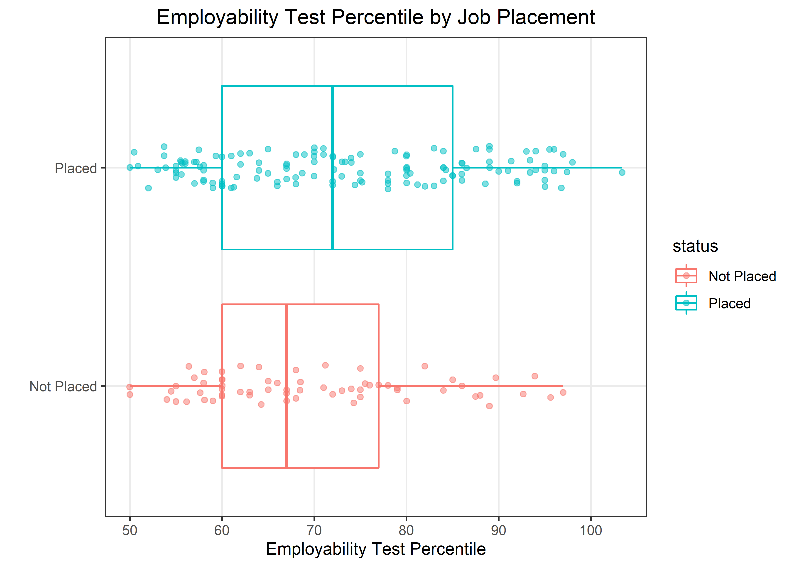
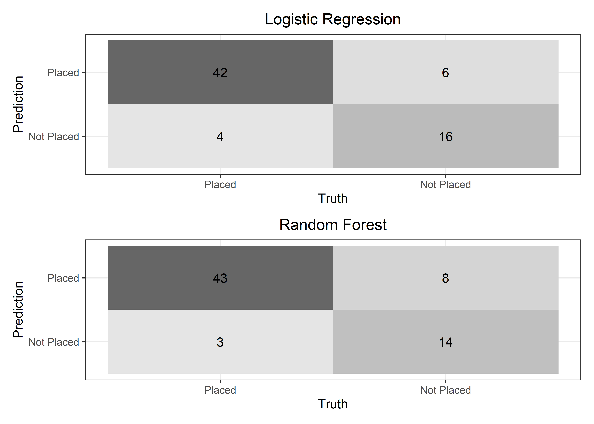

Masters Project: Job Placement
================
Matthew
2022-12-07

-   <a href="#intro" id="toc-intro">Intro</a>
    -   <a href="#data-dictionary" id="toc-data-dictionary">Data Dictionary</a>
-   <a href="#cleanse" id="toc-cleanse">Cleanse</a>
-   <a href="#outliers" id="toc-outliers">Outliers</a>
-   <a href="#who-are-these-graduates" id="toc-who-are-these-graduates">Who
    are these graduates?</a>
    -   <a href="#count-plots" id="toc-count-plots">Count Plots</a>
    -   <a href="#gender" id="toc-gender">Gender</a>
        -   <a href="#1-salary-distribution-by-gender"
            id="toc-1-salary-distribution-by-gender">1. Salary Distribution by
            Gender</a>
        -   <a
            href="#2-percent-specialization-in-higher-secondary-education-by-gender"
            id="toc-2-percent-specialization-in-higher-secondary-education-by-gender">2.
            Percent Specialization in Higher Secondary Education by Gender</a>
        -   <a href="#3-work-experience-by-gender"
            id="toc-3-work-experience-by-gender">3. Work Experience by Gender</a>
    -   <a href="#work-experience" id="toc-work-experience">Work Experience</a>
        -   <a href="#4-work-experience-by-undergrad-degree"
            id="toc-4-work-experience-by-undergrad-degree">4. Work Experience by
            Undergrad Degree</a>
        -   <a href="#5-work-experience-by-specialization"
            id="toc-5-work-experience-by-specialization">5. Work Experience by
            Specialization</a>
    -   <a href="#highschool-and-undergrad"
        id="toc-highschool-and-undergrad">Highschool and Undergrad</a>
        -   <a href="#6-highschool-specialization-and-undergrad-degree"
            id="toc-6-highschool-specialization-and-undergrad-degree">6. Highschool
            Specialization and Undergrad Degree</a>
-   <a href="#who-are-most-likely-to-get-placed"
    id="toc-who-are-most-likely-to-get-placed">Who are most likely to get
    placed?</a>
    -   <a href="#work-experience-1" id="toc-work-experience-1">Work
        Experience</a>
    -   <a href="#education" id="toc-education">Education</a>
    -   <a href="#employability-test-scores"
        id="toc-employability-test-scores">Employability Test Scores</a>
        -   <a href="#employability-quantiles"
            id="toc-employability-quantiles">Employability Quantiles</a>
    -   <a href="#mba-percentile" id="toc-mba-percentile">MBA Percentile</a>
    -   <a href="#gender-1" id="toc-gender-1">Gender</a>
    -   <a href="#highschool-and-undergrad-degree-percentile"
        id="toc-highschool-and-undergrad-degree-percentile">Highschool and
        Undergrad Degree Percentile</a>
-   <a href="#prepare-and-run-a-regression-analysis"
    id="toc-prepare-and-run-a-regression-analysis">Prepare and Run a
    “Regression” Analysis</a>
    -   <a href="#prepare-data" id="toc-prepare-data">Prepare Data</a>
    -   <a href="#preprocess-and-model-choice"
        id="toc-preprocess-and-model-choice">Preprocess and Model Choice</a>
        -   <a href="#logistic-regression" id="toc-logistic-regression">Logistic
            Regression</a>
        -   <a href="#random-forest" id="toc-random-forest">Random Forest</a>
-   <a href="#final-models" id="toc-final-models">Final Models</a>
    -   <a href="#final-logistic-regression-fit"
        id="toc-final-logistic-regression-fit">Final Logistic Regression Fit</a>
    -   <a href="#final-random-forest-fit"
        id="toc-final-random-forest-fit">Final Random Forest Fit</a>
    -   <a href="#metrics-2" id="toc-metrics-2">Metrics</a>
    -   <a href="#variable-importance" id="toc-variable-importance">Variable
        Importance</a>
        -   <a href="#logistic-regression-1" id="toc-logistic-regression-1">Logistic
            Regression</a>
        -   <a href="#random-forest-1" id="toc-random-forest-1">Random Forest</a>
        -   <a href="#conclusion" id="toc-conclusion">Conclusion</a>

``` r
fall <- read_csv("C:/Users/Matthew Hondrakis/OneDrive/Documents/DataAnalysis/Masters Project Job Placement/fall2022Placement.csv")
```

    ## Rows: 215 Columns: 15
    ## -- Column specification --------------------------------------------------------
    ## Delimiter: ","
    ## chr (8): gender, ssc_b, hsc_b, hsc_s, degree_t, workex, specialisation, status
    ## dbl (7): sl_no, ssc_p, hsc_p, degree_p, etest_p, mba_p, salary
    ## 
    ## i Use `spec()` to retrieve the full column specification for this data.
    ## i Specify the column types or set `show_col_types = FALSE` to quiet this message.

# Intro

This is a structured analysis guided by the assignment provided by my
friends professor. The task is as follows.

-   **Cleanse**: Look for null data in the table, and use the
    appropriate strategy to handle null data for each column. Explain
    why this was the strategy that you used.

-   **Outliers**: Search the data for outliers and remove them. Use the
    appropriate outlier method(s). Show all work.

-   **Who are these graduates?**: Create 4-5 visualizations providing
    useful and explanatory information about these graduates. The
    visualizations should show trends, correlations, and other useful
    patterns that the data provides.  
    Remember, we are dealing with senior management. The charts must be
    readable, meaningful and at a summary level.  
    Use at least one group/by or bin in your analysis.

-   **Who are most likely to get placed?**: Create visualizations to
    show management qualities specific to those who are likely to get
    placed at jobs. Show three meaningful visualizations.  
    Use at least one group/by or bin in your analysis.

-   **Prepare the data for a regression analysis**: The XYZ management
    company team has heard that it might be possible to use their data
    to make predictions. They don’t know much about data analytics. We
    are hoping that an example of what is possible will help them
    understand better.  
    Prepare the data file to run with a regression analysis. Use the
    techniques and methods discussed in class. (*I’m not a student, so
    I’m unfamiliar with what methods were discussed in class*)

-   **Run the regression analysis**: Show the regression scoring. Split
    the data into training and test sets. Show a confusion matrix for
    both.

## Data Dictionary

``` r
knitr::kable(readxl::read_excel("C:/Users/Matthew Hondrakis/OneDrive/Documents/DataAnalysis/Masters Project Job Placement/Data dictionary.xlsx"))
```

| Column         | Explanation                                  |
|:---------------|:---------------------------------------------|
| sl_no          | Serial Number                                |
| gender         | Gender (M/F)                                 |
| ssc_p          | Secondary Education percentile               |
| ssc_b          | Board of Education                           |
| hsc_p          | Higher Secondary Education percentile        |
| hsc_b          | Board of Education- Central/ Others          |
| hsc_s          | Specialization in Higher Secondary Education |
| degree_p       | Degree Percentile                            |
| degree_t       | Under Graduation(Degree type)                |
| workex         | Work Experience                              |
| etest_p        | Employability test percentile                |
| specialisation | Area of speciality                           |
| mba_p          | MBA percentile                               |
| Salary         | Salary of job offered                        |
| status         | placed or not placed (target variable)       |

# Cleanse

``` r
skimr::skim(fall) %>% select(skim_type, skim_variable, n_missing)
```

|                                                  |      |
|:-------------------------------------------------|:-----|
| Name                                             | fall |
| Number of rows                                   | 215  |
| Number of columns                                | 15   |
| \_\_\_\_\_\_\_\_\_\_\_\_\_\_\_\_\_\_\_\_\_\_\_   |      |
| Column type frequency:                           |      |
| character                                        | 8    |
| numeric                                          | 7    |
| \_\_\_\_\_\_\_\_\_\_\_\_\_\_\_\_\_\_\_\_\_\_\_\_ |      |
| Group variables                                  | None |

Data summary

**Variable type: character**

| skim_variable  | n_missing |
|:---------------|----------:|
| gender         |         0 |
| ssc_b          |         0 |
| hsc_b          |         0 |
| hsc_s          |         1 |
| degree_t       |         0 |
| workex         |         0 |
| specialisation |         1 |
| status         |         0 |

**Variable type: numeric**

| skim_variable | n_missing |
|:--------------|----------:|
| sl_no         |         0 |
| ssc_p         |         0 |
| hsc_p         |         2 |
| degree_p      |         0 |
| etest_p       |         0 |
| mba_p         |         0 |
| salary        |        67 |

As we can see, we have *N/A* values for:

-   *hsc_s* (Specialization in Higher Secondary Education): **1**

-   *specialisation* (Area of speciality): **1**

-   *hsc_p* (Higher Secondary Education percentile): **2**

-   *salary* (Salary of job offered): **67**

``` r
fall %>% 
  count(hsc_s, sort = TRUE)
```

    ## # A tibble: 4 x 2
    ##   hsc_s        n
    ##   <chr>    <int>
    ## 1 Commerce   112
    ## 2 Science     91
    ## 3 Arts        11
    ## 4 <NA>         1

``` r
fall %>% 
  count(specialisation, sort = TRUE)
```

    ## # A tibble: 4 x 2
    ##   specialisation     n
    ##   <chr>          <int>
    ## 1 Mkt&Fin          119
    ## 2 Mkt&HR            94
    ## 3 Mt&HR              1
    ## 4 <NA>               1

I am going to make a few assumptions. I will take “Mkt” to mean
“Marketing”, “Fin” to mean “Finance”, “HR” to mean “Human Resources”. We
see only one variable having the value of “Mt”, which we may assume is a
typo or just an outlier. For simplicity’s sake, I will consider this a
typo and convert it to “Mkt”.

``` r
fall <- fall %>% 
  mutate(specialisation = 
           ifelse(grepl("Mt", specialisation), "Mkt&HR", specialisation))
```

``` r
fall %>% 
  filter(is.na(hsc_s)) %>% 
  select(hsc_s, salary)
```

    ## # A tibble: 1 x 2
    ##   hsc_s salary
    ##   <chr>  <dbl>
    ## 1 <NA>      NA

``` r
fall %>% 
  filter(is.na(specialisation)) %>% 
  select(salary)
```

    ## # A tibble: 1 x 1
    ##   salary
    ##    <dbl>
    ## 1 250000

The row that has a missing value for *hsc_s* (Specialization in Higher
Secondary Education) also contains a missing value for *salary*; this is
not the case for when specialisation is NA.

``` r
fall %>% 
  group_by(specialisation) %>% 
  count(hsc_s) %>% 
  mutate(prop = n/sum(n)) %>% 
  arrange(specialisation, -n)
```

    ## # A tibble: 8 x 4
    ## # Groups:   specialisation [3]
    ##   specialisation hsc_s        n   prop
    ##   <chr>          <chr>    <int>  <dbl>
    ## 1 Mkt&Fin        Commerce    69 0.580 
    ## 2 Mkt&Fin        Science     42 0.353 
    ## 3 Mkt&Fin        Arts         8 0.0672
    ## 4 Mkt&HR         Science     49 0.516 
    ## 5 Mkt&HR         Commerce    42 0.442 
    ## 6 Mkt&HR         Arts         3 0.0316
    ## 7 Mkt&HR         <NA>         1 0.0105
    ## 8 <NA>           Commerce     1 1

``` r
fall %>% 
  group_by(hsc_b) %>% 
  count(hsc_s) %>% 
  mutate(prop = n/sum(n)) %>% 
  arrange(hsc_b, -n)
```

    ## # A tibble: 7 x 4
    ## # Groups:   hsc_b [2]
    ##   hsc_b   hsc_s        n   prop
    ##   <chr>   <chr>    <int>  <dbl>
    ## 1 Central Commerce    47 0.560 
    ## 2 Central Science     29 0.345 
    ## 3 Central Arts         7 0.0833
    ## 4 Central <NA>         1 0.0119
    ## 5 Others  Commerce    65 0.496 
    ## 6 Others  Science     62 0.473 
    ## 7 Others  Arts         4 0.0305

Most of “Mkt&HR” are evenly distributed between **Science** and
**Commerce**. Thus its not possible at the moment to decide which one of
the 2 should be used to fill in the missing value. With regards to
*hsc_b* (Board of Education), the majority of **Central** are in
**Commerce**. This may provide a clue later on, but it is still too
early to make an assumption.

``` r
fall %>% 
  group_by(missing = is.na(salary)) %>% 
  count(status) %>% 
  arrange(status)
```

    ## # A tibble: 2 x 3
    ## # Groups:   missing [2]
    ##   missing status         n
    ##   <lgl>   <chr>      <int>
    ## 1 TRUE    Not Placed    67
    ## 2 FALSE   Placed       148

As we can see, all missing values for *salary* are from individuals that
were not offered a job. Since the Data Dictionary defines *Salary* as
“Salary of job offered”, individuals that were not offered a job, do not
have a salary from an offer. Therefore, *salary* will be 0 for
individuals that were not offered a job. We will then drop any rows that
had missing information, which in total is only **4**.

``` r
clean_fall <- fall %>% 
  mutate(salary = ifelse(is.na(salary), 0, salary)) %>% 
  drop_na()
```

# Outliers

``` r
(fall %>% 
  ggplot(aes(salary)) +
  geom_histogram() +
  scale_x_log10(labels = comma_format())) /
(fall %>% 
  ggplot(aes(salary)) +
  geom_boxplot() +
  scale_x_log10(labels = comma_format()) +
  theme(axis.ticks.y = element_blank(),
        axis.text.y = element_blank(),
        axis.line.y = element_blank(),
        panel.grid.major.y = element_blank())) +
  plot_annotation(title = "Salary Distribution")
```

    ## `stat_bin()` using `bins = 30`. Pick better value with `binwidth`.

<!-- -->

Removing outliers below by filtering out the top 8 salaries and the
lowest salary. We are now left with **202** rows out of **215**.

``` r
clean_fall %>% 
  filter(salary != 0) %>% 
  arrange(salary) %>% 
  slice(1) %>% 
  pull(salary)
```

    ## [1] 45000

``` r
updated_fall <- clean_fall %>% 
  arrange(-salary) %>% 
  slice(-c(1:8)) %>% 
  filter(salary != 45000) 
```

# Who are these graduates?

A quick check on the **correlations** between **numeric** variables.

``` r
updated_fall %>% 
  keep(is.numeric) %>%
  cor() %>% 
  as.data.frame() %>% 
  rownames_to_column(var = "item1") %>% 
  gather(key = item2, value = corr, -item1) %>% 
  filter(item1 > item2) %>% 
  arrange(-abs(corr))
```

    ##      item1    item2        corr
    ## 1    ssc_p   salary  0.60684876
    ## 2    ssc_p    hsc_p  0.49333061
    ## 3   salary    hsc_p  0.48980446
    ## 4   salary degree_p  0.48279542
    ## 5    ssc_p degree_p  0.47395554
    ## 6    hsc_p degree_p  0.42149224
    ## 7    mba_p degree_p  0.37881548
    ## 8    mba_p    hsc_p  0.35227101
    ## 9    ssc_p    mba_p  0.33640024
    ## 10   hsc_p  etest_p  0.21641816
    ## 11 etest_p degree_p  0.20212580
    ## 12   mba_p  etest_p  0.19573442
    ## 13  salary  etest_p  0.19573391
    ## 14   ssc_p  etest_p  0.19436141
    ## 15   sl_no    hsc_p -0.11370274
    ## 16  salary    mba_p  0.09877951
    ## 17   sl_no degree_p -0.08906533
    ## 18   sl_no   salary -0.04738195
    ## 19   ssc_p    sl_no -0.04424477
    ## 20   sl_no  etest_p  0.03951716
    ## 21   sl_no    mba_p  0.01337281

Below I will create a function to quickly plot **counts** of factor
variables. It is often advised to make a function if one foresees using
the same plot/code often. Since this dataset contains many **factor**
variables, I assume there will be a lot of factor count plotting.

``` r
count_plot <- function(x){
  updated_fall %>% 
    filter(!is.na({{x}})) %>% 
    count({{x}}) %>% 
    ggplot(aes(n, fct_reorder({{x}}, n))) + 
    geom_col(color = "black", fill = "lightblue") +
    geom_text(aes(label = n), hjust = 1.3, size = 3) +
    theme(panel.grid.major.y = element_blank())
}
```

## Count Plots

<!-- --><!-- --><!-- --><!-- -->

## Gender

### 1. Salary Distribution by Gender

``` r
updated_fall %>% 
  filter(status == "Placed") %>% 
  ggplot(aes(salary, gender, color = gender)) + 
  geom_boxplot() +
  scale_x_log10(label = comma_format()) +
  labs(y = "", x = "Salary", title = "Salary Distribution by Gender") +
  theme(axis.text.y = element_blank(),
        axis.ticks.y = element_blank(),
        panel.grid.major.y = element_blank())
```

<!-- -->

### 2. Percent Specialization in Higher Secondary Education by Gender

Given the unequal distribution of the *gender* variable, I am plotting
the **percent** distribution of each specialization for each gender. As
we can see, the percentage of males or females choosing a certain
specialization is approximately equal.

``` r
group_count <- function(x,y){
  updated_fall %>%
    group_by({{x}}) %>% 
    count({{y}}) %>% 
    mutate(prop = n/sum(n)) %>% 
    ggplot(aes(prop, {{x}}, 
               fill = fct_reorder2({{y}}, {{x}}, prop, .desc = FALSE))) +
    geom_col(color = "black", position = position_dodge()) +
    labs(y = "", x = "", fill = "") +
    geom_text(aes(label = paste0(round(prop*100,1), "%")), 
            position = position_dodge2(0.9), hjust = 1, size = 3.5)
}
```

``` r
group_count(gender,hsc_s) +
  ggtitle("Percent Specialization in Higher Secondary Education by Gender") +
  scale_x_continuous(label = percent_format(), breaks = seq(0,0.5,0.1)) +
  theme(panel.grid.major.y = element_blank())
```

<!-- -->

A *chisq.test* is provided below to reinforce our confidence in this
assumption. As can be seen, the *p.value* is **0.3856** which means
there is not enough evidence to suggest that the two genders have uneven
specialization distributions.

``` r
chisq.test(updated_fall$gender, updated_fall$hsc_s)
```

    ## 
    ##  Pearson's Chi-squared test
    ## 
    ## data:  updated_fall$gender and updated_fall$hsc_s
    ## X-squared = 1.9058, df = 2, p-value = 0.3856

### 3. Work Experience by Gender

``` r
group_count(gender, workex) +
  scale_fill_discrete(direction = -1) +
  ggtitle("Work Experience by Gender") +
  scale_x_continuous(label = percent_format())
```

<!-- -->

## Work Experience

### 4. Work Experience by Undergrad Degree

``` r
group_count(degree_t, workex) +
  scale_fill_discrete(direction = -1) +
  ggtitle("Work Experience by Undergrad Degree") +
  scale_x_continuous(label = percent_format())
```

<!-- -->

The group with the highest percentage of individuals that have *work
experience* is **Sci&Tech**; yet every group still have less than
**50%** work experience. It may be interesting to see later on how *work
experience* relates to *status* (Job Placement), and whether this gives
Sci&Tech an advantage.

### 5. Work Experience by Specialization

``` r
group_count(specialisation, workex) +
  scale_fill_discrete(direction = -1) +
  scale_x_continuous(label = percent_format()) +
  ggtitle("Work Experience by Specialization")
```

<!-- -->

There appears to be a difference between the two groups (Finance **vs**
HR) with regards to *work experience*, although it does not appear to be
statistically significant. For now, while we can’t reject the hypothesis
that the two groups are equal, we will keep in mind that they do in fact
have slightly different proportions.

``` r
chisq.test(updated_fall$workex, updated_fall$specialisation)
```

    ## 
    ##  Pearson's Chi-squared test with Yates' continuity correction
    ## 
    ## data:  updated_fall$workex and updated_fall$specialisation
    ## X-squared = 3.4077, df = 1, p-value = 0.06489

## Highschool and Undergrad

### 6. Highschool Specialization and Undergrad Degree

``` r
updated_fall %>%
  group_by(hsc_s) %>% 
  count(degree_t) %>% 
  mutate(prop = n/sum(n)) %>% 
  ggplot(aes(prop, hsc_s, 
             fill = fct_reorder2(degree_t, hsc_s, prop, .desc = FALSE))) +
  geom_col(color = "black", position = position_dodge()) +
  labs(y = "", x = "", fill = "", 
       title = "Undergrad Degree by Highschool Specialization") +
  geom_text(aes(label = paste0(round(prop*100,1), "%"),
                hjust = ifelse(prop > 0.1, 1.1, -0.2)), 
            position = position_dodge2(0.9), size = 3.5) +
  scale_fill_manual(values = c("pink", "lightblue", "lightgreen")) +
  theme(legend.position = "bottom") +
  scale_x_continuous(label = percent_format())
```

<!-- -->

We can see that there is a bias with regards to what students study for
their Undergrad. Students that specialized in *Science* or *Commerce*,
stayed within those fields. We can see that students that studied
*Commerce* were overwhelming more likely (**96.3%**) to go onto studying
*Comm&Mgmt.* Individuals that studied *Science* were more likely
(**59.5%**) to go onto studying *Sci&Tech*. On the other hand, most of
the *Art* students (**63%**) later went on to studying *Comm&Mgmt*.

# Who are most likely to get placed?

## Work Experience

``` r
group_count(workex, status) +
  scale_x_continuous(label = percent_format()) +
  ggtitle("Placement by Work Experience")
```

<!-- -->

As expected, individuals that have *work experience* are more likely to
get a job offer. Almost **85%** of individuals with work experience,
received a job offer.

``` r
updated_fall %>% 
  ggplot(aes(etest_p, status, color = status)) +
  geom_boxplot() +
  geom_jitter(alpha = 0.5, height = 0.1) +
  labs(y = "", x = "Employability Test Percentile", 
       title = "Employability Test Percentile by Job Placement")
```

<!-- -->

We can see that the distribution of *employability test* scores in the
**0** to **25** percentile of *Placed* and *Not Placed* are equivalent.
Changes start to show after the **25th** percentile and above. This
suggests that fewer students among the higher percentiles were not being
placed (offered jobs).

``` r
updated_fall %>%
  group_by(status) %>% 
  summarize(Quantile = paste0(c(0,25,59,75,100),"%"),
            prob = quantile(etest_p, probs = c(0,.25,.50,.75,1))) %>% 
  pivot_wider(names_from = status, values_from = prob) %>% 
  knitr::kable()
```

    ## `summarise()` has grouped output by 'status'. You can override using the
    ## `.groups` argument.

| Quantile | Not Placed | Placed |
|:---------|-----------:|-------:|
| 0%       |         50 |   50.0 |
| 25%      |         60 |   60.0 |
| 59%      |         67 |   72.0 |
| 75%      |         77 |   85.0 |
| 100%     |         97 |  103.4 |

## Education

``` r
(group_count(degree_t, status) +
  ggtitle("Under Graduation Degree by Job Offer") +
  scale_x_continuous(label = percent_format())) /
(group_count(hsc_s, status) +
   ggtitle("Higher Secondary Education by Job Offer") +
   scale_x_continuous(label = percent_format())) +
plot_layout(guides = "collect")
```

<!-- -->

With regards to Undergrad degree, both *Sci&Tech* and *Comm&Mgmt* had
approximately equal proportions of students getting job offers while
*Others* had a majority not getting job offers. As we saw from **Plot
6** *(Highschool Specialization by Undergrad Degree),* **Science** and
**Sci&Tech** are correlated, as are **Commerce** and **Comm&Mgmt**.

``` r
updated_fall %>% 
  group_by(hsc_s, degree_t) %>% 
  count(status, sort = TRUE) %>% 
  ungroup(hsc_s) %>% 
  mutate(prop = n/sum(n)) %>% 
  filter(status == "Placed") %>% 
  ggplot(aes(prop, fct_reorder(degree_t, prop, .fun = max, .desc = FALSE), 
             fill = hsc_s)) +
  geom_col(position = position_dodge2(), color = "black") +
  geom_text(aes(label = paste0(round(prop*100,1), "%"),
                hjust = ifelse(prop > 0.1, 1.1, -0.2)),
            position = position_dodge2(0.9)) +
  scale_fill_manual(values = c("pink", "lightblue", "lightgreen")) +
  labs(y = "Undergrad", x = "", fill = "Highschool",
       title = "Percent Job offers by Education") +
  scale_x_continuous(label = percent_format())
```

<!-- -->

## Employability Test Scores

``` r
updated_fall %>% 
  ggplot(aes(etest_p, status, color = status)) +
  geom_boxplot() +
  geom_jitter(alpha = 0.5, height = 0.1) +
  labs(y = "", x = "Employability Test Percentile", 
       title = "Employability Test Percentile by Job Placement")
```

<!-- -->

We can see that the distribution of *employability test* scores in the
**0** to **25** percentile of *Placed* and *Not Placed* are equivalent.
Changes start to show after the **25th** percentile and above. This
suggests that fewer students among the higher percentiles were not being
placed (offered jobs).

### Employability Quantiles

``` r
updated_fall %>%
  group_by(status) %>% 
  summarize(Quantile = paste0(c(0,25,50,75,100),"%"),
            prob = quantile(etest_p, probs = c(0,.25,.50,.75,1))) %>% 
  pivot_wider(names_from = status, values_from = prob) %>% 
  knitr::kable()
```

    ## `summarise()` has grouped output by 'status'. You can override using the
    ## `.groups` argument.

| Quantile | Not Placed | Placed |
|:---------|-----------:|-------:|
| 0%       |         50 |   50.0 |
| 25%      |         60 |   60.0 |
| 50%      |         67 |   72.0 |
| 75%      |         77 |   85.0 |
| 100%     |         97 |  103.4 |

## MBA Percentile

``` r
updated_fall %>% 
  ggplot(aes(mba_p, status, color = status)) +
  geom_boxplot() +
  geom_jitter(alpha = 0.5, height = 0.1) +
  labs(y = "", x = "MBA Test Percentile", 
       title = "MBA Test Percentile by Job Placement")
```

<!-- -->

``` r
t.test(mba_p ~ status, data = updated_fall)
```

    ## 
    ##  Welch Two Sample t-test
    ## 
    ## data:  mba_p by status
    ## t = -0.67691, df = 130.05, p-value = 0.4997
    ## alternative hypothesis: true difference in means is not equal to 0
    ## 95 percent confidence interval:
    ##  -2.314060  1.134219
    ## sample estimates:
    ## mean in group Not Placed     mean in group Placed 
    ##                 61.76585                 62.35577

There does not appear to be a clear difference between whether an
individual got a job based on their **MBA percentile**. A *t.test* does
not suggest a difference in average MBA percentile between the two
groups, and the boxplot shows that both groups are approximately equally
distributed among the same percentiles.

## Gender

``` r
group_count(gender, status)
```

<!-- -->

``` r
chisq.test(updated_fall$status, updated_fall$gender)
```

    ## 
    ##  Pearson's Chi-squared test with Yates' continuity correction
    ## 
    ## data:  updated_fall$status and updated_fall$gender
    ## X-squared = 0.89046, df = 1, p-value = 0.3454

Although gender does not appear to play a major role in job placement,
males appear to have a slight advantage. A *chisq.test* is also
provided, showing that there is not enough evidence to suggest there is
a statistical difference between the two groups, with respect to job
offers.

## Highschool and Undergrad Degree Percentile

These plots were added **after** the model fitting process. Because I
was rushed for time, I supplied only a few plots to satisfy the grading
rubric and thus did not check every variable. I added these plots here
because after checking for which variables were most important in
predicting *job offers*, I noticed that these variables were ranked very
high.

``` r
(updated_fall %>% 
  ggplot(aes(ssc_p, status, color = status)) +
  geom_boxplot() +
  geom_jitter(alpha = 0.5, height = 0.1) +
  labs(y = "", x = "", 
       title = "Highschool Percentile by Job Placement") +
  scale_color_discrete(direction = -1)) /
(updated_fall %>% 
  ggplot(aes(degree_p, status, color = status)) +
  geom_boxplot() +
  geom_jitter(alpha = 0.5, height = 0.1) +
  labs(y = "", x = "", 
       title = "Degree Percentile by Job Placement") +
  scale_color_discrete(direction = -1)) +
plot_layout(guides = "collect")
```

<!-- -->

As we can see, we were right to include these plots because they clearly
show that individuals with job offers have higher test scores.

``` r
t.test(ssc_p ~ status, updated_fall)
```

    ## 
    ##  Welch Two Sample t-test
    ## 
    ## data:  ssc_p by status
    ## t = -11.224, df = 142.01, p-value < 2.2e-16
    ## alternative hypothesis: true difference in means is not equal to 0
    ## 95 percent confidence interval:
    ##  -17.53814 -12.28565
    ## sample estimates:
    ## mean in group Not Placed     mean in group Placed 
    ##                  57.3300                  72.2419

``` r
t.test(degree_p ~ status, updated_fall)
```

    ## 
    ##  Welch Two Sample t-test
    ## 
    ## data:  degree_p by status
    ## t = -7.8348, df = 128.83, p-value = 1.529e-12
    ## alternative hypothesis: true difference in means is not equal to 0
    ## 95 percent confidence interval:
    ##  -9.381462 -5.598509
    ## sample estimates:
    ## mean in group Not Placed     mean in group Placed 
    ##                 61.24600                 68.73599

# Prepare and Run a “Regression” Analysis

The intro suggests that a regression should be run and I often take
“regression” to mean that the *dependent* variable (what is being
predicted) is a number. I don’t believe this to be the case so I will
instead fit a **classification** model, attempting to predict who gets a
job offer or not. Maybe we can be a bit cheeky and fit a logistic
**regression** model.

## Prepare Data

Setting the target factor to be *Placed*

``` r
updated_fall$status <- factor(updated_fall$status, 
                              levels = c("Placed","Not Placed"))
```

``` r
set.seed(123)

splits <- initial_split(updated_fall, strata = status, prop = 2/3) # Split data
train_data <- training(splits)
test_data <- testing(splits)
```

## Preprocess and Model Choice

### Logistic Regression

``` r
glm_mod <- logistic_reg() %>% 
  set_mode("classification") %>%
  set_engine("glm") 

glm_rec <- recipe(status ~ workex + etest_p + degree_t + hsc_s, train_data) %>% 
  step_dummy(all_nominal_predictors()) 

glm_wkfl_fit <- workflow() %>% 
  add_model(glm_mod) %>% 
  add_recipe(glm_rec) %>% 
  last_fit(splits)
```

#### Metrics

``` r
(glm_wkfl_fit %>% 
  collect_predictions() %>% 
  roc_curve(status, `.pred_Placed`) %>% 
  autoplot()) /
(glm_wkfl_fit %>% 
  collect_predictions() %>% 
  conf_mat(status, .pred_class) %>% 
  autoplot(type = "heatmap"))
```

<!-- -->

``` r
glm_wkfl_fit %>% 
  collect_metrics() %>% select(-.config)
```

    ## # A tibble: 2 x 3
    ##   .metric  .estimator .estimate
    ##   <chr>    <chr>          <dbl>
    ## 1 accuracy binary         0.706
    ## 2 roc_auc  binary         0.730

### Random Forest

``` r
rf_mod <- rand_forest() %>% 
  set_mode("classification") %>% 
  set_engine("ranger", importance = "impurity")

rf_rec <- recipe(status ~ workex + etest_p + degree_t + hsc_s, train_data) %>% 
  step_dummy(all_nominal_predictors())

rf_wkfl_fit <- workflow() %>% 
  add_model(rf_mod) %>% 
  add_recipe(rf_rec) %>% 
  last_fit(splits) 
```

#### Metrics

``` r
(rf_wkfl_fit %>% 
  collect_predictions() %>% 
  roc_curve(status, `.pred_Placed`) %>% 
  autoplot()) /
(rf_wkfl_fit %>% 
  collect_predictions() %>% 
  conf_mat(status, .pred_class) %>% 
  autoplot(type = "heatmap"))
```

<!-- -->

``` r
rf_wkfl_fit %>% 
  collect_metrics() %>% select(-.config)
```

    ## # A tibble: 2 x 3
    ##   .metric  .estimator .estimate
    ##   <chr>    <chr>          <dbl>
    ## 1 accuracy binary         0.676
    ## 2 roc_auc  binary         0.558

# Final Models

Here I intend to go further, to fit models using all variables as
predictors and see how well our models perform. I will then check which
variables played the biggest role in predicting whether an individual
got a job offer.

## Final Logistic Regression Fit

``` r
glm_rec_final <- recipe(status ~ ., train_data) %>% 
  step_rm("salary") %>% 
  step_dummy(all_nominal_predictors())

final_glm_fit <- workflow() %>% 
  add_model(glm_mod) %>% 
  add_recipe(glm_rec_final) %>% 
  last_fit(splits)
```

## Final Random Forest Fit

``` r
rf_rec_final <- recipe(status ~ ., train_data) %>% 
  step_rm("salary") %>% 
  step_dummy(all_nominal_predictors())

final_rf_fit <- workflow() %>% 
  add_model(rf_mod) %>% 
  add_recipe(rf_rec_final) %>% 
  last_fit(splits)
```

## Metrics

``` r
(final_glm_fit %>% 
  collect_predictions() %>% 
  mutate(Model = "Logistic Regression") %>% 
  rbind(final_rf_fit %>% 
          collect_predictions() %>% 
          mutate(Model = "Random Forest")) %>%
  group_by(Model) %>% 
  roc_curve(status, `.pred_Placed`) %>% 
  autoplot() + theme(legend.position = "top", legend.title = element_blank()))
```

<!-- -->

``` r
(final_glm_fit %>% 
  collect_predictions() %>% 
  conf_mat(status, .pred_class) %>% 
  autoplot(type = "heatmap") + ggtitle("Logistic Regression")) /
(final_rf_fit %>% 
  collect_predictions() %>% 
  conf_mat(status, .pred_class) %>% 
  autoplot(type = "heatmap") + ggtitle("Random Forest"))
```

<!-- -->

``` r
final_glm_fit %>% 
  collect_metrics() %>% 
  select(-.config, -.estimator) %>% 
  mutate(model = "Logistic Regression") %>% 
  rbind(final_rf_fit %>% 
  collect_metrics() %>% 
  select(-.config, -.estimator) %>% 
  mutate(model = "Random Forest")) %>% 
  arrange(-.estimate) %>% 
  knitr::kable()
```

| .metric  | .estimate | model               |
|:---------|----------:|:--------------------|
| roc_auc  | 0.9318182 | Logistic Regression |
| roc_auc  | 0.8972332 | Random Forest       |
| accuracy | 0.8529412 | Logistic Regression |
| accuracy | 0.8382353 | Random Forest       |

## Variable Importance

### Logistic Regression

``` r
final_glm_fit %>% 
  extract_fit_parsnip() %>% 
  tidy() %>% 
  mutate(sign = ifelse(estimate > 0, "Positive", "Negative")) %>% 
  filter(term != "(Intercept)") %>% 
  mutate(estimate = exp(estimate)) %>% 
  ggplot(aes(abs(estimate), fct_reorder(term, estimate, .fun = abs))) +
  geom_col(aes(fill = sign), color = "black") +
  labs(y = "", x = "Likelihood of Prediction (Multiple)",  
       title = "GLM's Variable Importance")
```

<!-- -->

### Random Forest

``` r
vip::vip(final_rf_fit %>% extract_fit_parsnip()) +
  labs(title = "Random Forest Variable Importance")
```

<!-- -->

### Conclusion

Surprisingly, *Random Forest* used mostly **numeric** variables for its
predictions, while *Logistic Regression* used mostly **factor**
variables for its predictions. Intuitively, I expect Random Forest to
get more value out of **factor** variables because of the nature of the
model. A Random Forest model is a type of tree based model which uses
conditional statements for its predictions; and thus it would make sense
that factor variables make for better conditionals. On the other hand, a
Logistic Regression model is very similar to a typical Linear Regression
and thus I don’t expect it to have a “preference”. What actually
surprised me the most, is that the most important variables for Random
Forest, *Highschool and Undergrad Education* (ssc_p & degree_p), were
not very important to the Logistic Regression mopdel for its
predictions. In fact, it perceived it as a negative effect in predicting
job offers. This is often an issue of using multiple predictors in GLM
based models; the coefficients start to lose their “truthfulness”
because of correlated predictors (multicollinearity).
