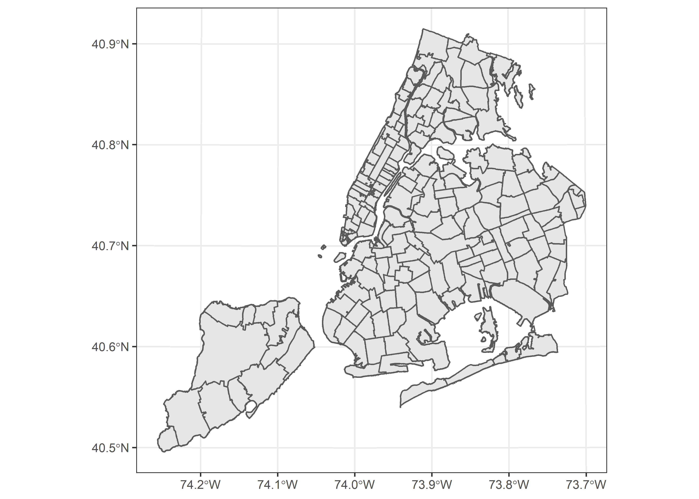
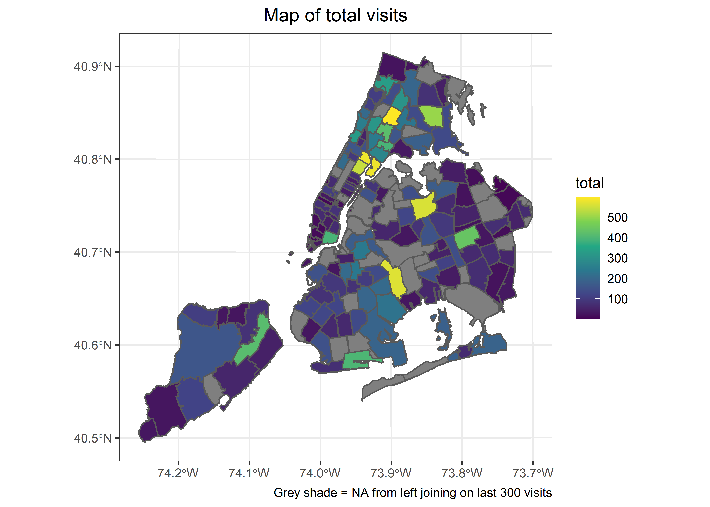

NYC Emergency Visits
================
Matthew
5/19/2022

# Read Data

``` r
emergencyVisits <- 
fromJSON("https://data.cityofnewyork.us/resource/2nwg-uqyg.json?$limit=3000")
```

# Part 1

## Alter date column and remove ‘extract\_date’

``` r
emergencyVisits <- emergencyVisits %>% 
  mutate(date = as.POSIXct(date)) %>% 
  select(-extract_date) 
```

## Last 300 Visits

``` r
last300 <- emergencyVisits %>% 
  arrange(desc(date)) %>% 
  head(300)
```

## Convert appropriate columns to numeric

``` r
last300 <- last300 %>% 
  rename(ZIPCODE = mod_zcta) %>% 
  mutate(across(.cols = -c(date, ZIPCODE), as.numeric))
```

## Number of visits per zip code

``` r
last300 %>% 
  group_by(ZIPCODE) %>% 
  summarize(total = sum(total_ed_visits)) %>% 
  arrange(-total)
```

    ## # A tibble: 141 x 2
    ##    ZIPCODE total
    ##    <chr>   <dbl>
    ##  1 11207     608
    ##  2 10027     544
    ##  3 11373     431
    ##  4 11203     389
    ##  5 10451     352
    ##  6 10032     330
    ##  7 10301     312
    ##  8 11210     303
    ##  9 10304     301
    ## 10 10459     291
    ## # ... with 131 more rows

# Part 2

``` r
NYCmap <- st_read("C:/Users/Matthew Hondrakis/Downloads/ZIP_CODE_040114", layer = "ZIP_CODE_040114")
```

    ## Reading layer `ZIP_CODE_040114' from data source 
    ##   `C:\Users\Matthew Hondrakis\Downloads\ZIP_CODE_040114' using driver `ESRI Shapefile'
    ## Simple feature collection with 263 features and 12 fields
    ## Geometry type: POLYGON
    ## Dimension:     XY
    ## Bounding box:  xmin: 913129 ymin: 120020.9 xmax: 1067494 ymax: 272710.9
    ## Projected CRS: NAD83 / New York Long Island (ftUS)

## Plot empty map

``` r
NYCmap %>% 
  ggplot() + geom_sf() 
```

<!-- -->

# Part 3

## Join data

``` r
joined_data <- last300 %>% 
  inner_join(NYCmap)
```

    ## Joining, by = "ZIPCODE"

## Colored Map by Visits

``` r
NYCmap %>% 
  left_join(last300) %>% 
  group_by(ZIPCODE) %>% 
  mutate(total = sum(total_ed_visits)) %>% 
  ggplot(aes(fill = total)) + geom_sf() +
  scale_fill_viridis_c() + 
  labs(title = "Map of total visits", caption = "Grey shade = NA from left joining on last 300 visits") +
  theme(plot.title = element_text(hjust = 0.5))
```

    ## Joining, by = "ZIPCODE"

<!-- -->

# Part 4
