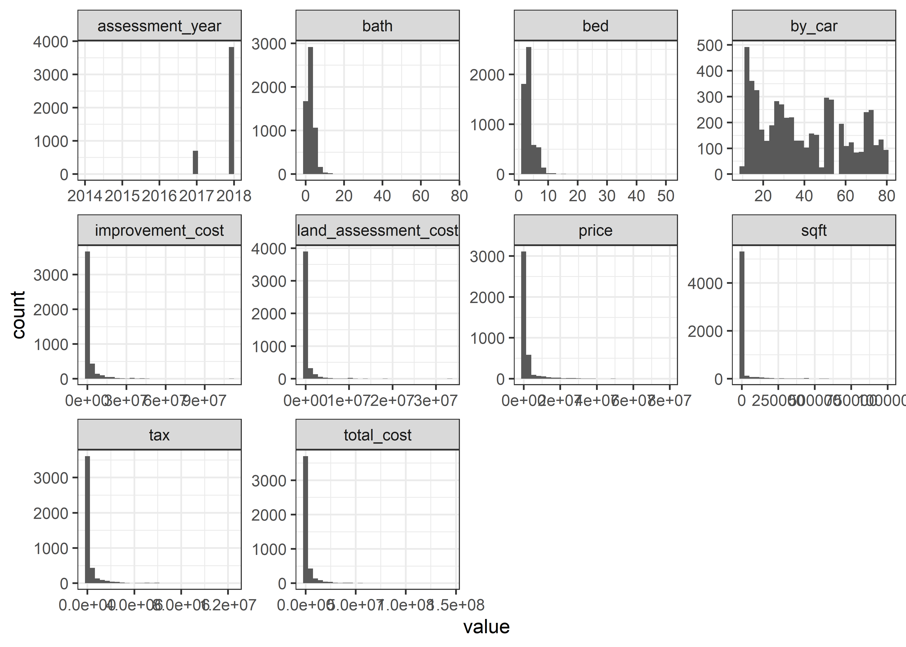
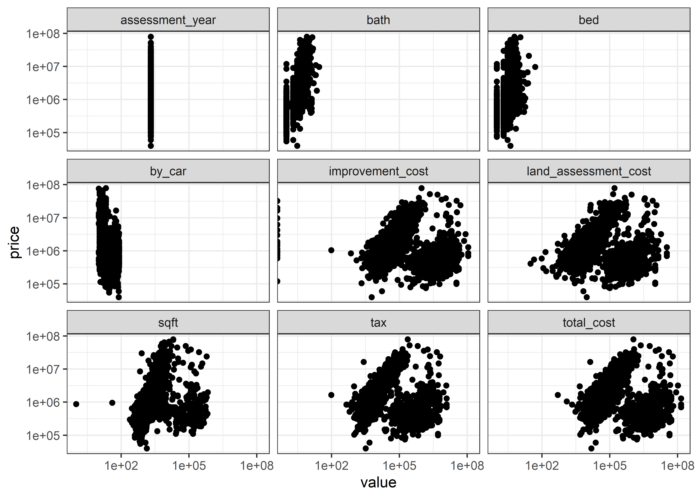

NYC House Prices
================
Matthew
4/24/2022

``` r
house <- read_csv("C:/Users/Matthew Hondrakis/OneDrive/Documents/data_lat_long2.csv")
```

    ## New names:
    ## * `` -> ...1

    ## Rows: 6163 Columns: 28
    ## -- Column specification --------------------------------------------------------
    ## Delimiter: ","
    ## chr (23): bath, bed, sqft, address, estimated mortage, school information, c...
    ## dbl  (5): ...1, Price, assessment year, Lat, Lon
    ## 
    ## i Use `spec()` to retrieve the full column specification for this data.
    ## i Specify the column types or set `show_col_types = FALSE` to quiet this message.

``` r
house <- house[,-1]
```

# Explore Data and Clean

``` r
house[1:20,] %>% 
  View()

skim(house)
```

|                                                  |       |
|:-------------------------------------------------|:------|
| Name                                             | house |
| Number of rows                                   | 6163  |
| Number of columns                                | 27    |
| \_\_\_\_\_\_\_\_\_\_\_\_\_\_\_\_\_\_\_\_\_\_\_   |       |
| Column type frequency:                           |       |
| character                                        | 23    |
| numeric                                          | 4     |
| \_\_\_\_\_\_\_\_\_\_\_\_\_\_\_\_\_\_\_\_\_\_\_\_ |       |
| Group variables                                  | None  |

Data summary

**Variable type: character**

| skim\_variable                               | n\_missing | complete\_rate | min |  max | empty | n\_unique | whitespace |
|:---------------------------------------------|-----------:|---------------:|----:|-----:|------:|----------:|-----------:|
| bath                                         |        270 |           0.96 |   6 |    9 |     0 |        26 |          0 |
| bed                                          |        210 |           0.97 |   5 |    7 |     0 |        25 |          0 |
| sqft                                         |        364 |           0.94 |   6 |   12 |     0 |      2274 |          0 |
| address                                      |          0 |           1.00 |  25 |   53 |     0 |      5370 |          0 |
| estimated mortage                            |        201 |           0.97 |  19 |   26 |     0 |      4189 |          0 |
| school information                           |          0 |           1.00 |  21 |   61 |     0 |        50 |          0 |
| crime information                            |          0 |           1.00 |  37 |   62 |     0 |        33 |          0 |
| commute information                          |          0 |           1.00 |  40 |   47 |     0 |        65 |          0 |
| shop and eat information                     |          0 |           1.00 |  36 |   56 |     0 |      5027 |          0 |
| description                                  |         14 |           1.00 |   1 | 3003 |     0 |      5751 |          0 |
| home details                                 |          1 |           1.00 |   8 |  882 |     0 |      5975 |          0 |
| price details                                |       1581 |           0.74 |  11 | 8859 |     0 |      4183 |          0 |
| tax                                          |       1629 |           0.74 |   3 |  363 |     0 |      3076 |          0 |
| land assessment cost                         |       1629 |           0.74 |   3 |  138 |     0 |      3517 |          0 |
| improvement cost                             |       1630 |           0.74 |   2 |  171 |     0 |      3824 |          0 |
| total cost                                   |       1630 |           0.74 |   4 |  693 |     0 |      3095 |          0 |
| neighborhood name                            |         40 |           0.99 |   4 |   35 |     0 |       248 |          0 |
| what local say about the neighborhood        |         67 |           0.99 |   6 |  454 |     0 |       528 |          0 |
| comments of residents and previous residents |         58 |           0.99 |   7 | 8260 |     0 |       619 |          0 |
| comparable properties                        |       1567 |           0.75 |   7 | 6722 |     0 |      4511 |          0 |
| provider info                                |        392 |           0.94 |   7 | 4027 |     0 |      3960 |          0 |
| seo description                              |          0 |           1.00 |  14 | 1163 |     0 |      5812 |          0 |
| linktoproperty                               |          0 |           1.00 |  68 | 4952 |     0 |      5812 |          0 |

**Variable type: numeric**

| skim\_variable  | n\_missing | complete\_rate |       mean |         sd |       p0 |       p25 |       p50 |        p75 |       p100 | hist  |
|:----------------|-----------:|---------------:|-----------:|-----------:|---------:|----------:|----------:|-----------:|-----------:|:------|
| Price           |       2065 |           0.66 | 2324633.85 | 5814353.04 | 40000.00 | 528952.00 | 785000.00 | 1325000.00 |  7.900e+07 | ▇▁▁▁▁ |
| assessment year |       1635 |           0.73 |    2017.84 |       0.37 |  2014.00 |   2018.00 |   2018.00 |    2018.00 |  2.018e+03 | ▁▁▁▂▇ |
| Lat             |       1079 |           0.82 |      40.71 |       0.12 |    40.50 |     40.62 |     40.71 |      40.77 |  4.317e+01 | ▇▁▁▁▁ |
| Lon             |       1079 |           0.82 |     -73.96 |       0.14 |   -77.59 |    -74.00 |    -73.96 |     -73.90 | -7.265e+01 | ▁▁▁▇▁ |

``` r
house <- 
  house %>% rename_with(tolower) %>% 
  rename_with( ~ gsub(" information", "", .x)) %>% 
  rename_with( ~ gsub(" ", "_", .x))
```

``` r
house <- house %>% 
  mutate(across(c(bath:sqft, tax:total_cost), ~ parse_number(.x)))

house <- house %>% 
  rename(by_car = commute) %>% 
  mutate(by_car = parse_number(by_car))


house <- house %>% 
  mutate(type = sub(",.*","", home_details))
```

``` r
house %>% 
  keep(is.numeric) %>% 
  select(-lon, -lat) %>% 
  gather() %>% 
  ggplot(aes(value)) + geom_histogram() + facet_wrap(~key, scales = "free")
```

    ## `stat_bin()` using `bins = 30`. Pick better value with `binwidth`.

<!-- -->

``` r
house %>% 
  keep(is.numeric) %>% 
  select(-lon, -lat) %>% 
  pivot_longer(-price) %>% 
  ggplot(aes(value, price)) + geom_point() +
  scale_y_log10() + scale_x_log10() +
  facet_wrap(~name)
```

<!-- -->

``` r
house %>% 
  select_if(is.numeric) %>% 
  drop_na() %>% 
  pivot_longer(-price) %>% 
  group_by(name) %>% 
  summarize(corr = cor(price, value)) %>% 
  arrange(-abs(corr))
```

    ## # A tibble: 11 x 2
    ##    name                     corr
    ##    <chr>                   <dbl>
    ##  1 bath                  0.445  
    ##  2 by_car               -0.251  
    ##  3 bed                   0.220  
    ##  4 lat                   0.139  
    ##  5 land_assessment_cost  0.123  
    ##  6 assessment_year       0.120  
    ##  7 tax                   0.111  
    ##  8 total_cost            0.106  
    ##  9 improvement_cost      0.101  
    ## 10 sqft                  0.0889 
    ## 11 lon                  -0.00669

``` r
tidy_model <- house %>% 
  select_if(is.numeric) %>% 
  drop_na() %>% 
  pivot_longer(-price) %>% 
  nest(-name) %>% 
  mutate(mod = map(data, ~ lm(log(price) ~ value, .x)),
         tidy = map(mod, broom::tidy)) %>% 
  unnest(tidy)
```

``` r
tidy_model %>% 
  filter(term == "value") %>% 
  arrange(-abs(estimate))
```

    ## # A tibble: 11 x 8
    ##    name              data     mod   term  estimate std.error statistic   p.value
    ##    <chr>             <list>   <lis> <chr>    <dbl>     <dbl>     <dbl>     <dbl>
    ##  1 lat               <tibble> <lm>  value  9.52e-1   1.73e-1     5.51  3.98e-  8
    ##  2 assessment_year   <tibble> <lm>  value  3.34e-1   4.38e-2     7.63  3.47e- 14
    ##  3 bath              <tibble> <lm>  value  2.86e-1   7.97e-3    35.9   2.00e-223
    ##  4 bed               <tibble> <lm>  value  1.85e-1   8.21e-3    22.5   3.08e-101
    ##  5 lon               <tibble> <lm>  value -1.61e-1   1.69e-1    -0.951 3.42e-  1
    ##  6 by_car            <tibble> <lm>  value -1.40e-2   8.54e-4   -16.4   6.12e- 57
    ##  7 sqft              <tibble> <lm>  value  4.56e-7   3.35e-7     1.36  1.74e-  1
    ##  8 tax               <tibble> <lm>  value  9.04e-8   2.63e-8     3.43  6.13e-  4
    ##  9 land_assessment_~ <tibble> <lm>  value  6.93e-8   1.46e-8     4.74  2.29e-  6
    ## 10 improvement_cost  <tibble> <lm>  value  1.03e-8   3.61e-9     2.87  4.20e-  3
    ## 11 total_cost        <tibble> <lm>  value  9.59e-9   2.93e-9     3.27  1.08e-  3
