NYC House Prices
================
Matthew
4/24/2022

``` r
house <- read_csv("C:/Users/Matthew Hondrakis/OneDrive/Documents/data_lat_long2.csv")
```

    ## New names:
    ## * `` -> ...1

    ## Rows: 6163 Columns: 28
    ## -- Column specification --------------------------------------------------------
    ## Delimiter: ","
    ## chr (23): bath, bed, sqft, address, estimated mortage, school information, c...
    ## dbl  (5): ...1, Price, assessment year, Lat, Lon
    ## 
    ## i Use `spec()` to retrieve the full column specification for this data.
    ## i Specify the column types or set `show_col_types = FALSE` to quiet this message.

``` r
house <- house[,-1]
```

# Explore and Clean

``` r
house[1:20,] %>% 
  View()

skim(house)
```

|                                                  |       |
|:-------------------------------------------------|:------|
| Name                                             | house |
| Number of rows                                   | 6163  |
| Number of columns                                | 27    |
| \_\_\_\_\_\_\_\_\_\_\_\_\_\_\_\_\_\_\_\_\_\_\_   |       |
| Column type frequency:                           |       |
| character                                        | 23    |
| numeric                                          | 4     |
| \_\_\_\_\_\_\_\_\_\_\_\_\_\_\_\_\_\_\_\_\_\_\_\_ |       |
| Group variables                                  | None  |

Data summary

**Variable type: character**

| skim\_variable                               | n\_missing | complete\_rate | min |  max | empty | n\_unique | whitespace |
|:---------------------------------------------|-----------:|---------------:|----:|-----:|------:|----------:|-----------:|
| bath                                         |        270 |           0.96 |   6 |    9 |     0 |        26 |          0 |
| bed                                          |        210 |           0.97 |   5 |    7 |     0 |        25 |          0 |
| sqft                                         |        364 |           0.94 |   6 |   12 |     0 |      2274 |          0 |
| address                                      |          0 |           1.00 |  25 |   53 |     0 |      5370 |          0 |
| estimated mortage                            |        201 |           0.97 |  19 |   26 |     0 |      4189 |          0 |
| school information                           |          0 |           1.00 |  21 |   61 |     0 |        50 |          0 |
| crime information                            |          0 |           1.00 |  37 |   62 |     0 |        33 |          0 |
| commute information                          |          0 |           1.00 |  40 |   47 |     0 |        65 |          0 |
| shop and eat information                     |          0 |           1.00 |  36 |   56 |     0 |      5027 |          0 |
| description                                  |         14 |           1.00 |   1 | 3003 |     0 |      5751 |          0 |
| home details                                 |          1 |           1.00 |   8 |  882 |     0 |      5975 |          0 |
| price details                                |       1581 |           0.74 |  11 | 8859 |     0 |      4183 |          0 |
| tax                                          |       1629 |           0.74 |   3 |  363 |     0 |      3076 |          0 |
| land assessment cost                         |       1629 |           0.74 |   3 |  138 |     0 |      3517 |          0 |
| improvement cost                             |       1630 |           0.74 |   2 |  171 |     0 |      3824 |          0 |
| total cost                                   |       1630 |           0.74 |   4 |  693 |     0 |      3095 |          0 |
| neighborhood name                            |         40 |           0.99 |   4 |   35 |     0 |       248 |          0 |
| what local say about the neighborhood        |         67 |           0.99 |   6 |  454 |     0 |       528 |          0 |
| comments of residents and previous residents |         58 |           0.99 |   7 | 8260 |     0 |       619 |          0 |
| comparable properties                        |       1567 |           0.75 |   7 | 6722 |     0 |      4511 |          0 |
| provider info                                |        392 |           0.94 |   7 | 4027 |     0 |      3960 |          0 |
| seo description                              |          0 |           1.00 |  14 | 1163 |     0 |      5812 |          0 |
| linktoproperty                               |          0 |           1.00 |  68 | 4952 |     0 |      5812 |          0 |

**Variable type: numeric**

| skim\_variable  | n\_missing | complete\_rate |       mean |         sd |       p0 |       p25 |       p50 |        p75 |       p100 | hist  |
|:----------------|-----------:|---------------:|-----------:|-----------:|---------:|----------:|----------:|-----------:|-----------:|:------|
| Price           |       2065 |           0.66 | 2324633.85 | 5814353.04 | 40000.00 | 528952.00 | 785000.00 | 1325000.00 |  7.900e+07 | ▇▁▁▁▁ |
| assessment year |       1635 |           0.73 |    2017.84 |       0.37 |  2014.00 |   2018.00 |   2018.00 |    2018.00 |  2.018e+03 | ▁▁▁▂▇ |
| Lat             |       1079 |           0.82 |      40.71 |       0.12 |    40.50 |     40.62 |     40.71 |      40.77 |  4.317e+01 | ▇▁▁▁▁ |
| Lon             |       1079 |           0.82 |     -73.96 |       0.14 |   -77.59 |    -74.00 |    -73.96 |     -73.90 | -7.265e+01 | ▁▁▁▇▁ |

``` r
house <- 
  house %>% rename_with(tolower) %>% 
  rename_with( ~ gsub(" information", "", .x)) %>% 
  rename_with( ~ gsub(" ", "_", .x))
```

``` r
house <- house %>% 
  mutate(across(c(bath:sqft, tax:total_cost), ~ parse_number(.x)))

house <- house %>% 
  rename(by_car = commute) %>% 
  mutate(by_car = parse_number(by_car))


house <- house %>% 
  mutate(type = sub(",.*","", home_details))
```

``` r
house %>% 
  keep(is.numeric) %>% 
  select(-lon, -lat) %>% 
  gather() %>% 
  ggplot(aes(value)) + geom_histogram() + facet_wrap(~key, scales = "free")
```

    ## `stat_bin()` using `bins = 30`. Pick better value with `binwidth`.

<!-- -->

``` r
house %>% 
  keep(is.numeric) %>% 
  select(-lon, -lat) %>% 
  pivot_longer(-price) %>% 
  ggplot(aes(value, price)) + geom_point() +
  scale_y_log10() + scale_x_log10() +
  facet_wrap(~name)
```

<!-- -->

``` r
house %>% 
  select_if(is.numeric) %>% 
  select(-lon, -lat) %>% 
  drop_na() %>% 
  pivot_longer(-price) %>% 
  group_by(name) %>% 
  summarize(corr = cor(price, value)) %>% 
  arrange(-abs(corr))
```

    ## # A tibble: 9 x 2
    ##   name                    corr
    ##   <chr>                  <dbl>
    ## 1 bath                  0.428 
    ## 2 by_car               -0.245 
    ## 3 bed                   0.214 
    ## 4 land_assessment_cost  0.145 
    ## 5 tax                   0.133 
    ## 6 total_cost            0.130 
    ## 7 improvement_cost      0.124 
    ## 8 sqft                  0.100 
    ## 9 assessment_year       0.0955

``` r
tidy_model <- house %>% 
  select_if(is.numeric) %>% 
  select(-lon, -lat) %>% 
  drop_na() %>% 
  pivot_longer(-price) %>% 
  nest(-name) %>% 
  mutate(mod = map(data, ~ lm(log(price) ~ value, .x)),
         tidy = map(mod, broom::tidy)) %>% 
  unnest(tidy)
```

``` r
tidy_model %>% 
  filter(term == "value") %>% 
  arrange(-abs(estimate))
```

    ## # A tibble: 9 x 8
    ##   name               data     mod   term  estimate std.error statistic   p.value
    ##   <chr>              <list>   <lis> <chr>    <dbl>     <dbl>     <dbl>     <dbl>
    ## 1 assessment_year    <tibble> <lm>  value  3.00e-1   3.92e-2      7.65 2.80e- 14
    ## 2 bath               <tibble> <lm>  value  2.75e-1   6.90e-3     39.8  1.71e-276
    ## 3 bed                <tibble> <lm>  value  1.80e-1   7.00e-3     25.8  6.10e-132
    ## 4 by_car             <tibble> <lm>  value -1.24e-2   7.21e-4    -17.2  2.53e- 63
    ## 5 sqft               <tibble> <lm>  value  3.87e-7   2.93e-7      1.32 1.86e-  1
    ## 6 tax                <tibble> <lm>  value  9.22e-8   2.38e-8      3.88 1.09e-  4
    ## 7 land_assessment_c~ <tibble> <lm>  value  7.16e-8   1.33e-8      5.39 7.70e-  8
    ## 8 improvement_cost   <tibble> <lm>  value  1.09e-8   3.26e-9      3.35 8.11e-  4
    ## 9 total_cost         <tibble> <lm>  value  1.00e-8   2.65e-9      3.80 1.50e-  4

## Checking correlated variables

``` r
gplot <- function(x){
  (house %>% 
    filter(!is.na({{x}}), !is.na(price)) %>% 
    ggplot(aes({{x}}, price, group = {{x}})) + geom_boxplot() + scale_y_log10()) +
  (house %>% 
     filter(!is.na({{x}}), !is.na(price)) %>% 
     group_by({{x}}) %>% 
     summarize(m = mean(price, na.rm = TRUE)) %>% 
     ggplot(aes({{x}}, m)) + geom_line() + scale_y_log10())
}

gplot(bath)
```

<!-- -->

``` r
gplot(bed)
```

<!-- -->

``` r
gplot(assessment_year)
```

<!-- -->

``` r
house %>% 
  filter(price != 0, !is.na(price)) %>% 
  mutate(price = price/1e3,
         type = fct_lump(type, 7),
         type = fct_reorder(type, price, median)) %>% 
  ggplot(aes(price, type)) + geom_boxplot() +
  scale_x_log10(labels = scales::comma) + labs(x = "", title = "Price in thousands") +
  theme(plot.margin = margin(10,50,10,0))
```

<!-- -->

## Plots of Price by numerics

``` r
gplot2 <- function(x){
  house %>% 
    ggplot(aes({{x}}, price, color = fct_lump(type, 6))) + 
    geom_point() +
    scale_x_log10() + scale_y_log10()
}
(gplot2(tax) +
gplot2(total_cost) +
gplot2(land_assessment_cost)) /
(gplot2(sqft) +
gplot2(improvement_cost)) + plot_layout(guides = 'collect')
```

<!-- -->

# Model

## Preprocess

``` r
house <- house %>% 
  mutate(type_mod = fct_lump(type, 6))

house_mod <- house %>% 
  select(price, tax, total_cost, sqft, land_assessment_cost,
         improvement_cost, type_mod, bath, bed, address) %>% 
  drop_na() %>% 
  filter_if(is.numeric, all_vars(. > 0))

house_mod %>% 
  keep(is.numeric) %>% 
  cor()
```

    ##                           price         tax  total_cost        sqft
    ## price                1.00000000  0.07593635  0.06624251  0.07727393
    ## tax                  0.07593635  1.00000000  0.99086226  0.48728324
    ## total_cost           0.06624251  0.99086226  1.00000000  0.44406856
    ## sqft                 0.07727393  0.48728324  0.44406856  1.00000000
    ## land_assessment_cost 0.07131328  0.94467569  0.96450910  0.38640371
    ## improvement_cost     0.06414354  0.99137901  0.99761312  0.45396698
    ## bath                 0.44701449 -0.07189192 -0.07345366 -0.06450716
    ## bed                  0.21414699 -0.16695827 -0.15946214 -0.13076296
    ##                      land_assessment_cost improvement_cost        bath
    ## price                          0.07131328       0.06414354  0.44701449
    ## tax                            0.94467569       0.99137901 -0.07189192
    ## total_cost                     0.96450910       0.99761312 -0.07345366
    ## sqft                           0.38640371       0.45396698 -0.06450716
    ## land_assessment_cost           1.00000000       0.94397401 -0.04720870
    ## improvement_cost               0.94397401       1.00000000 -0.07945988
    ## bath                          -0.04720870      -0.07945988  1.00000000
    ## bed                           -0.12324898      -0.16707156  0.62187514
    ##                             bed
    ## price                 0.2141470
    ## tax                  -0.1669583
    ## total_cost           -0.1594621
    ## sqft                 -0.1307630
    ## land_assessment_cost -0.1232490
    ## improvement_cost     -0.1670716
    ## bath                  0.6218751
    ## bed                   1.0000000

``` r
house_mod %>% 
  keep(is.numeric) %>% 
  pivot_longer(-tax) %>% 
  ggplot(aes(tax, value)) + geom_point() +
  facet_wrap(~name, scales = "free")
```

<!-- -->

``` r
house_mod %>% 
  ggplot(aes(bath, price)) + geom_point() + scale_y_log10() +
  geom_smooth()
```

    ## `geom_smooth()` using method = 'gam' and formula 'y ~ s(x, bs = "cs")'

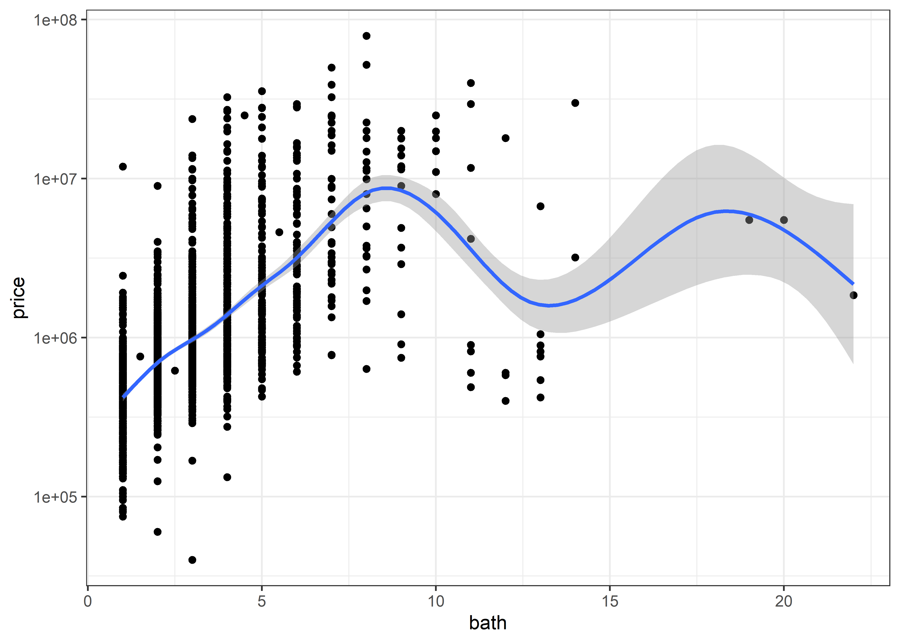<!-- -->

``` r
updated_model <- 
  lm(log(price) ~ (log(sqft) + log(tax) + bath) * type_mod, 
   house_mod)

anova(updated_model)
```

    ## Analysis of Variance Table
    ## 
    ## Response: log(price)
    ##                      Df Sum Sq Mean Sq   F value  Pr(>F)    
    ## log(sqft)             1 223.79  223.79  888.5009 < 2e-16 ***
    ## log(tax)              1   0.88    0.88    3.5067 0.06122 .  
    ## bath                  1 771.45  771.45 3062.8759 < 2e-16 ***
    ## type_mod              6 344.56   57.43  228.0026 < 2e-16 ***
    ## log(sqft):type_mod    5 182.22   36.44  144.6928 < 2e-16 ***
    ## log(tax):type_mod     5  25.44    5.09   20.2023 < 2e-16 ***
    ## bath:type_mod         5 146.88   29.38  116.6327 < 2e-16 ***
    ## Residuals          3058 770.22    0.25                      
    ## ---
    ## Signif. codes:  0 '***' 0.001 '**' 0.01 '*' 0.05 '.' 0.1 ' ' 1

``` r
summary(updated_model)
```

    ## 
    ## Call:
    ## lm(formula = log(price) ~ (log(sqft) + log(tax) + bath) * type_mod, 
    ##     data = house_mod)
    ## 
    ## Residuals:
    ##     Min      1Q  Median      3Q     Max 
    ## -4.6162 -0.2469 -0.0219  0.2375  3.1464 
    ## 
    ## Coefficients: (3 not defined because of singularities)
    ##                                       Estimate Std. Error t value Pr(>|t|)    
    ## (Intercept)                           12.19048    0.67783  17.985  < 2e-16 ***
    ## log(sqft)                             -0.02840    0.05846  -0.486  0.62710    
    ## log(tax)                               0.03633    0.05185   0.701  0.48353    
    ## bath                                   0.68004    0.11856   5.736 1.07e-08 ***
    ## type_modCondo                         -8.05309    0.96481  -8.347  < 2e-16 ***
    ## type_modCoop                          -1.44071    0.71916  -2.003  0.04523 *  
    ## type_modMulti Family                  -4.33679    0.82684  -5.245 1.67e-07 ***
    ## type_modSingle Family Home            -4.23697    0.71429  -5.932 3.33e-09 ***
    ## type_modTownhouse                    -10.15189    0.88895 -11.420  < 2e-16 ***
    ## type_modOther                         -3.03641    0.73193  -4.149 3.44e-05 ***
    ## log(sqft):type_modCondo                1.14003    0.12494   9.124  < 2e-16 ***
    ## log(sqft):type_modCoop                 0.08402    0.05937   1.415  0.15708    
    ## log(sqft):type_modMulti Family         0.38250    0.08653   4.420 1.02e-05 ***
    ## log(sqft):type_modSingle Family Home   0.21924    0.06837   3.207  0.00136 ** 
    ## log(sqft):type_modTownhouse            1.01197    0.11804   8.573  < 2e-16 ***
    ## log(sqft):type_modOther                     NA         NA      NA       NA    
    ## log(tax):type_modCondo                 0.08954    0.05735   1.561  0.11857    
    ## log(tax):type_modCoop                  0.04712    0.05528   0.852  0.39409    
    ## log(tax):type_modMulti Family          0.31363    0.06619   4.738 2.26e-06 ***
    ## log(tax):type_modSingle Family Home    0.41476    0.05990   6.924 5.32e-12 ***
    ## log(tax):type_modTownhouse             0.48069    0.06979   6.888 6.84e-12 ***
    ## log(tax):type_modOther                      NA         NA      NA       NA    
    ## bath:type_modCondo                    -0.39376    0.12706  -3.099  0.00196 ** 
    ## bath:type_modCoop                     -0.09088    0.12048  -0.754  0.45074    
    ## bath:type_modMulti Family             -0.62703    0.11920  -5.261 1.54e-07 ***
    ## bath:type_modSingle Family Home       -0.58201    0.11898  -4.892 1.05e-06 ***
    ## bath:type_modTownhouse                -0.70280    0.12093  -5.812 6.83e-09 ***
    ## bath:type_modOther                          NA         NA      NA       NA    
    ## ---
    ## Signif. codes:  0 '***' 0.001 '**' 0.01 '*' 0.05 '.' 0.1 ' ' 1
    ## 
    ## Residual standard error: 0.5019 on 3058 degrees of freedom
    ## Multiple R-squared:  0.6876, Adjusted R-squared:  0.6851 
    ## F-statistic: 280.4 on 24 and 3058 DF,  p-value: < 2.2e-16

``` r
(augment(updated_model) %>% 
  ggplot(aes(`log(price)`,.fitted, color = type_mod)) + 
  geom_point(alpha = 0.5) + geom_abline()) /
(augment(updated_model) %>% 
  mutate(residual = .fitted - `log(price)`) %>% 
  ggplot(aes(.fitted, residual, color = type_mod)) + 
  geom_point(alpha = 0.5) +
  geom_hline(yintercept = 0)) + plot_layout(guides = "collect")
```

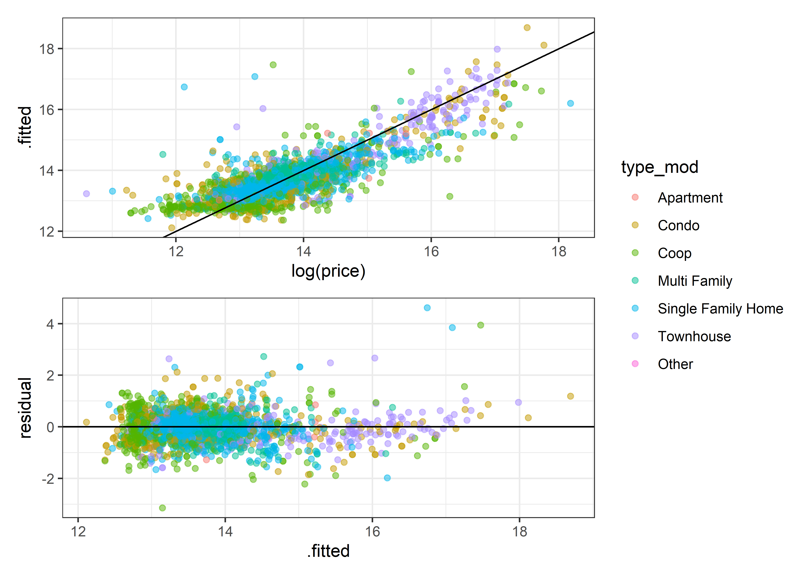<!-- -->

``` r
hist(residuals(updated_model))
```

<!-- -->

## Tidymodels

### Set up and data split

``` r
set.seed(123)
house_split <- initial_split(house_mod %>% 
                               mutate(price = log(price),
                                      tax = log(tax),
                                      sqft = log(sqft),
                                      bath = log(bath), 
                             strata = bath))
house_test <- testing(house_split)
house_train <- training(house_split)
```

### Model creating and fit

``` r
mod <- linear_reg() %>% 
  set_mode("regression") %>% 
  set_engine("lm")
rec <- recipe(price ~ tax + sqft + 
                     bath + type_mod, house_train) %>% 
  step_dummy(all_nominal_predictors()) %>%
  step_interact(terms = ~ starts_with("type"):all_predictors())
wkfl <- workflow() %>% 
  add_model(mod) %>% 
  add_recipe(rec)
wkfl_fit <- fit(wkfl, house_train)
```

### Analysis

``` r
house_res <- 
  house_test %>% 
  bind_cols(predict(wkfl_fit, house_test))
```

``` r
(house_res %>%
  mutate(residuals = price - .pred) %>% 
  ggplot(aes(.pred, residuals, color = type_mod)) + 
  geom_point(alpha = 0.5) + geom_hline(yintercept = 0)) /
(house_res %>%  
  ggplot(aes(.pred, price, color = type_mod)) + 
  geom_point(alpha = 0.5) + geom_abline()) + plot_layout(guide = "collect")
```

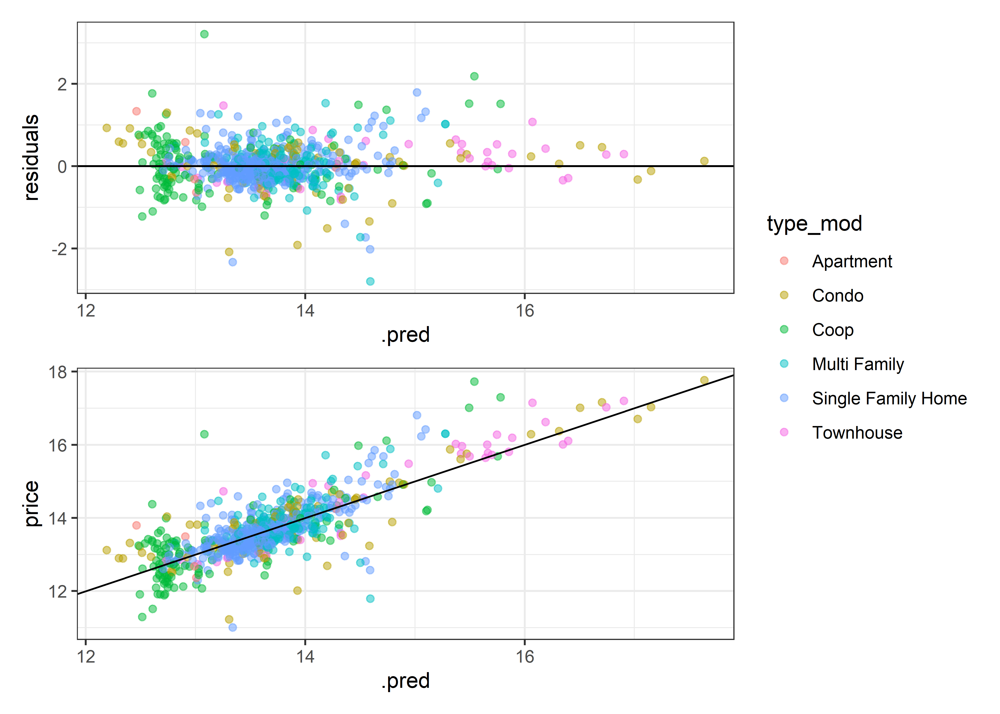<!-- -->

``` r
three_metrics <- metric_set(rsq, rmse, mae)

joined_metrics <- three_metrics(augment(updated_model) %>% 
      rename(price = `log(price)`),
    price, .fitted) %>% 
  mutate(model = "1") %>% 
  bind_rows(three_metrics(house_res, price, .pred) %>% 
              mutate(model = "2"))

joined_metrics %>% arrange(desc(.metric))
```

    ## # A tibble: 6 x 4
    ##   .metric .estimator .estimate model
    ##   <chr>   <chr>          <dbl> <chr>
    ## 1 rsq     standard       0.688 1    
    ## 2 rsq     standard       0.681 2    
    ## 3 rmse    standard       0.500 1    
    ## 4 rmse    standard       0.508 2    
    ## 5 mae     standard       0.346 1    
    ## 6 mae     standard       0.349 2

``` r
joined_metrics %>% 
  ggplot(aes(.estimate, .metric, fill = model)) +
  geom_col(position = "dodge") +
  labs(title = "Base R model (1) vs Tidymodels (2)",
       caption = "Comparison is not equal; the fit methods were done differently. \n
       Did not separate a training/testing dataset for the first model")
```

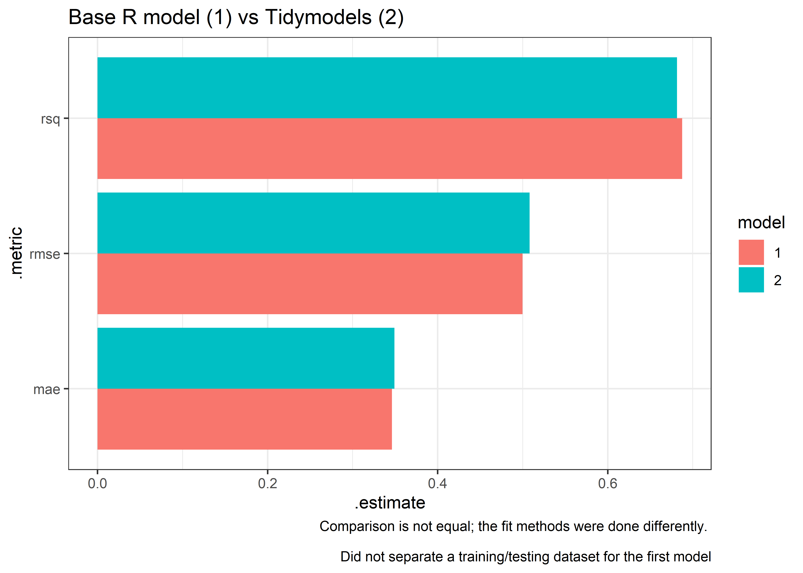<!-- -->

``` r
house <- house %>% 
  mutate(zip_code = str_sub(address, - 5, - 1))

x <- house %>% 
  filter(!is.na(price)) %>% 
  group_by(zip_code) %>% 
  summarize(m = median(price)) %>% 
  arrange(-m) %>% 
  head(20) %>% 
  pull(zip_code)
y <- house %>% 
  filter(!is.na(price)) %>% 
  group_by(zip_code) %>% 
  summarize(m = median(price)) %>% 
  arrange(-m) %>% 
  tail(20) %>% 
  pull(zip_code)
  
house %>% 
  select(zip_code, price) %>% group_by(zip_code) %>% 
  filter(!is.na(price), zip_code %in% c(x,y)) %>% 
  group_by(zip_code) %>% 
  ggplot(aes(price, fct_reorder(zip_code, price, median))) + geom_boxplot() +
  scale_x_log10() + labs(y = "", title = "House Prices in NYC by zipcode", x = "Price (log10 scale)")
```

<!-- -->

## No Taxes!

``` r
wkfl2 <- workflow() %>% 
  add_model(mod) %>% 
  add_recipe(recipe(price ~ sqft + 
                     bath + type_mod, house_train) %>% 
  step_dummy(all_nominal_predictors()) %>%
  step_interact(terms = ~ starts_with("type"):all_predictors()))

wkfl_fit2 <- fit(wkfl2, house_train)
```

``` r
house_res2 <- house_test %>%
  bind_cols(predict(wkfl_fit2, house_test))
  
all_metrics <- joined_metrics %>% 
  bind_rows(three_metrics(house_res2, price, .pred) %>% 
              mutate(model = "3"))
```

``` r
all_metrics %>% 
  ggplot(aes(.estimate, .metric, fill = model)) +
  geom_col(position = "dodge")
```

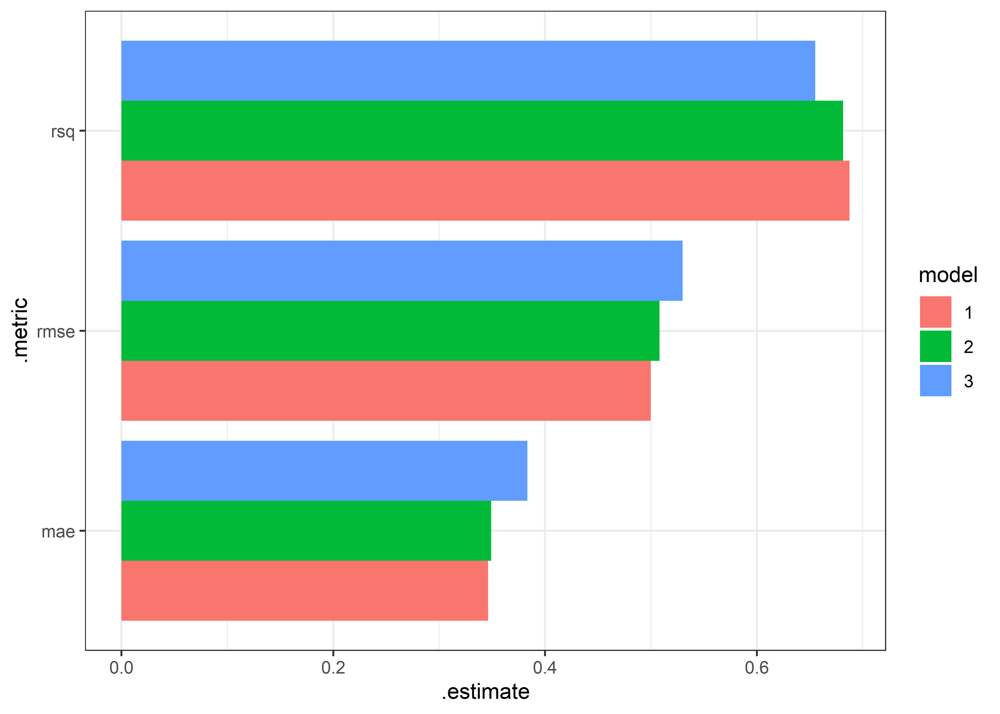<!-- -->

``` r
all_metrics %>% 
  arrange(desc(.metric), -.estimate)
```

    ## # A tibble: 9 x 4
    ##   .metric .estimator .estimate model
    ##   <chr>   <chr>          <dbl> <chr>
    ## 1 rsq     standard       0.688 1    
    ## 2 rsq     standard       0.681 2    
    ## 3 rsq     standard       0.655 3    
    ## 4 rmse    standard       0.530 3    
    ## 5 rmse    standard       0.508 2    
    ## 6 rmse    standard       0.500 1    
    ## 7 mae     standard       0.383 3    
    ## 8 mae     standard       0.349 2    
    ## 9 mae     standard       0.346 1

# Borough?

``` r
house %>% 
  mutate(borough = case_when(
    str_detect(address, "New York") ~ "New York",
    str_detect(address, "Brooklyn") ~ "Brooklyn",
    str_detect(address, "Queens") ~ "Queens",
    str_detect(address, "Bronx") ~ "Bronx",
    str_detect(address, "Staten Island") ~ "Staten Island"
  )) %>% 
  filter(!is.na(borough), !is.na(price)) %>% 
  ggplot(aes(price, borough)) + geom_boxplot() + scale_x_log10()
```

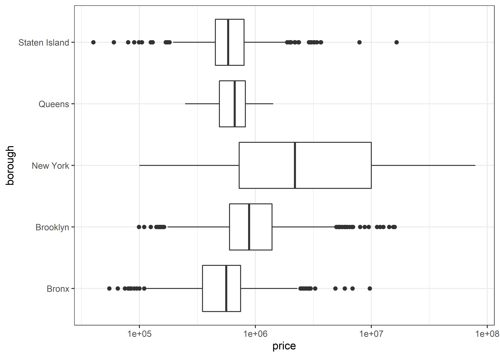<!-- -->

## Don’t miss the forrest for the trees

``` r
house_mod <- house_mod %>%
  mutate(zip_code = str_sub(address, -5, -1))

house_mod %>% 
  ggplot(aes(tax, price, color = zip_code)) + geom_point() +
  theme(legend.position = "none") + scale_x_log10() +
  scale_y_log10()
```

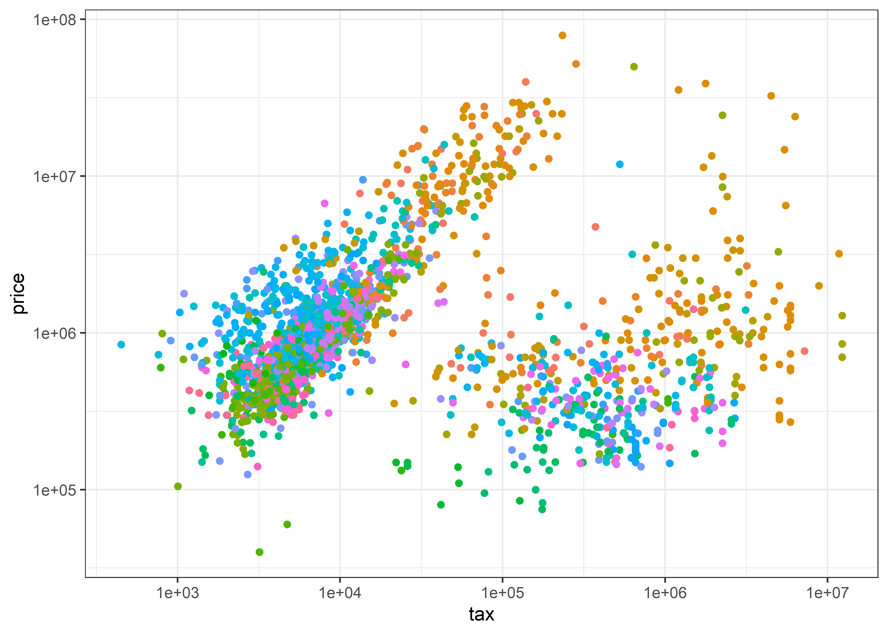<!-- -->

``` r
house_mod2 <- house_mod %>% 
  mutate(zip_code = fct_lump(zip_code, prop = 0.003))
```

``` r
set.seed(123)
split2 <- initial_split(house_mod2 %>% 
                               mutate(price = log(price),
                                      tax = log(tax),
                                      sqft = log(sqft),
                                      zip_code = factor(zip_code),
                                      bath = factor(bath)),
                        strata = zip_code)


train2 <- training(split2)
test2 <- testing(split2)
```

``` r
modrf <- rand_forest() %>% 
  set_mode("regression") %>% 
  set_engine("ranger")


recrf <- recipe(price ~ sqft + type_mod + zip_code, train2) %>% 
  step_dummy(all_nominal_predictors()) %>%
  step_interact(terms = ~ starts_with("zip"):all_predictors())

wkflrf <- workflow() %>% 
  add_model(modrf) %>% 
  add_recipe(recrf)
```

``` r
wkflrf_fit <- fit(wkfl2, train2)

house_res2 <- 
  test2 %>% 
  bind_cols(predict(wkflrf_fit, test2))

all_metrics_rf <- all_metrics %>% 
  bind_rows(three_metrics(house_res2, price, .pred) %>% 
              mutate(model = "4"))

all_metrics_rf %>% 
  arrange(desc(.metric), -.estimate)
```

    ## # A tibble: 12 x 4
    ##    .metric .estimator .estimate model
    ##    <chr>   <chr>          <dbl> <chr>
    ##  1 rsq     standard       0.688 1    
    ##  2 rsq     standard       0.681 2    
    ##  3 rsq     standard       0.655 3    
    ##  4 rsq     standard       0.580 4    
    ##  5 rmse    standard       0.593 4    
    ##  6 rmse    standard       0.530 3    
    ##  7 rmse    standard       0.508 2    
    ##  8 rmse    standard       0.500 1    
    ##  9 mae     standard       0.412 4    
    ## 10 mae     standard       0.383 3    
    ## 11 mae     standard       0.349 2    
    ## 12 mae     standard       0.346 1

``` r
all_metrics_rf %>% 
  ggplot(aes(.estimate, .metric, fill = fct_reorder(model, .estimate, max, .desc = TRUE))) +
  geom_col(position = "dodge") + 
  labs(title = "All 4 Models", 
       subtitle = "Base R lm (Red), TM lm (Blue), TM no tax lm (Purple), Random Forrest (Green)") +
  theme(legend.position = "none") + scale_x_continuous(breaks = seq(0.3,0.7,0.05))
```

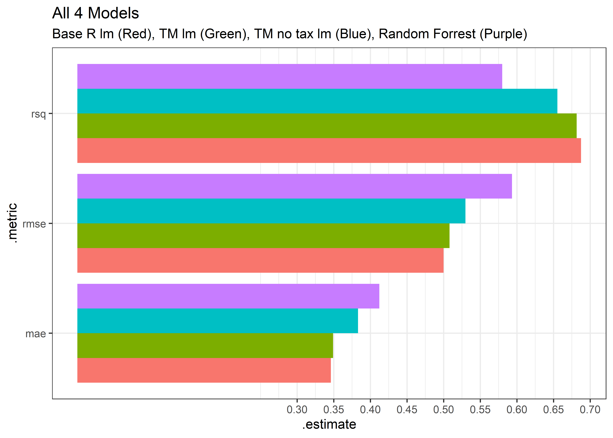<!-- -->

# Just let Gam figure it out

``` r
library(mgcv)
```

    ## Loading required package: nlme

    ## 
    ## Attaching package: 'nlme'

    ## The following object is masked from 'package:dplyr':
    ## 
    ##     collapse

    ## This is mgcv 1.8-39. For overview type 'help("mgcv-package")'.

``` r
set.seed(10)
gam_data <- house %>% 
  select(price, tax, sqft, bath, lon, lat, type_mod) %>% 
  mutate(price = log(price)) %>% 
  drop_na()

gam_split <- initial_split(gam_data, strata = type_mod)

gam_train <- training(gam_split)
gam_test <- testing(gam_split)

gam_mod <- gam(price ~ s(sqft, by = type_mod) + s(bath, by = type_mod) + s(lon, lat), gaussian, gam_train)

summary(gam_mod)
```

    ## 
    ## Family: gaussian 
    ## Link function: identity 
    ## 
    ## Formula:
    ## price ~ s(sqft, by = type_mod) + s(bath, by = type_mod) + s(lon, 
    ##     lat)
    ## 
    ## Parametric coefficients:
    ##             Estimate Std. Error t value Pr(>|t|)    
    ## (Intercept)  13.7306     0.1524   90.09   <2e-16 ***
    ## ---
    ## Signif. codes:  0 '***' 0.001 '**' 0.01 '*' 0.05 '.' 0.1 ' ' 1
    ## 
    ## Approximate significance of smooth terms:
    ##                                       edf Ref.df       F  p-value    
    ## s(sqft):type_modApartment           1.000  1.001   0.716  0.39775    
    ## s(sqft):type_modCondo               2.928  2.996  33.022  < 2e-16 ***
    ## s(sqft):type_modCoop                8.516  8.923   5.534 4.38e-07 ***
    ## s(sqft):type_modMulti Family        3.259  3.443  27.063  < 2e-16 ***
    ## s(sqft):type_modSingle Family Home  2.801  2.962 102.157  < 2e-16 ***
    ## s(sqft):type_modTownhouse           3.896  3.989  37.626  < 2e-16 ***
    ## s(bath):type_modApartment           1.749  2.043  16.745 2.15e-07 ***
    ## s(bath):type_modCondo               3.869  4.225   6.561 8.25e-05 ***
    ## s(bath):type_modCoop                6.098  6.398 152.674  < 2e-16 ***
    ## s(bath):type_modMulti Family        5.352  6.095   3.909  0.00057 ***
    ## s(bath):type_modSingle Family Home  5.382  6.194  15.990  < 2e-16 ***
    ## s(bath):type_modTownhouse           6.749  6.965  12.817  < 2e-16 ***
    ## s(lon,lat)                         27.501 28.851  65.915  < 2e-16 ***
    ## ---
    ## Signif. codes:  0 '***' 0.001 '**' 0.01 '*' 0.05 '.' 0.1 ' ' 1
    ## 
    ## Rank: 132/138
    ## R-sq.(adj) =  0.857   Deviance explained = 86.3%
    ## GCV = 0.14226  Scale est. = 0.13636   n = 1934

``` r
augment(gam_mod) %>% 
  three_metrics(price, .fitted)
```

    ## # A tibble: 3 x 3
    ##   .metric .estimator .estimate
    ##   <chr>   <chr>          <dbl>
    ## 1 rsq     standard       0.863
    ## 2 rmse    standard       0.362
    ## 3 mae     standard       0.246

``` r
(gam_test %>% 
  mutate(predict = predict(gam_mod, gam_test)) %>% 
  ggplot(aes(price, predict, color = type_mod)) + geom_point(alpha = 0.3) +
  geom_abline()) /
(gam_test %>% 
  mutate(predict = predict(gam_mod, gam_test),
         resid = price - predict) %>% 
  ggplot(aes(predict, resid, color = type_mod)) + geom_point(alpha = 0.3) +
  geom_hline(yintercept = 0)) + plot_layout(guides = "collect")
```

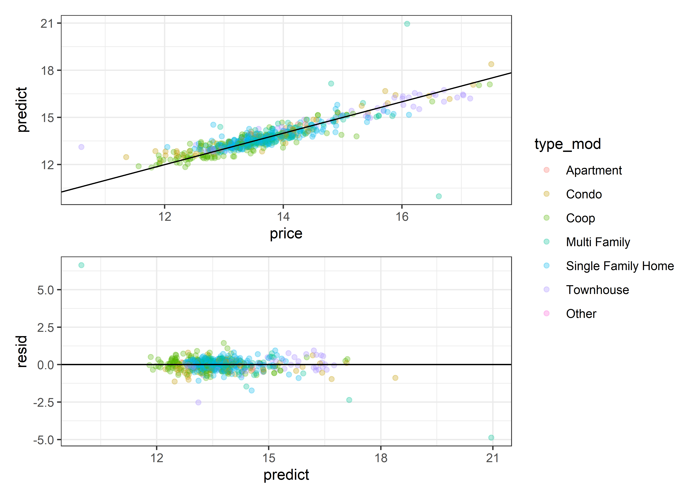<!-- -->

``` r
gam.check(gam_mod)
```

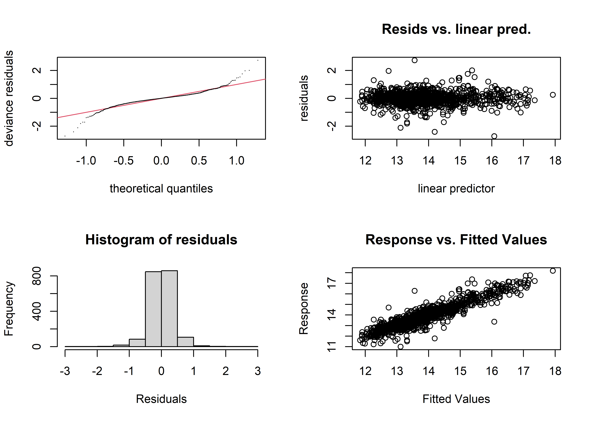<!-- -->

    ## 
    ## Method: GCV   Optimizer: magic
    ## Smoothing parameter selection converged after 64 iterations.
    ## The RMS GCV score gradient at convergence was 6.260063e-06 .
    ## The Hessian was positive definite.
    ## Model rank =  132 / 138 
    ## 
    ## Basis dimension (k) checking results. Low p-value (k-index<1) may
    ## indicate that k is too low, especially if edf is close to k'.
    ## 
    ##                                       k'   edf k-index p-value    
    ## s(sqft):type_modApartment           9.00  1.00    0.94  <2e-16 ***
    ## s(sqft):type_modCondo               9.00  2.93    0.94  <2e-16 ***
    ## s(sqft):type_modCoop                9.00  8.52    0.94  <2e-16 ***
    ## s(sqft):type_modMulti Family        9.00  3.26    0.94  <2e-16 ***
    ## s(sqft):type_modSingle Family Home  9.00  2.80    0.94   0.005 ** 
    ## s(sqft):type_modTownhouse           9.00  3.90    0.94  <2e-16 ***
    ## s(bath):type_modApartment           9.00  1.75    0.94  <2e-16 ***
    ## s(bath):type_modCondo               9.00  3.87    0.94   0.005 ** 
    ## s(bath):type_modCoop                9.00  6.10    0.94   0.010 ** 
    ## s(bath):type_modMulti Family        9.00  5.35    0.94  <2e-16 ***
    ## s(bath):type_modSingle Family Home  9.00  5.38    0.94  <2e-16 ***
    ## s(bath):type_modTownhouse           9.00  6.75    0.94   0.005 ** 
    ## s(lon,lat)                         29.00 27.50    0.81  <2e-16 ***
    ## ---
    ## Signif. codes:  0 '***' 0.001 '**' 0.01 '*' 0.05 '.' 0.1 ' ' 1

``` r
all_metrics_rf %>% 
  bind_rows(augment(gam_mod) %>% 
    three_metrics(price, .fitted) %>% mutate(model = "5")) %>% 
  arrange(desc(.metric), -.estimate)
```

    ## # A tibble: 15 x 4
    ##    .metric .estimator .estimate model
    ##    <chr>   <chr>          <dbl> <chr>
    ##  1 rsq     standard       0.863 5    
    ##  2 rsq     standard       0.688 1    
    ##  3 rsq     standard       0.681 2    
    ##  4 rsq     standard       0.655 3    
    ##  5 rsq     standard       0.580 4    
    ##  6 rmse    standard       0.593 4    
    ##  7 rmse    standard       0.530 3    
    ##  8 rmse    standard       0.508 2    
    ##  9 rmse    standard       0.500 1    
    ## 10 rmse    standard       0.362 5    
    ## 11 mae     standard       0.412 4    
    ## 12 mae     standard       0.383 3    
    ## 13 mae     standard       0.349 2    
    ## 14 mae     standard       0.346 1    
    ## 15 mae     standard       0.246 5

``` r
all_metrics_rf %>% 
  arrange(desc(.metric), -.estimate) %>% 
  bind_rows(augment(gam_mod) %>% 
  three_metrics(price, .fitted) %>% 
    mutate(model = "5")) %>% 
  ggplot(aes(.estimate, .metric, fill = fct_reorder(model, .estimate, max, .desc = TRUE))) +
  geom_col(position = "dodge") + 
  labs(title = "All 4 Models", 
       subtitle = "Base R lm (Brownish-Yellow), TM lm (Green), TM no tax lm (Blue), Random Forrest (Purple), Gam (Red)") +
  theme(legend.position = "none")
```

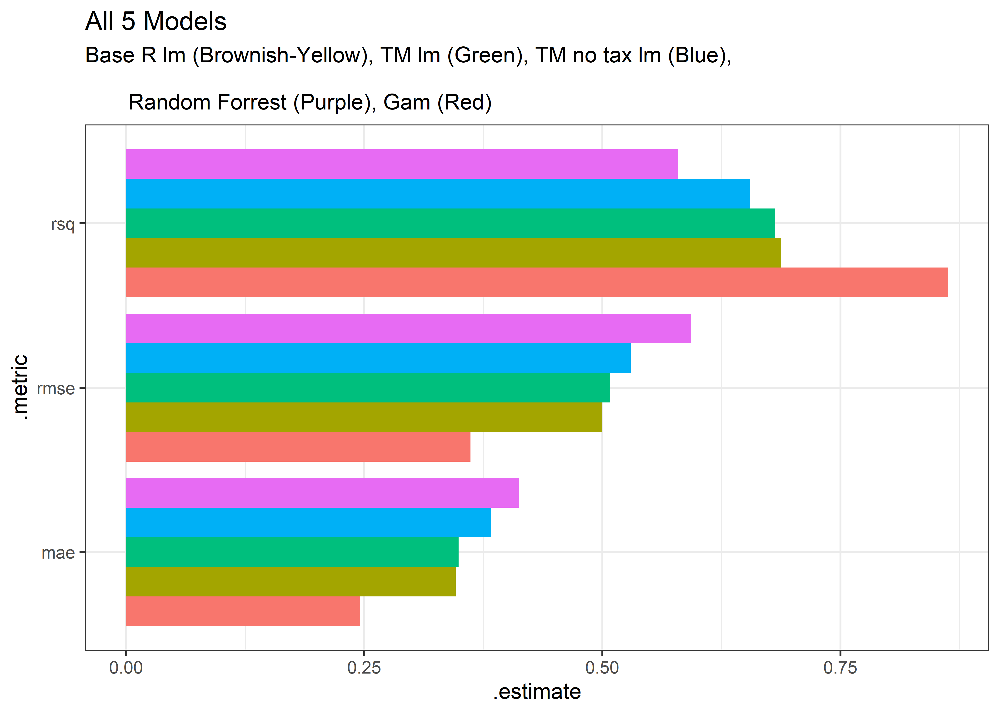<!-- -->

# Scrap work

``` r
world <- ne_countries(scale = "medium", returnclass = "sf")

range(house$lon, na.rm = TRUE)
```

    ## [1] -77.59145 -72.64771

``` r
range(house$lat, na.rm = TRUE)
```

    ## [1] 40.49896 43.16907

``` r
ggplot(world) + geom_sf() +
  coord_sf(
    xlim = c(-74.35, -73.6), 
    ylim = c(min(house$lat, na.rm = TRUE), 40.95), expand = FALSE) + 
  geom_point(data = house %>% filter(!is.na(price)) %>% mutate(price = log(price)), 
             aes(lon, lat, color = price, alpha = 0.3)) +
  scale_color_viridis_c()
```

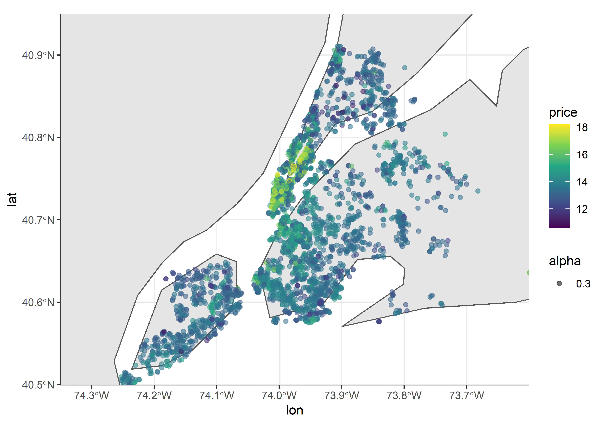<!-- -->

Because of the lack of precision in longitude/latitude variables, the
points on the map are slightly off.

``` r
house %>% 
  filter(!is.na(price), between(lon, -75, -73), between(lat, 40, 41)) %>% 
  select(price, lon, lat) %>% 
  pivot_longer(-price) %>% 
  ggplot(aes(value, log(price))) + geom_point() + geom_smooth(formula = y ~ ns(x, 5)) +
  facet_wrap(~name, scales = "free")
```

    ## `geom_smooth()` using method = 'gam'

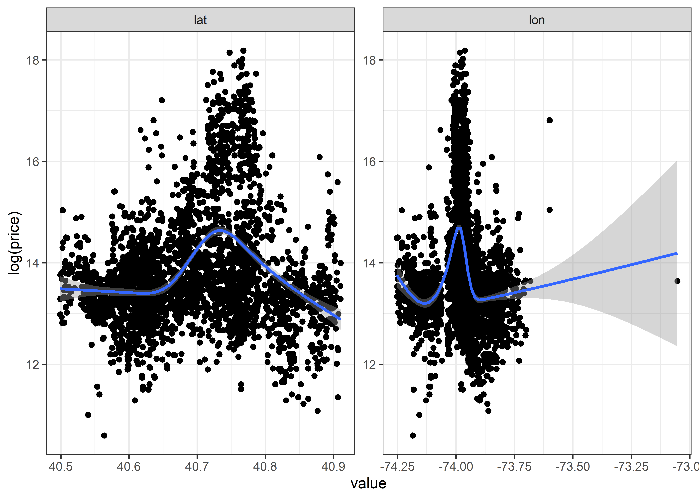<!-- -->
