NYC House Prices
================
Matthew
4/24/2022

-   <a href="#introduction" id="toc-introduction">Introduction</a>
-   <a href="#explore-and-clean" id="toc-explore-and-clean">Explore and
    Clean</a>
    -   <a href="#checking-correlated-variables"
        id="toc-checking-correlated-variables">Checking correlated variables</a>
    -   <a href="#plots-of-price-by-numerics-using-type-to-color"
        id="toc-plots-of-price-by-numerics-using-type-to-color">Plots of Price
        by numerics using Type to color</a>
-   <a href="#model" id="toc-model">Model</a>
    -   <a href="#preprocess" id="toc-preprocess">Preprocess</a>
    -   <a href="#tidymodels" id="toc-tidymodels">Tidymodels</a>
        -   <a href="#set-up-and-data-split" id="toc-set-up-and-data-split">Set up
            and data split</a>
        -   <a href="#model-creating-and-fit" id="toc-model-creating-and-fit">Model
            creating and fit</a>
        -   <a href="#analysis" id="toc-analysis">Analysis</a>
    -   <a href="#no-taxes" id="toc-no-taxes">No Taxes!</a>
-   <a href="#borough" id="toc-borough">Borough?</a>
    -   <a href="#dont-miss-the-forest-for-the-trees"
        id="toc-dont-miss-the-forest-for-the-trees">Don’t miss the forest for
        the trees</a>
-   <a href="#just-let-gam-figure-it-out"
    id="toc-just-let-gam-figure-it-out">Just let Gam figure it out</a>

# Introduction

This project was inspired by a course taken by a friend of mine for his
masters. I believe the data came from Kaggle but I am not certain. The
task was to fit a model to predict NYC Housing prices but I wanted to
take this opportunity and fit different models and compare the results.

``` r
house <- read_csv("C:/Users/Matthew Hondrakis/OneDrive/Documents/data_lat_long2.csv")
```

    ## New names:
    ## * `` -> ...1

    ## Rows: 6163 Columns: 28
    ## -- Column specification --------------------------------------------------------
    ## Delimiter: ","
    ## chr (23): bath, bed, sqft, address, estimated mortage, school information, c...
    ## dbl  (5): ...1, Price, assessment year, Lat, Lon
    ## 
    ## i Use `spec()` to retrieve the full column specification for this data.
    ## i Specify the column types or set `show_col_types = FALSE` to quiet this message.

``` r
house <- house[,-1]
```

# Explore and Clean

``` r
skim(house)
```

|                                                  |       |
|:-------------------------------------------------|:------|
| Name                                             | house |
| Number of rows                                   | 6163  |
| Number of columns                                | 27    |
| \_\_\_\_\_\_\_\_\_\_\_\_\_\_\_\_\_\_\_\_\_\_\_   |       |
| Column type frequency:                           |       |
| character                                        | 23    |
| numeric                                          | 4     |
| \_\_\_\_\_\_\_\_\_\_\_\_\_\_\_\_\_\_\_\_\_\_\_\_ |       |
| Group variables                                  | None  |

Data summary

**Variable type: character**

| skim_variable                                | n_missing | complete_rate | min |  max | empty | n_unique | whitespace |
|:---------------------------------------------|----------:|--------------:|----:|-----:|------:|---------:|-----------:|
| bath                                         |       270 |          0.96 |   6 |    9 |     0 |       26 |          0 |
| bed                                          |       210 |          0.97 |   5 |    7 |     0 |       25 |          0 |
| sqft                                         |       364 |          0.94 |   6 |   12 |     0 |     2274 |          0 |
| address                                      |         0 |          1.00 |  25 |   53 |     0 |     5370 |          0 |
| estimated mortage                            |       201 |          0.97 |  19 |   26 |     0 |     4189 |          0 |
| school information                           |         0 |          1.00 |  21 |   61 |     0 |       50 |          0 |
| crime information                            |         0 |          1.00 |  37 |   62 |     0 |       33 |          0 |
| commute information                          |         0 |          1.00 |  40 |   47 |     0 |       65 |          0 |
| shop and eat information                     |         0 |          1.00 |  36 |   56 |     0 |     5027 |          0 |
| description                                  |        14 |          1.00 |   1 | 3003 |     0 |     5751 |          0 |
| home details                                 |         1 |          1.00 |   8 |  882 |     0 |     5975 |          0 |
| price details                                |      1581 |          0.74 |  11 | 8859 |     0 |     4183 |          0 |
| tax                                          |      1629 |          0.74 |   3 |  363 |     0 |     3076 |          0 |
| land assessment cost                         |      1629 |          0.74 |   3 |  138 |     0 |     3517 |          0 |
| improvement cost                             |      1630 |          0.74 |   2 |  171 |     0 |     3824 |          0 |
| total cost                                   |      1630 |          0.74 |   4 |  693 |     0 |     3095 |          0 |
| neighborhood name                            |        40 |          0.99 |   4 |   35 |     0 |      248 |          0 |
| what local say about the neighborhood        |        67 |          0.99 |   6 |  454 |     0 |      528 |          0 |
| comments of residents and previous residents |        58 |          0.99 |   7 | 8260 |     0 |      619 |          0 |
| comparable properties                        |      1567 |          0.75 |   7 | 6722 |     0 |     4511 |          0 |
| provider info                                |       392 |          0.94 |   7 | 4027 |     0 |     3960 |          0 |
| seo description                              |         0 |          1.00 |  14 | 1163 |     0 |     5812 |          0 |
| linktoproperty                               |         0 |          1.00 |  68 | 4952 |     0 |     5812 |          0 |

**Variable type: numeric**

| skim_variable   | n_missing | complete_rate |       mean |         sd |       p0 |       p25 |       p50 |        p75 |       p100 | hist  |
|:----------------|----------:|--------------:|-----------:|-----------:|---------:|----------:|----------:|-----------:|-----------:|:------|
| Price           |      2065 |          0.66 | 2324633.85 | 5814353.04 | 40000.00 | 528952.00 | 785000.00 | 1325000.00 |  7.900e+07 | ▇▁▁▁▁ |
| assessment year |      1635 |          0.73 |    2017.84 |       0.37 |  2014.00 |   2018.00 |   2018.00 |    2018.00 |  2.018e+03 | ▁▁▁▂▇ |
| Lat             |      1079 |          0.82 |      40.71 |       0.12 |    40.50 |     40.62 |     40.71 |      40.77 |  4.317e+01 | ▇▁▁▁▁ |
| Lon             |      1079 |          0.82 |     -73.96 |       0.14 |   -77.59 |    -74.00 |    -73.96 |     -73.90 | -7.265e+01 | ▁▁▁▇▁ |

``` r
house <- 
  house %>% rename_with(tolower) %>% 
  rename_with( ~ gsub(" information", "", .x)) %>% 
  rename_with( ~ gsub(" ", "_", .x))
```

Cleaning column names to make typing them easier moving forward.

``` r
head(house[,1:4])
```

    ## # A tibble: 6 x 4
    ##   bath    bed    sqft       address                                  
    ##   <chr>   <chr>  <chr>      <chr>                                    
    ## 1 1 Bath  2 Beds 825 sqft   5613 Avenue T Brooklyn, NY 11234         
    ## 2 1 Bath  2 Beds 900 sqft   475 Armstrong Ave Staten Island, NY 10308
    ## 3 1 Bath  2 Beds 1,000 sqft 353 W 47th St New York, NY 10036         
    ## 4 2 Baths 3 Beds 1,350 sqft 12 White Pl Staten Island, NY 10310      
    ## 5 4 Baths 3 Beds 1,900 sqft 5716 224th St Flushing, NY 11364         
    ## 6 1 Bath  2 Beds 700 sqft   406 W 46th St New York, NY 10036

``` r
head(house[,5:8])
```

    ## # A tibble: 6 x 4
    ##    price estimated_mortage      school                                     crime
    ##    <dbl> <chr>                  <chr>                                      <chr>
    ## 1     NA Est. Mortgage$950/mo   Schools 1 Elementary School 2 Middle Scho~ Crim~
    ## 2     NA Est. Mortgage$2,002/mo Schools 1 Elementary School 1 Middle Scho~ Crim~
    ## 3     NA Est. Mortgage$4,059/mo Schools 1 Elementary School 4 Middle Scho~ Crim~
    ## 4 425309 Est. Mortgage$2,774/mo Schools 1 Elementary School 1 Middle Scho~ Crim~
    ## 5 903453 Est. Mortgage$4,711/mo Schools 1 Elementary School 1 Middle Scho~ Crim~
    ## 6 549000 Est. Mortgage$4,138/mo Schools 1 Elementary School 4 Middle Scho~ Crim~

``` r
head(house[,9:12])
```

    ## # A tibble: 6 x 4
    ##   commute                                  shop_and_eat description home_details
    ##   <chr>                                    <chr>        <chr>       <chr>       
    ## 1 Commute 51% of residents commute by car. Shop & Eat ~ OLD MILL B~ Coop, $236/~
    ## 2 Commute 76% of residents commute by car. Shop & Eat ~ beautiful ~ Coop, $267/~
    ## 3 Commute Learn about commute times to th~ Shop & Eat ~ Back on th~ Coop, $699/~
    ## 4 Commute 60% of residents commute by car. Shop & Eat ~ BEAUTIFUL ~ Single Fami~
    ## 5 Commute 69% of residents commute by car. Shop & Eat ~ spacious, ~ Single Fami~
    ## 6 Commute Learn about commute times to th~ Shop & Eat ~ Two bedroo~ Coop, $821/~

``` r
head(house[,13:16])
```

    ## # A tibble: 6 x 4
    ##   price_details                           assessment_year tax   land_assessment~
    ##   <chr>                                             <dbl> <chr> <chr>           
    ## 1 04/05/2014 $154,900 Posting Removed So~            2018 $67,~ $2,71,350       
    ## 2 04/20/2012 $155,000 Posting Removed So~            2018 $1,3~ $2,68,650       
    ## 3 <NA>                                                 NA <NA>  <NA>            
    ## 4 01/10/2020 $578,000 Listed For Sale So~            2017 $3,1~ $4,935          
    ## 5 07/29/2015 $730,000 Sold Recording Dat~            2018 $9,3~ $18,278         
    ## 6 11/15/2019 $575,000 Price Change Price~            2018 $97,~ $2,52,900

``` r
head(house[,17:20])
```

    ## # A tibble: 6 x 4
    ##   improvement_cost total_cost neighborhood_name what_local_say_about_the_neighb~
    ##   <chr>            <chr>      <chr>             <chr>                           
    ## 1 $3,33,450        $6,04,800  Flatlands         91% There are sidewalks , 87% I~
    ## 2 $8,47,350        $11,16,000 Great Kills       94% It's dog friendly , 89% The~
    ## 3 <NA>             <NA>       Hell's Kitchen    89% It's walkable to restaurant~
    ## 4 $10,401          $15,336    West Brighton     88% There are sidewalks , 84% I~
    ## 5 $26,178          $44,456    Bayside           89% There are sidewalks , 87% I~
    ## 6 $5,87,700        $8,40,600  Hell's Kitchen    89% It's walkable to restaurant~

``` r
head(house[,21:24])
```

    ## # A tibble: 6 x 4
    ##   comments_of_residents_and_prev~ comparable_prop~ provider_info seo_description
    ##   <chr>                           <chr>            <chr>         <chr>          
    ## 1 "Trulia User Resident 1mo ago ~ 3105 Avenue V #~ Marianne Del~ 5613 Avenue T ~
    ## 2 "Trulia User Resident 1mo ago ~ <NA>             Gary Papirov~ 475 Armstrong ~
    ## 3 "Trulia User Resident 4d ago \~ 30 E 37th St #8~ John Montalv~ 353 W 47th St ~
    ## 4 "Trulia User Resident 1mo ago ~ <NA>             Simon (yongd~ 12 White Pl, S~
    ## 5 "Trulia User Resident 1w ago \~ <NA>             Hantha Seo ,~ 5716 224th St,~
    ## 6 "Trulia User Resident 4d ago \~ 155 E 38th St #~ Alessandra D~ 406 W 46th St ~

``` r
head(house[,25:27])
```

    ## # A tibble: 6 x 3
    ##   linktoproperty                                                       lat   lon
    ##   <chr>                                                              <dbl> <dbl>
    ## 1 https://www.trulia.com/p/ny/brooklyn/5613-avenue-t-49c-brooklyn-n~  40.6 -73.9
    ## 2 https://www.trulia.com/p/ny/staten-island/475-armstrong-ave-i1-st~  40.5 -74.2
    ## 3 https://www.trulia.com/p/ny/new-york/353-w-47th-st-2r-new-york-ny~  40.8 -74.0
    ## 4 https://www.trulia.com/p/ny/staten-island/12-white-pl-staten-isla~  40.6 -74.1
    ## 5 https://www.trulia.com/p/ny/flushing/5716-224th-st-flushing-ny-11~  NA    NA  
    ## 6 https://www.trulia.com/p/ny/new-york/406-w-46th-st-3b-new-york-ny~  40.8 -74.0

``` r
house <- house %>% 
  mutate(across(c(bath:sqft, tax:total_cost), ~ parse_number(.x)))

house <- house %>% 
  rename(by_car = commute) %>% 
  mutate(by_car = parse_number(by_car))
```

Extracting the number portion of the numeric variables and editing the
*commute* column. It only contains information on car travel, therefore
it will be rename to *by_car* and the number portion will be extracted
from it as well.

``` r
house <- house %>% 
  mutate(type = sub(",.*","", home_details))
```

By removing everything after the first comma in the *home_details*
variable, we are left with a variable containing the type of property.
This variable will be named *type*. Time to take a closer look at the
numeric variables, excluding longitude (*lon*) and latitude (*lat*).

``` r
house %>% 
  keep(is.numeric) %>% 
  select(-lon, -lat) %>% 
  gather() %>% 
  ggplot(aes(value)) + geom_histogram() + facet_wrap(~key, scales = "free")
```

    ## `stat_bin()` using `bins = 30`. Pick better value with `binwidth`.

<!-- -->

Most numeric variables appear to be lognormally distributed.

``` r
house %>% 
  keep(is.numeric) %>% 
  select(-lon, -lat) %>% 
  pivot_longer(-price) %>% 
  ggplot(aes(value, price)) + geom_point() +
  scale_y_log10() + scale_x_log10() +
  facet_wrap(~name)
```

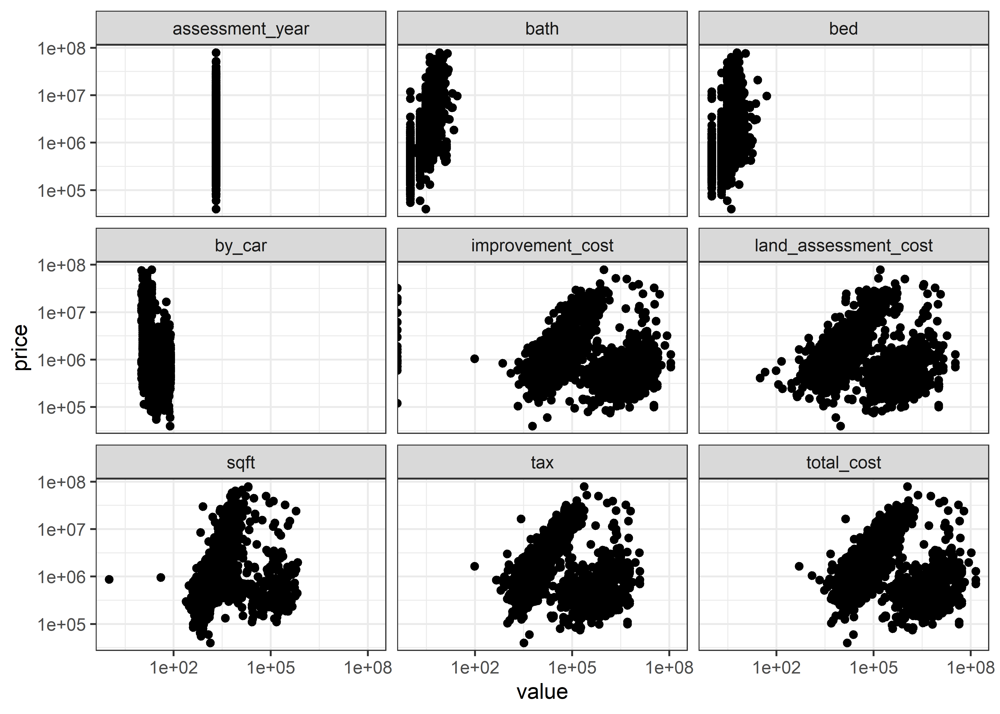<!-- -->

When plotting price against the numeric variables, a bimodal
distribution appears. This may be explored further using a knn model.

``` r
house %>% 
  select_if(is.numeric) %>% 
  select(-lon, -lat) %>% 
  drop_na() %>% 
  pivot_longer(-price) %>% 
  group_by(name) %>% 
  summarize(corr = cor(price, value)) %>% 
  arrange(-abs(corr))
```

    ## # A tibble: 9 x 2
    ##   name                    corr
    ##   <chr>                  <dbl>
    ## 1 bath                  0.428 
    ## 2 by_car               -0.245 
    ## 3 bed                   0.214 
    ## 4 land_assessment_cost  0.145 
    ## 5 tax                   0.133 
    ## 6 total_cost            0.130 
    ## 7 improvement_cost      0.124 
    ## 8 sqft                  0.100 
    ## 9 assessment_year       0.0955

There does not seem to be a linear relationship between price and the
other numeric variables.

``` r
house %>% 
  keep(is.numeric) %>% 
  select(-lon, -lat) %>% 
  drop_na() %>% 
  mutate(across(everything(), ~log(.x), .names = "log_{.col}")) %>% 
  pivot_longer(-log_price) %>% 
  group_by(name) %>% 
  summarize(corr = cor(log_price, value)) %>% 
  arrange(-abs(corr)) %>% 
  filter(name != "price" & !is.na(corr))
```

    ## # A tibble: 17 x 2
    ##    name                        corr
    ##    <chr>                      <dbl>
    ##  1 log_bath                  0.638 
    ##  2 bath                      0.597 
    ##  3 log_bed                   0.501 
    ##  4 bed                       0.434 
    ##  5 log_by_car               -0.378 
    ##  6 log_sqft                  0.312 
    ##  7 by_car                   -0.306 
    ##  8 assessment_year           0.141 
    ##  9 log_assessment_year       0.141 
    ## 10 log_land_assessment_cost  0.101 
    ## 11 land_assessment_cost      0.100 
    ## 12 log_tax                   0.0923
    ## 13 tax                       0.0722
    ## 14 total_cost                0.0707
    ## 15 log_total_cost            0.0657
    ## 16 improvement_cost          0.0625
    ## 17 sqft                      0.0247

Log(price) improves the linear correlation with respect to the numeric
variables. A simple linear regression model will now be fit for
log(price) vs each numeric variable.

``` r
tidy_model <- house %>% 
  select_if(is.numeric) %>% 
  select(-lon, -lat) %>% 
  drop_na() %>% 
  pivot_longer(-price) %>% 
  nest(-name) %>% 
  mutate(mod = map(data, ~ lm(log(price) ~ value, .x)),
         tidy = map(mod, broom::tidy)) %>% 
  unnest(tidy)
```

``` r
tidy_model %>% 
  filter(term == "value") %>% 
  arrange(-abs(estimate))
```

    ## # A tibble: 9 x 8
    ##   name               data     mod   term  estimate std.error statistic   p.value
    ##   <chr>              <list>   <lis> <chr>    <dbl>     <dbl>     <dbl>     <dbl>
    ## 1 assessment_year    <tibble> <lm>  value  3.00e-1   3.92e-2      7.65 2.80e- 14
    ## 2 bath               <tibble> <lm>  value  2.75e-1   6.90e-3     39.8  1.71e-276
    ## 3 bed                <tibble> <lm>  value  1.80e-1   7.00e-3     25.8  6.10e-132
    ## 4 by_car             <tibble> <lm>  value -1.24e-2   7.21e-4    -17.2  2.53e- 63
    ## 5 sqft               <tibble> <lm>  value  3.87e-7   2.93e-7      1.32 1.86e-  1
    ## 6 tax                <tibble> <lm>  value  9.22e-8   2.38e-8      3.88 1.09e-  4
    ## 7 land_assessment_c~ <tibble> <lm>  value  7.16e-8   1.33e-8      5.39 7.70e-  8
    ## 8 improvement_cost   <tibble> <lm>  value  1.09e-8   3.26e-9      3.35 8.11e-  4
    ## 9 total_cost         <tibble> <lm>  value  1.00e-8   2.65e-9      3.80 1.50e-  4

## Checking correlated variables

``` r
gplot <- function(x){
  (house %>% 
    filter(!is.na({{x}}), !is.na(price)) %>% 
    ggplot(aes({{x}}, price, group = {{x}})) + geom_boxplot() + scale_y_log10()) +
  (house %>% 
     filter(!is.na({{x}}), !is.na(price)) %>% 
     group_by({{x}}) %>% 
     summarize(m = mean(price, na.rm = TRUE)) %>% 
     ggplot(aes({{x}}, m)) + geom_line() + scale_y_log10())
}

gplot(bath)
```

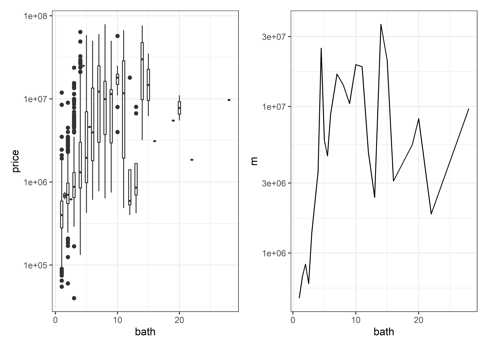<!-- -->

``` r
gplot(bed)
```

<!-- -->

``` r
gplot(assessment_year)
```

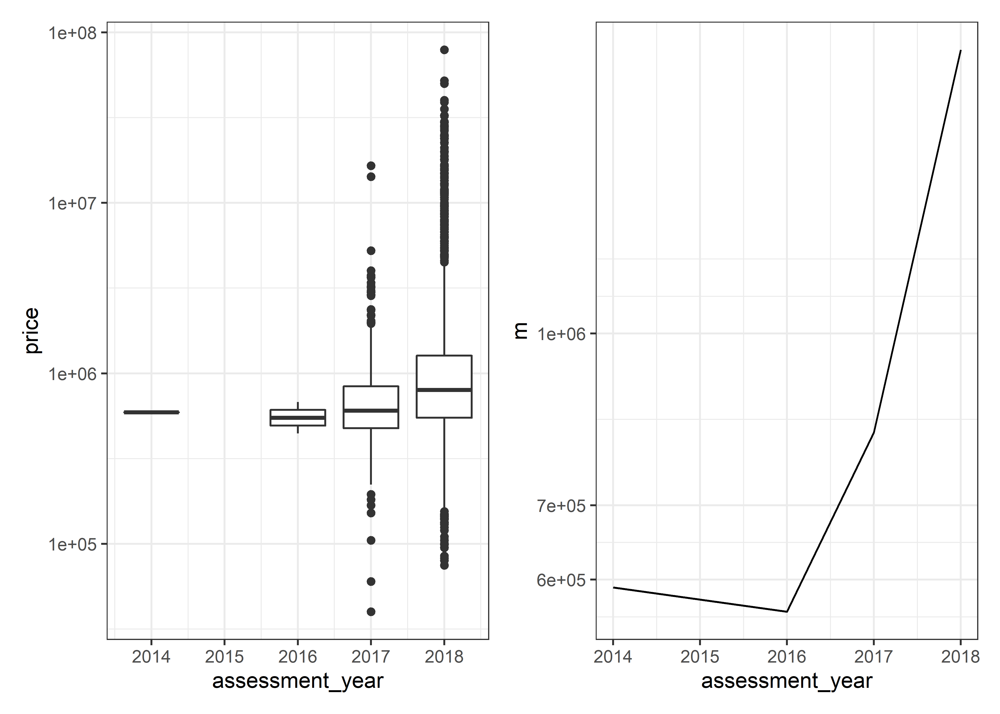<!-- -->

``` r
house %>% 
  filter(price != 0, !is.na(price)) %>% 
  mutate(price = price/1e3,
         type = fct_lump(type, 7),
         type = fct_reorder(type, price, median)) %>% 
  ggplot(aes(price, type)) + geom_boxplot() +
  scale_x_log10(labels = scales::comma) + labs(x = "", title = "Price in thousands") +
  theme(plot.margin = margin(10,50,10,0))
```

<!-- -->

The type of property seems to be significant, lets explore this further.

## Plots of Price by numerics using Type to color

``` r
gplot2 <- function(x){
  house %>% 
    ggplot(aes({{x}}, price, color = fct_lump(type, 6))) + 
    geom_point() +
    scale_x_log10() + scale_y_log10()
}
(gplot2(tax) +
gplot2(total_cost) +
gplot2(land_assessment_cost)) /
(gplot2(sqft) +
gplot2(improvement_cost)) + plot_layout(guides = 'collect')
```

<!-- -->

The bimodal distribution is finally explained by this new variable. Type
of property accounts for this separation, Coop vs (Single & Multi
Family, Townhouse and Condo).

# Model

## Preprocess

``` r
house <- house %>% 
  mutate(type_mod = fct_lump(type, 6))

house_mod <- house %>% 
  select(price, tax, total_cost, sqft, land_assessment_cost,
         improvement_cost, type_mod, bath, bed, address) %>% 
  drop_na() %>% 
  filter_if(is.numeric, all_vars(. > 0))

house_mod %>% 
  keep(is.numeric) %>% 
  cor() %>% 
  as.data.frame() %>% 
  rownames_to_column(var = "item1") %>% 
  gather(key = item2, value = corr, -item1) %>% 
  filter(item1 > item2) %>% 
  arrange(desc(item1), -abs(corr))
```

    ##                   item1                item2        corr
    ## 1            total_cost     improvement_cost  0.99761312
    ## 2            total_cost                  tax  0.99086226
    ## 3            total_cost land_assessment_cost  0.96450910
    ## 4            total_cost                 sqft  0.44406856
    ## 5            total_cost                  bed -0.15946214
    ## 6            total_cost                 bath -0.07345366
    ## 7            total_cost                price  0.06624251
    ## 8                   tax     improvement_cost  0.99137901
    ## 9                   tax land_assessment_cost  0.94467569
    ## 10                  tax                 sqft  0.48728324
    ## 11                  tax                  bed -0.16695827
    ## 12                  tax                price  0.07593635
    ## 13                  tax                 bath -0.07189192
    ## 14                 sqft     improvement_cost  0.45396698
    ## 15                 sqft land_assessment_cost  0.38640371
    ## 16                 sqft                  bed -0.13076296
    ## 17                 sqft                price  0.07727393
    ## 18                 sqft                 bath -0.06450716
    ## 19                price                 bath  0.44701449
    ## 20                price                  bed  0.21414699
    ## 21                price land_assessment_cost  0.07131328
    ## 22                price     improvement_cost  0.06414354
    ## 23 land_assessment_cost     improvement_cost  0.94397401
    ## 24 land_assessment_cost                  bed -0.12324898
    ## 25 land_assessment_cost                 bath -0.04720870
    ## 26     improvement_cost                  bed -0.16707156
    ## 27     improvement_cost                 bath -0.07945988
    ## 28                  bed                 bath  0.62187514

``` r
house_mod %>% 
  keep(is.numeric) %>% 
  pivot_longer(-tax) %>% 
  ggplot(aes(tax, value)) + geom_point() +
  facet_wrap(~name, scales = "free")
```

<!-- -->

There is a lot of correlation between tax and the other numeric
variables, as can be seen by the graphs above.

``` r
house_mod %>% 
  ggplot(aes(bath, price)) + geom_point() + scale_y_log10() +
  geom_smooth()
```

    ## `geom_smooth()` using method = 'gam' and formula 'y ~ s(x, bs = "cs")'

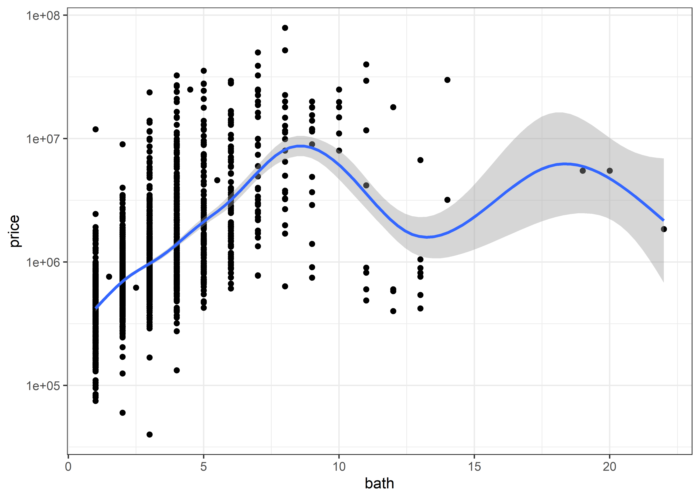<!-- -->

There are some outliers in the number of baths that don’t seem reliable.
Many of the apartments with 15 or more baths may come from faulty data
(some addresses were checked as well).

``` r
updated_model <- 
  lm(log(price) ~ (log(sqft) + log(tax) + bath) * type_mod, 
   house_mod)

anova(updated_model)
```

    ## Analysis of Variance Table
    ## 
    ## Response: log(price)
    ##                      Df Sum Sq Mean Sq   F value  Pr(>F)    
    ## log(sqft)             1 223.79  223.79  888.5009 < 2e-16 ***
    ## log(tax)              1   0.88    0.88    3.5067 0.06122 .  
    ## bath                  1 771.45  771.45 3062.8759 < 2e-16 ***
    ## type_mod              6 344.56   57.43  228.0026 < 2e-16 ***
    ## log(sqft):type_mod    5 182.22   36.44  144.6928 < 2e-16 ***
    ## log(tax):type_mod     5  25.44    5.09   20.2023 < 2e-16 ***
    ## bath:type_mod         5 146.88   29.38  116.6327 < 2e-16 ***
    ## Residuals          3058 770.22    0.25                      
    ## ---
    ## Signif. codes:  0 '***' 0.001 '**' 0.01 '*' 0.05 '.' 0.1 ' ' 1

``` r
summary(updated_model)
```

    ## 
    ## Call:
    ## lm(formula = log(price) ~ (log(sqft) + log(tax) + bath) * type_mod, 
    ##     data = house_mod)
    ## 
    ## Residuals:
    ##     Min      1Q  Median      3Q     Max 
    ## -4.6162 -0.2469 -0.0219  0.2375  3.1464 
    ## 
    ## Coefficients: (3 not defined because of singularities)
    ##                                       Estimate Std. Error t value Pr(>|t|)    
    ## (Intercept)                           12.19048    0.67783  17.985  < 2e-16 ***
    ## log(sqft)                             -0.02840    0.05846  -0.486  0.62710    
    ## log(tax)                               0.03633    0.05185   0.701  0.48353    
    ## bath                                   0.68004    0.11856   5.736 1.07e-08 ***
    ## type_modCondo                         -8.05309    0.96481  -8.347  < 2e-16 ***
    ## type_modCoop                          -1.44071    0.71916  -2.003  0.04523 *  
    ## type_modMulti Family                  -4.33679    0.82684  -5.245 1.67e-07 ***
    ## type_modSingle Family Home            -4.23697    0.71429  -5.932 3.33e-09 ***
    ## type_modTownhouse                    -10.15189    0.88895 -11.420  < 2e-16 ***
    ## type_modOther                         -3.03641    0.73193  -4.149 3.44e-05 ***
    ## log(sqft):type_modCondo                1.14003    0.12494   9.124  < 2e-16 ***
    ## log(sqft):type_modCoop                 0.08402    0.05937   1.415  0.15708    
    ## log(sqft):type_modMulti Family         0.38250    0.08653   4.420 1.02e-05 ***
    ## log(sqft):type_modSingle Family Home   0.21924    0.06837   3.207  0.00136 ** 
    ## log(sqft):type_modTownhouse            1.01197    0.11804   8.573  < 2e-16 ***
    ## log(sqft):type_modOther                     NA         NA      NA       NA    
    ## log(tax):type_modCondo                 0.08954    0.05735   1.561  0.11857    
    ## log(tax):type_modCoop                  0.04712    0.05528   0.852  0.39409    
    ## log(tax):type_modMulti Family          0.31363    0.06619   4.738 2.26e-06 ***
    ## log(tax):type_modSingle Family Home    0.41476    0.05990   6.924 5.32e-12 ***
    ## log(tax):type_modTownhouse             0.48069    0.06979   6.888 6.84e-12 ***
    ## log(tax):type_modOther                      NA         NA      NA       NA    
    ## bath:type_modCondo                    -0.39376    0.12706  -3.099  0.00196 ** 
    ## bath:type_modCoop                     -0.09088    0.12048  -0.754  0.45074    
    ## bath:type_modMulti Family             -0.62703    0.11920  -5.261 1.54e-07 ***
    ## bath:type_modSingle Family Home       -0.58201    0.11898  -4.892 1.05e-06 ***
    ## bath:type_modTownhouse                -0.70280    0.12093  -5.812 6.83e-09 ***
    ## bath:type_modOther                          NA         NA      NA       NA    
    ## ---
    ## Signif. codes:  0 '***' 0.001 '**' 0.01 '*' 0.05 '.' 0.1 ' ' 1
    ## 
    ## Residual standard error: 0.5019 on 3058 degrees of freedom
    ## Multiple R-squared:  0.6876, Adjusted R-squared:  0.6851 
    ## F-statistic: 280.4 on 24 and 3058 DF,  p-value: < 2.2e-16

``` r
(augment(updated_model) %>% 
  ggplot(aes(`log(price)`,.fitted, color = type_mod)) + 
  geom_point(alpha = 0.5) + xlim(10,19) + ylim(10,19) + geom_abline()) /
(augment(updated_model) %>% 
  mutate(residual = .fitted - `log(price)`) %>% 
  ggplot(aes(.fitted, residual, color = type_mod)) + 
  geom_point(alpha = 0.5) +
  geom_hline(yintercept = 0)) + plot_layout(guides = "collect")
```

<!-- -->

``` r
hist(residuals(updated_model))
```

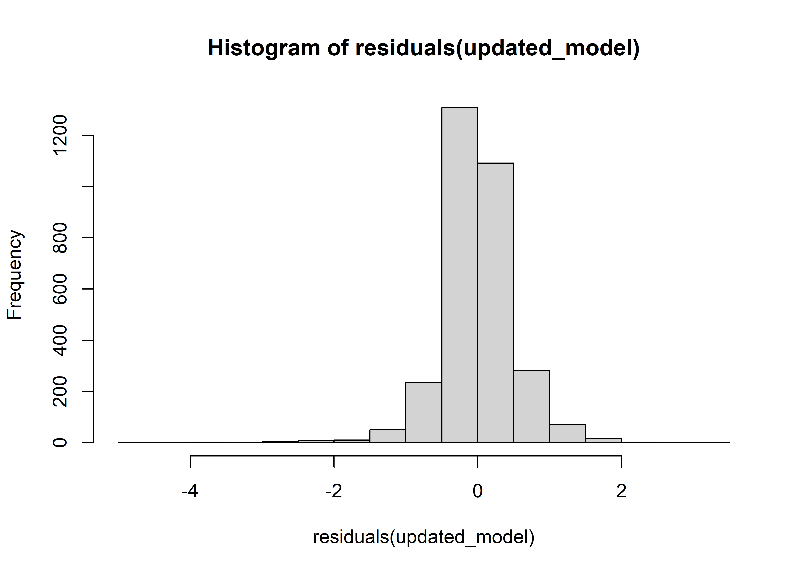<!-- -->

The diagnostic plots don’t show any irregularities.

## Tidymodels

### Set up and data split

``` r
set.seed(123)
house_split <- initial_split(house_mod %>% 
                               mutate(price = log(price),
                                      tax = log(tax),
                                      sqft = log(sqft),
                                      bath = log(bath), 
                             strata = bath))
house_test <- testing(house_split)
house_train <- training(house_split)
```

### Model creating and fit

``` r
mod <- linear_reg() %>% 
  set_mode("regression") %>% 
  set_engine("lm")
rec <- recipe(price ~ tax + sqft + 
                     bath + type_mod, house_train) %>% 
  step_dummy(all_nominal_predictors()) %>%
  step_interact(terms = ~ starts_with("type"):all_predictors())
wkfl <- workflow() %>% 
  add_model(mod) %>% 
  add_recipe(rec)
wkfl_fit <- fit(wkfl, house_train)
```

### Analysis

``` r
house_res <- 
  house_test %>% 
  bind_cols(predict(wkfl_fit, house_test))
```

``` r
(house_res %>%
  mutate(residuals = price - .pred) %>% 
  ggplot(aes(.pred, residuals, color = type_mod)) + 
  geom_point(alpha = 0.5) + geom_hline(yintercept = 0)) /
(house_res %>%  
  ggplot(aes(.pred, price, color = type_mod)) + 
  geom_point(alpha = 0.5) + geom_abline() +
  xlim(11,18) + ylim(11,18)) + plot_layout(guide = "collect")
```

<!-- -->

``` r
three_metrics <- metric_set(rsq, rmse, mae)

joined_metrics <- three_metrics(augment(updated_model) %>% 
      rename(price = `log(price)`),
    price, .fitted) %>% 
  mutate(model = "Base LM") %>% 
  bind_rows(three_metrics(house_res, price, .pred) %>% 
              mutate(model = "Tidy LM")) %>% 
  mutate(model = fct_reorder(model, .estimate, .fun = max))

joined_metrics %>% arrange(desc(.metric))
```

    ## # A tibble: 6 x 4
    ##   .metric .estimator .estimate model  
    ##   <chr>   <chr>          <dbl> <fct>  
    ## 1 rsq     standard       0.688 Base LM
    ## 2 rsq     standard       0.681 Tidy LM
    ## 3 rmse    standard       0.500 Base LM
    ## 4 rmse    standard       0.508 Tidy LM
    ## 5 mae     standard       0.346 Base LM
    ## 6 mae     standard       0.349 Tidy LM

``` r
(joined_metrics %>% 
  filter(.metric == "rsq") %>% 
  ggplot(aes(.estimate, .metric, fill = model)) +
  geom_col(position = "dodge") + labs(y = "", x = "", title = "Variance explained")) /
(joined_metrics %>% 
  filter(.metric != "rsq") %>% 
  ggplot(aes(.estimate, .metric, fill = model)) +
  geom_col(position = "dodge") + labs(y = "", x = "", title = "Error")) + 
plot_layout(guide = "collect") + 
plot_annotation(title = "Metrics of Both Models", 
                theme = theme(plot.title = element_text(hjust = 0.5)))
```

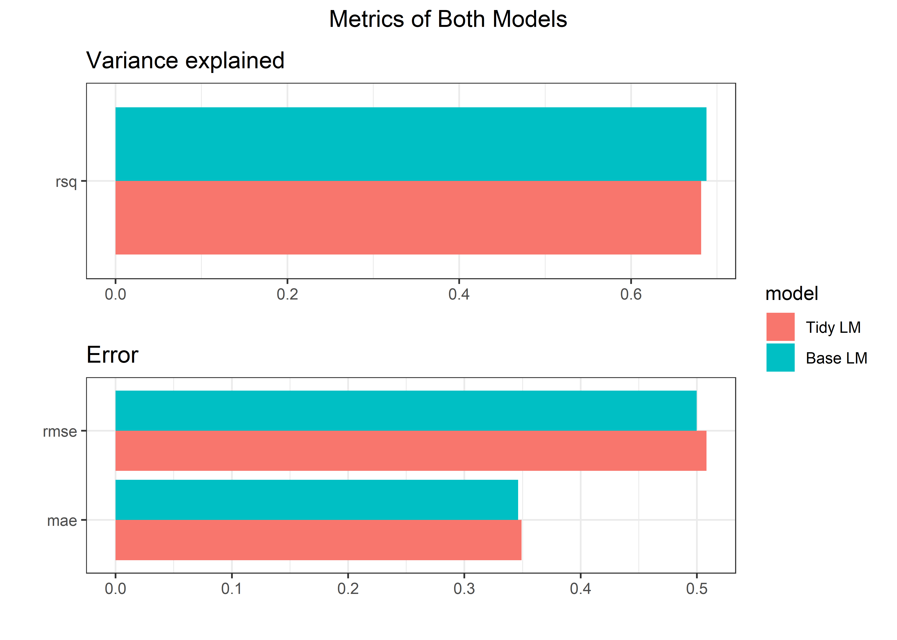<!-- -->

The original base R model just barely outperforms the tidymodels model.
The only difference between the 2 is that the tidymodels model was
trained on a subset of the data, while the original was trained on the
whole dataset.

``` r
house <- house %>% 
  mutate(zip_code = str_sub(address, - 5, - 1))

x <- house %>% 
  filter(!is.na(price)) %>% 
  group_by(zip_code) %>% 
  summarize(m = median(price)) %>% 
  arrange(-m) %>% 
  head(20) %>% 
  pull(zip_code)
y <- house %>% 
  filter(!is.na(price)) %>% 
  group_by(zip_code) %>% 
  summarize(m = median(price)) %>% 
  arrange(-m) %>% 
  tail(20) %>% 
  pull(zip_code)
  
house %>% 
  select(zip_code, price) %>% group_by(zip_code) %>% 
  filter(!is.na(price), zip_code %in% c(x,y)) %>% 
  group_by(zip_code) %>% 
  ggplot(aes(price, fct_reorder(zip_code, price, median))) + geom_boxplot() +
  scale_x_log10() + labs(y = "", title = "House Prices in NYC by zipcode", x = "Price (log10 scale)")
```

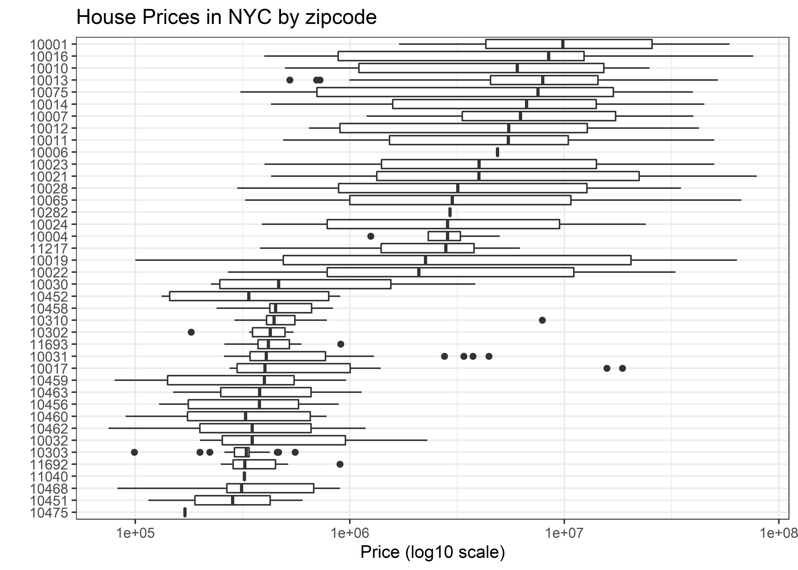<!-- -->

## No Taxes!

``` r
wkfl2 <- workflow() %>% 
  add_model(mod) %>% 
  add_recipe(recipe(price ~ sqft + 
                     bath + type_mod, house_train) %>% 
  step_dummy(all_nominal_predictors()) %>%
  step_interact(terms = ~ starts_with("type"):all_predictors()))

wkfl_fit2 <- fit(wkfl2, house_train)
```

``` r
house_res2 <- house_test %>%
  bind_cols(predict(wkfl_fit2, house_test))
  
all_metrics <- joined_metrics %>% 
  bind_rows(three_metrics(house_res2, price, .pred) %>% 
              mutate(model = "No Tax LM")) %>% 
  mutate(model = fct_reorder(model, .estimate, .fun = max))
```

``` r
(all_metrics %>% 
  filter(.metric == "rsq") %>% 
  ggplot(aes(.estimate, .metric, fill = model)) +
  geom_col(position = "dodge") + labs(y = "", x = "", title = "Variance explained")) /
(all_metrics %>% 
  filter(.metric != "rsq") %>% 
  ggplot(aes(.estimate, .metric, fill = model)) +
  geom_col(position = "dodge") + labs(y = "", x = "", title = "Error")) + 
plot_layout(guide = "collect") + 
plot_annotation(title = "Metrics of 3 Models", 
                theme = theme(plot.title = element_text(hjust = 0.5)))
```

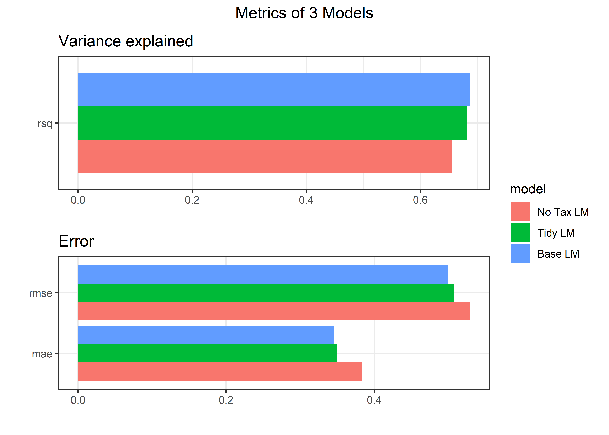<!-- -->

``` r
all_metrics %>% 
  arrange(desc(.metric), -.estimate)
```

    ## # A tibble: 9 x 4
    ##   .metric .estimator .estimate model    
    ##   <chr>   <chr>          <dbl> <fct>    
    ## 1 rsq     standard       0.688 Base LM  
    ## 2 rsq     standard       0.681 Tidy LM  
    ## 3 rsq     standard       0.655 No Tax LM
    ## 4 rmse    standard       0.530 No Tax LM
    ## 5 rmse    standard       0.508 Tidy LM  
    ## 6 rmse    standard       0.500 Base LM  
    ## 7 mae     standard       0.383 No Tax LM
    ## 8 mae     standard       0.349 Tidy LM  
    ## 9 mae     standard       0.346 Base LM

# Borough?

``` r
house %>% 
  mutate(borough = case_when(
    str_detect(address, "New York") ~ "New York",
    str_detect(address, "Brooklyn") ~ "Brooklyn",
    str_detect(address, "Queens") ~ "Queens",
    str_detect(address, "Bronx") ~ "Bronx",
    str_detect(address, "Staten Island") ~ "Staten Island"
  )) %>% 
  filter(!is.na(borough), !is.na(price)) %>% 
  ggplot(aes(price, borough)) + geom_boxplot() + scale_x_log10()
```

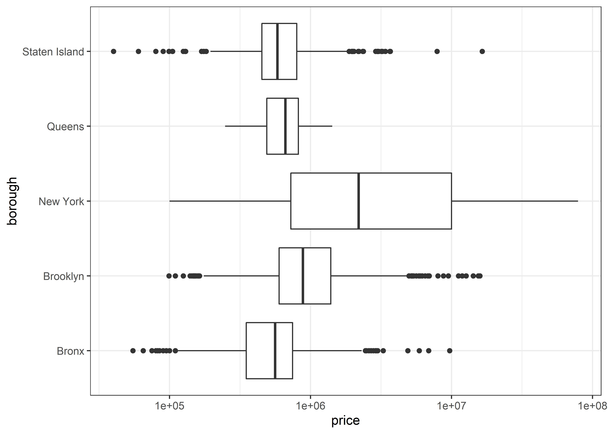<!-- -->

## Don’t miss the forest for the trees

``` r
house_mod <- house_mod %>% 
  mutate(zip_code = str_sub(address, -5, -1))
```

The zip_code can be found in the last 5 digits of the address variable,
thus we extract and keep only the last 5 digits of the variable.

``` r
house_mod %>% 
  ggplot(aes(tax, price, color = zip_code)) + geom_point() +
  theme(legend.position = "none") + scale_x_log10() +
  scale_y_log10() + labs(title = "Price vs Taxes", caption = "Both axis on Log-scales") +
  theme(plot.title = element_text(hjust = 0.5))
```

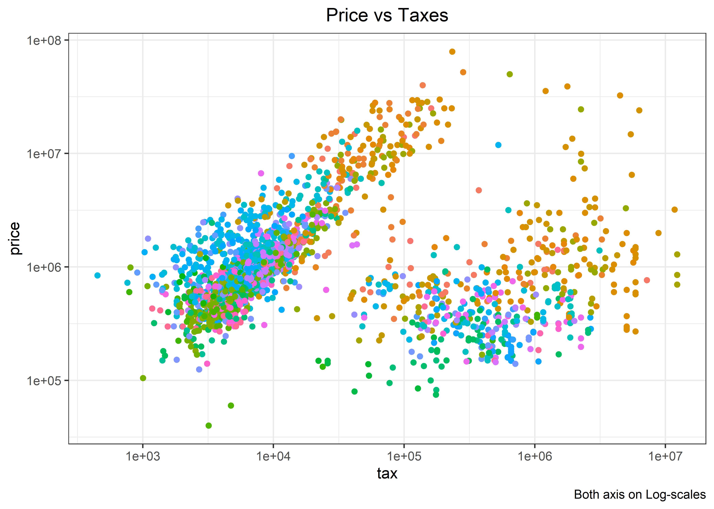<!-- -->

``` r
house_mod2 <- house_mod %>% 
  mutate(zip_code = fct_lump(zip_code, prop = 0.003))
```

``` r
set.seed(123)
split2 <- initial_split(house_mod2 %>% 
                               mutate(price = log(price),
                                      tax = log(tax),
                                      sqft = log(sqft),
                                      zip_code = factor(zip_code),
                                      bath = factor(bath)),
                        strata = zip_code)


train2 <- training(split2)
test2 <- testing(split2)
```

``` r
modrf <- rand_forest() %>% 
  set_mode("regression") %>% 
  set_engine("ranger")


recrf <- recipe(price ~ sqft + type_mod + zip_code, train2) %>% 
  step_dummy(all_nominal_predictors()) %>%
  step_interact(terms = ~ starts_with("type"):all_predictors())

wkflrf <- workflow() %>% 
  add_model(modrf) %>% 
  add_recipe(recrf)
```

``` r
wkflrf_fit <- fit(wkfl2, train2)

house_res2 <- 
  test2 %>% 
  bind_cols(predict(wkflrf_fit, test2))

all_metrics_rf <- all_metrics %>% 
  bind_rows(three_metrics(house_res2, price, .pred) %>% 
              mutate(model = "Random Forest")) %>%
  mutate(model = fct_reorder(model, .estimate, .fun = max))

all_metrics_rf %>% 
  arrange(desc(.metric), -.estimate)
```

    ## # A tibble: 12 x 4
    ##    .metric .estimator .estimate model        
    ##    <chr>   <chr>          <dbl> <fct>        
    ##  1 rsq     standard       0.688 Base LM      
    ##  2 rsq     standard       0.681 Tidy LM      
    ##  3 rsq     standard       0.655 No Tax LM    
    ##  4 rsq     standard       0.580 Random Forest
    ##  5 rmse    standard       0.593 Random Forest
    ##  6 rmse    standard       0.530 No Tax LM    
    ##  7 rmse    standard       0.508 Tidy LM      
    ##  8 rmse    standard       0.500 Base LM      
    ##  9 mae     standard       0.412 Random Forest
    ## 10 mae     standard       0.383 No Tax LM    
    ## 11 mae     standard       0.349 Tidy LM      
    ## 12 mae     standard       0.346 Base LM

``` r
(all_metrics_rf %>% 
  filter(.metric == "rsq") %>% 
  ggplot(aes(.estimate, .metric, fill = model)) +
  geom_col(position = "dodge") + labs(y = "", x = "", title = "Variance Explained", fill = "Model") + 
  scale_x_continuous(breaks = seq(0.55,0.9,0.05), minor_breaks = NULL)) /
(all_metrics_rf %>% 
  filter(.metric != "rsq") %>% 
  ggplot(aes(.estimate, .metric, fill = model)) +
  geom_col(position = "dodge") + labs(y = "", x = "", title = "Error", fill = "Model") + 
  scale_x_continuous(breaks = seq(0.35,0.7,0.05), minor_breaks = NULL)) +
plot_layout(guides = "collect") +
plot_annotation(title = "All 4 Models",
                theme = theme(plot.title = element_text(hjust = 0.5)))
```

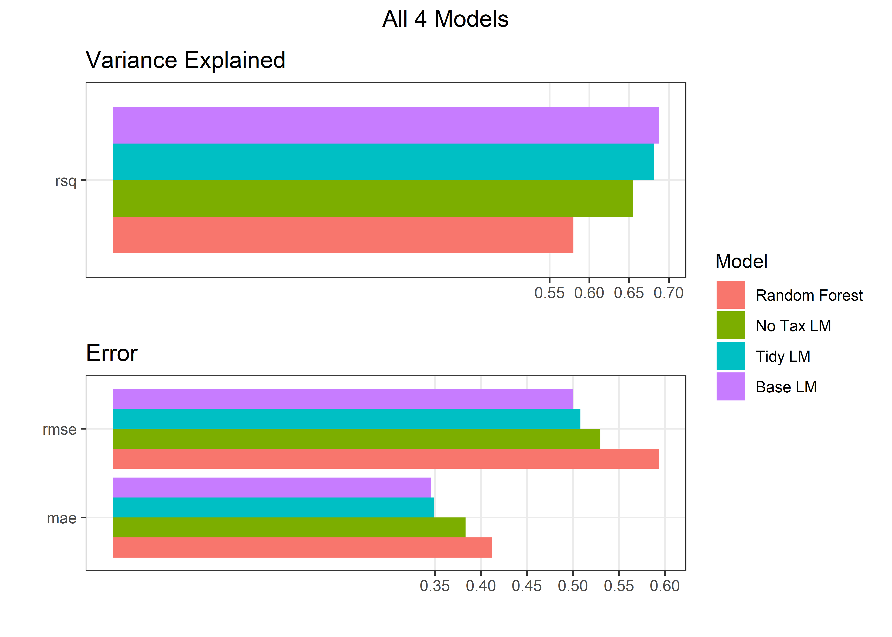<!-- -->

# Just let Gam figure it out

``` r
library(mgcv)
```

    ## Loading required package: nlme

    ## 
    ## Attaching package: 'nlme'

    ## The following object is masked from 'package:dplyr':
    ## 
    ##     collapse

    ## This is mgcv 1.8-39. For overview type 'help("mgcv-package")'.

``` r
library(gratia)
```

    ## 
    ## Attaching package: 'gratia'

    ## The following object is masked from 'package:dials':
    ## 
    ##     penalty

``` r
set.seed(10)
gam_data <- house %>% 
  select(price, tax, sqft, bath, lon, lat, type_mod) %>% 
  mutate(price = log(price)) %>% 
  drop_na()

gam_split <- initial_split(gam_data, strata = type_mod)

gam_train <- training(gam_split)
gam_test <- testing(gam_split)

gam_mod <- gam(price ~ 
                 s(sqft, by = type_mod) + 
                 s(bath, by = type_mod) + 
                 s(lon, lat), 
               gaussian, gam_train, method = 'REML')
```

``` r
summary(gam_mod)
```

    ## 
    ## Family: gaussian 
    ## Link function: identity 
    ## 
    ## Formula:
    ## price ~ s(sqft, by = type_mod) + s(bath, by = type_mod) + s(lon, 
    ##     lat)
    ## 
    ## Parametric coefficients:
    ##             Estimate Std. Error t value Pr(>|t|)    
    ## (Intercept)  13.4719     0.1187   113.5   <2e-16 ***
    ## ---
    ## Signif. codes:  0 '***' 0.001 '**' 0.01 '*' 0.05 '.' 0.1 ' ' 1
    ## 
    ## Approximate significance of smooth terms:
    ##                                       edf Ref.df       F  p-value    
    ## s(sqft):type_modApartment           1.001  1.002   0.449 0.503566    
    ## s(sqft):type_modCondo               2.924  2.993  37.858  < 2e-16 ***
    ## s(sqft):type_modCoop                7.337  8.276   4.617 2.19e-05 ***
    ## s(sqft):type_modMulti Family        2.041  2.094  49.044  < 2e-16 ***
    ## s(sqft):type_modSingle Family Home  2.630  2.863 107.926  < 2e-16 ***
    ## s(sqft):type_modTownhouse           2.911  3.002  48.980  < 2e-16 ***
    ## s(bath):type_modApartment           2.476  2.768  13.123 4.61e-07 ***
    ## s(bath):type_modCondo               3.611  4.021   6.298 5.77e-05 ***
    ## s(bath):type_modCoop                5.271  5.486 171.616  < 2e-16 ***
    ## s(bath):type_modMulti Family        1.820  2.274   7.228 0.000495 ***
    ## s(bath):type_modSingle Family Home  5.370  6.182  16.417  < 2e-16 ***
    ## s(bath):type_modTownhouse           6.303  6.725  12.400  < 2e-16 ***
    ## s(lon,lat)                         27.460 28.843  66.989  < 2e-16 ***
    ## ---
    ## Signif. codes:  0 '***' 0.001 '**' 0.01 '*' 0.05 '.' 0.1 ' ' 1
    ## 
    ## R-sq.(adj) =  0.855   Deviance explained =   86%
    ## -REML = 973.34  Scale est. = 0.13818   n = 1934

``` r
appraise(gam_mod)
```

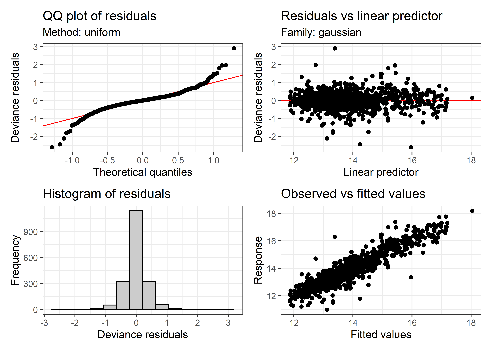<!-- -->

``` r
draw(gam_mod, select = smooths(gam_mod)[1:6])
```

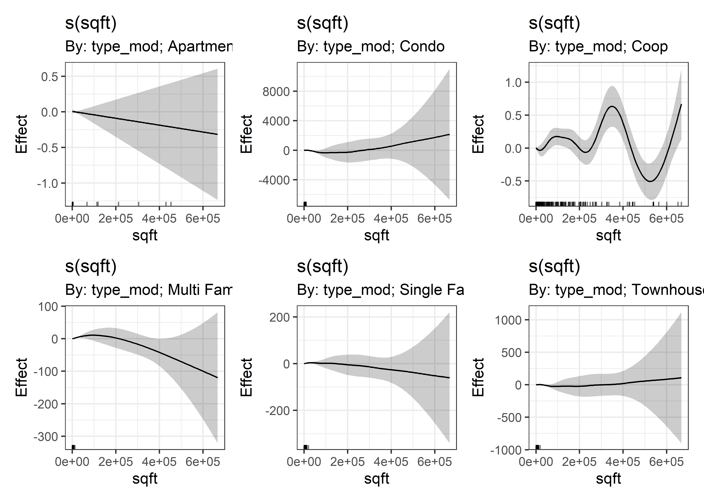<!-- -->

``` r
draw(gam_mod, select = smooths(gam_mod)[7:12])
```

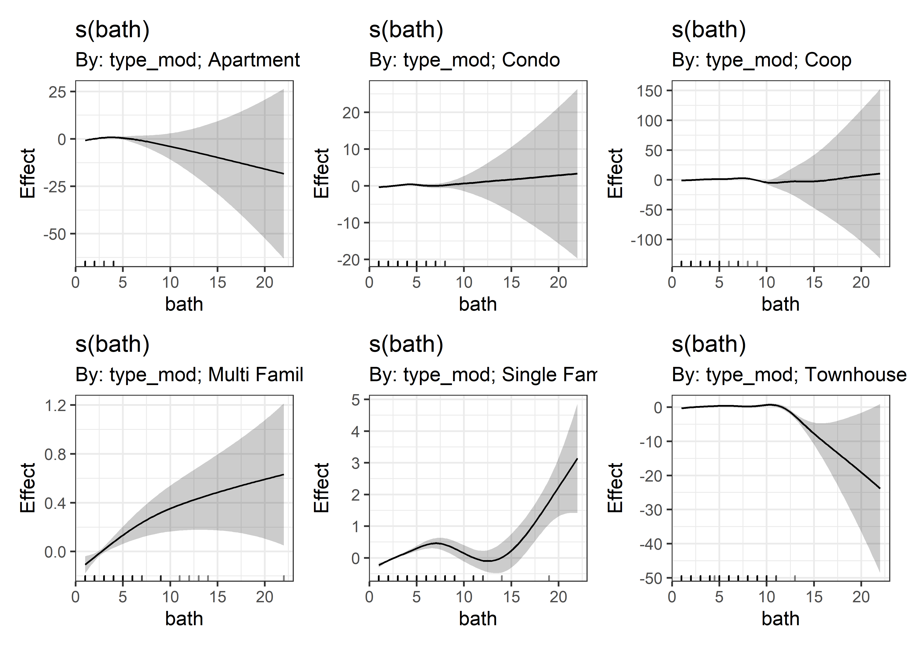<!-- -->

``` r
draw(gam_mod, select = smooths(gam_mod)[13])
```

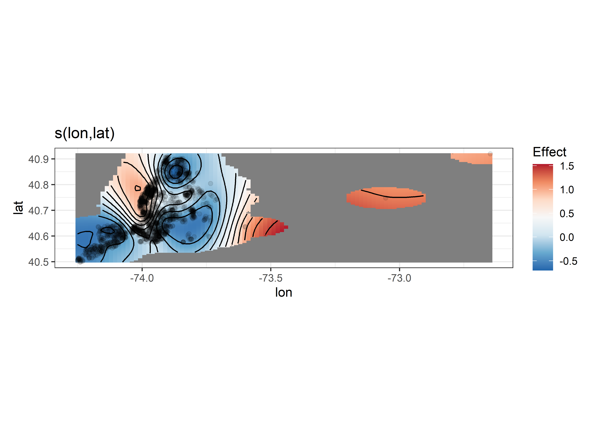<!-- -->

``` r
augment(gam_mod) %>% 
  three_metrics(price, .fitted)
```

    ## # A tibble: 3 x 3
    ##   .metric .estimator .estimate
    ##   <chr>   <chr>          <dbl>
    ## 1 rsq     standard       0.860
    ## 2 rmse    standard       0.365
    ## 3 mae     standard       0.248

``` r
(gam_test %>% 
  mutate(predict = predict(gam_mod, gam_test)) %>% 
  ggplot(aes(price, predict, color = type_mod)) + geom_point(alpha = 0.3) +
  geom_abline()) /
(gam_test %>% 
  mutate(predict = predict(gam_mod, gam_test),
         resid = price - predict) %>% 
  ggplot(aes(predict, resid, color = type_mod)) + geom_point(alpha = 0.3) +
  geom_hline(yintercept = 0)) + plot_layout(guides = "collect")
```

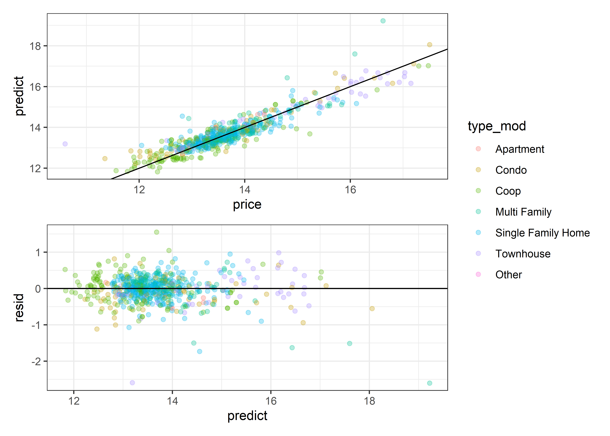<!-- -->

``` r
k.check(gam_mod)
```

    ##                                    k'       edf   k-index p-value
    ## s(sqft):type_modApartment           9  1.001019 0.9342033  0.0000
    ## s(sqft):type_modCondo               9  2.924083 0.9342033  0.0000
    ## s(sqft):type_modCoop                9  7.337217 0.9342033  0.0025
    ## s(sqft):type_modMulti Family        9  2.040906 0.9342033  0.0025
    ## s(sqft):type_modSingle Family Home  9  2.630311 0.9342033  0.0050
    ## s(sqft):type_modTownhouse           9  2.911370 0.9342033  0.0025
    ## s(bath):type_modApartment           9  2.475556 0.9439070  0.0050
    ## s(bath):type_modCondo               9  3.611493 0.9439070  0.0025
    ## s(bath):type_modCoop                9  5.271495 0.9439070  0.0025
    ## s(bath):type_modMulti Family        9  1.819709 0.9439070  0.0200
    ## s(bath):type_modSingle Family Home  9  5.369886 0.9439070  0.0075
    ## s(bath):type_modTownhouse           9  6.303077 0.9439070  0.0100
    ## s(lon,lat)                         29 27.460304 0.8016391  0.0000

I would correct the ‘k’ value for the bath and lon/lat variables, but it
took too long for my computer to run. So, we will leave it like this!

And if you are wondering, its metrics did improve.

``` r
(all_metrics_rf <- all_metrics_rf %>% 
  bind_rows(augment(gam_mod) %>% 
    three_metrics(price, .fitted) %>% 
    mutate(model = "GAM")) %>% 
  mutate(model = fct_reorder(model, .estimate, .desc = TRUE)) %>% 
  arrange(desc(.metric), -.estimate))
```

    ## # A tibble: 15 x 4
    ##    .metric .estimator .estimate model        
    ##    <chr>   <chr>          <dbl> <fct>        
    ##  1 rsq     standard       0.860 GAM          
    ##  2 rsq     standard       0.688 Base LM      
    ##  3 rsq     standard       0.681 Tidy LM      
    ##  4 rsq     standard       0.655 No Tax LM    
    ##  5 rsq     standard       0.580 Random Forest
    ##  6 rmse    standard       0.593 Random Forest
    ##  7 rmse    standard       0.530 No Tax LM    
    ##  8 rmse    standard       0.508 Tidy LM      
    ##  9 rmse    standard       0.500 Base LM      
    ## 10 rmse    standard       0.365 GAM          
    ## 11 mae     standard       0.412 Random Forest
    ## 12 mae     standard       0.383 No Tax LM    
    ## 13 mae     standard       0.349 Tidy LM      
    ## 14 mae     standard       0.346 Base LM      
    ## 15 mae     standard       0.248 GAM

``` r
(all_metrics_rf %>% 
  filter(.metric == "rsq") %>% 
  ggplot(aes(.estimate, .metric, fill = model)) +
  geom_col(position = "dodge") + labs(y = "", x = "", title = "Variance Explained", fill = "Model") + 
  scale_x_continuous(breaks = seq(0.55,0.9,0.05), minor_breaks = NULL)) /
(all_metrics_rf %>% 
  filter(.metric != "rsq") %>% 
  ggplot(aes(.estimate, .metric, fill = model)) +
  geom_col(position = "dodge") + labs(y = "", x = "", title = "Error", fill = "Model") + 
  scale_x_continuous(breaks = seq(0.35,0.7,0.05), minor_breaks = NULL)) +
plot_layout(guides = "collect") +
plot_annotation(title = "All 5 Models",
                theme = theme(plot.title = element_text(hjust = 0.5)))
```

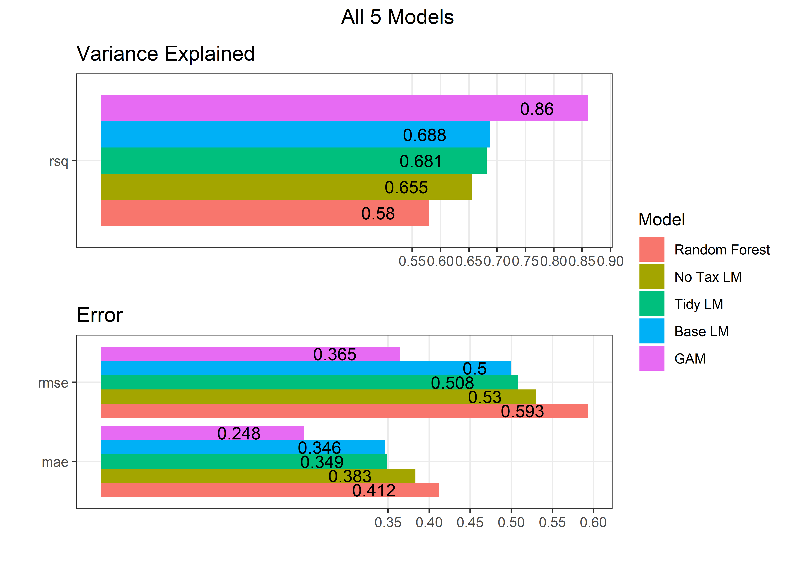<!-- -->

The GAM Model outperforms all other models. It has less RMSE and MAE, as
well as a higher R^2
