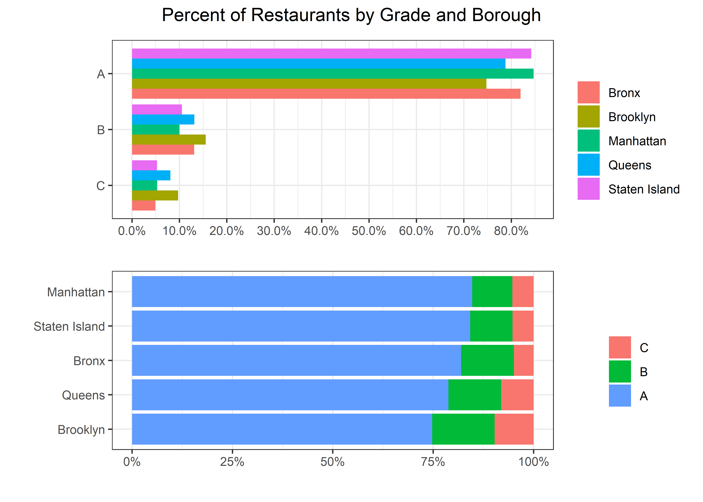

Inspections
================
Matthew
3/16/2022

``` r
inspections <- read_csv("https://data.cityofnewyork.us/resource/43nn-pn8j.csv")
```

    ## Rows: 1000 Columns: 26
    ## -- Column specification --------------------------------------------------------
    ## Delimiter: ","
    ## chr  (14): dba, boro, building, street, cuisine_description, action, violati...
    ## dbl   (9): camis, zipcode, phone, score, latitude, longitude, community_boar...
    ## dttm  (3): inspection_date, grade_date, record_date
    ## 
    ## i Use `spec()` to retrieve the full column specification for this data.
    ## i Specify the column types or set `show_col_types = FALSE` to quiet this message.

``` r
inspections <- inspections %>%
  rename(id = camis, name = dba)
```

# EDA

``` r
inspections %>%
  filter(!is.na(score)) %>%
  summarize(min(score), max(score))
```

    ## # A tibble: 1 x 2
    ##   `min(score)` `max(score)`
    ##          <dbl>        <dbl>
    ## 1            0          141

``` r
inspections %>%
  count(score, sort = TRUE)
```

    ## # A tibble: 80 x 2
    ##    score     n
    ##    <dbl> <int>
    ##  1    12   102
    ##  2    13    65
    ##  3    10    51
    ##  4     7    48
    ##  5    11    43
    ##  6     9    40
    ##  7    NA    39
    ##  8    18    32
    ##  9    21    32
    ## 10    20    31
    ## # ... with 70 more rows

## Analysis of Boroughs

``` r
inspections %>%
  filter(!is.na(score), boro != 0) %>%
  group_by(boro) %>%
  summarize(m = mean(score)) %>%
  ggplot(aes(m, fct_reorder(boro, m), fill = boro)) + geom_col() +
  labs(y = "", x = "Average Score", fill = "", title = "Average Score by Borough")
```

<!-- -->

``` r
inspections %>%
  filter(grade %in% c("A", "B", "C")) %>%
  group_by(boro) %>%
  count(grade, sort = TRUE) %>%
  ggplot(aes(n, fct_rev(grade), fill = boro)) + geom_col(position = "dodge") +
  labs(y = "", x = "Count", title = "The Number of Restaurants by Borough and Grade")
```

<!-- -->

``` r
(inspections %>%
  filter(grade %in% c("A", "B", "C")) %>%
  group_by(boro) %>%
  summarize(A = mean(grade == "A"),
            B = mean(grade == "B"),
            C = mean(grade == "C")) %>%
  pivot_longer(-boro) %>%
  ggplot(aes(value, fct_rev(name), fill = boro)) + geom_col(position = "dodge") +
  labs(y = "", x = "", fill = "") + 
  scale_x_continuous(breaks = seq(0,1,0.1),
                     labels = scales::percent_format())) /
  (inspections %>%
    filter(grade %in% c("A", "B", "C")) %>%
    group_by(boro) %>%
    summarize(A = mean(grade == "A"),
              B = mean(grade == "B"),
              C = mean(grade == "C")) %>%
    pivot_longer(-boro) %>%
    ggplot(aes(value, fct_reorder(boro, value, .fun = max), fill = fct_rev(name))) + geom_col() +
    labs(y = "", x = "", fill = "") +
    scale_x_continuous(labels = scales::percent_format())) + 
  plot_annotation(title = "Percent of Restaurants by Grade and Borough",
                  theme = theme(plot.title = element_text(hjust = 0.5)))
```

<!-- -->

``` r
borofun <- function(x){
  inspections %>%
    filter(boro == {{x}}, !is.na(score)) %>%
    group_by(cuisine_description) %>%
    summarize(max_score = max(score)) %>%
    arrange(-max_score) 
}


tablefun <- function(x) {
  borofun({{x}}) %>% 
    head(3) %>%
    mutate(Borough = paste({{x}}, " (Top)")) %>%
    bind_rows(borofun({{x}}) %>%
    tail(3) %>%
    mutate(Borough = paste({{x}}, " (Bottom)")))
}
table <- tablefun("Bronx") %>%
  bind_rows(tablefun("Brooklyn")) %>%
  bind_rows(tablefun("Manhattan")) %>%
  bind_rows(tablefun("Queens")) %>%
  bind_rows(tablefun("Staten Island"))
```

### Table of Top and Bottom 3 Inspection Score Violations by Borough

``` r
table[,c(3,1,2)] %>% knitr::kable()
```

| Borough                | cuisine\_description     | max\_score |
|:-----------------------|:-------------------------|-----------:|
| Bronx (Top)            | American                 |         71 |
| Bronx (Top)            | Pizza                    |         57 |
| Bronx (Top)            | African                  |         55 |
| Bronx (Bottom)         | Mediterranean            |          4 |
| Bronx (Bottom)         | Tex-Mex                  |          4 |
| Bronx (Bottom)         | Donuts                   |          2 |
| Brooklyn (Top)         | Spanish                  |        141 |
| Brooklyn (Top)         | Mexican                  |        104 |
| Brooklyn (Top)         | Caribbean                |         88 |
| Brooklyn (Bottom)      | Polish                   |         10 |
| Brooklyn (Bottom)      | Barbecue                 |          9 |
| Brooklyn (Bottom)      | Other                    |          9 |
| Manhattan (Top)        | Italian                  |         76 |
| Manhattan (Top)        | Vegetarian               |         74 |
| Manhattan (Top)        | American                 |         73 |
| Manhattan (Bottom)     | Greek                    |         11 |
| Manhattan (Bottom)     | Salads                   |         10 |
| Manhattan (Bottom)     | Australian               |          4 |
| Queens (Top)           | Latin American           |         90 |
| Queens (Top)           | Caribbean                |         78 |
| Queens (Top)           | American                 |         77 |
| Queens (Bottom)        | Southeast Asian          |          8 |
| Queens (Bottom)        | Hamburgers               |          7 |
| Queens (Bottom)        | Southwestern             |          2 |
| Staten Island (Top)    | Mexican                  |         48 |
| Staten Island (Top)    | Chinese                  |         46 |
| Staten Island (Top)    | Italian                  |         45 |
| Staten Island (Bottom) | Bakery Products/Desserts |          6 |
| Staten Island (Bottom) | Asian/Asian Fusion       |          4 |
| Staten Island (Bottom) | Donuts                   |          3 |

``` r
inspections %>%
  filter(grade %in% c("A", "B", "C")) %>%
  group_by(grade) %>%
  summarize(n = mean(score)) %>%
  ggplot(aes(n, fct_rev(grade))) + geom_col(fill = "blue") +
  labs(y = "Grade", x = "Average Score")
```

<!-- -->
