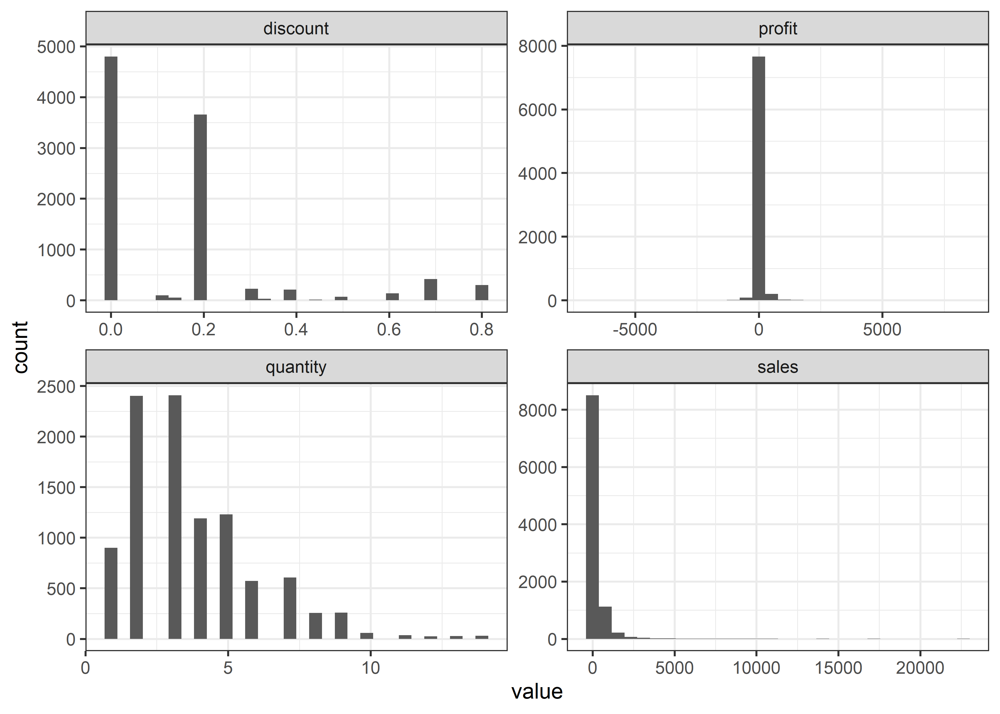
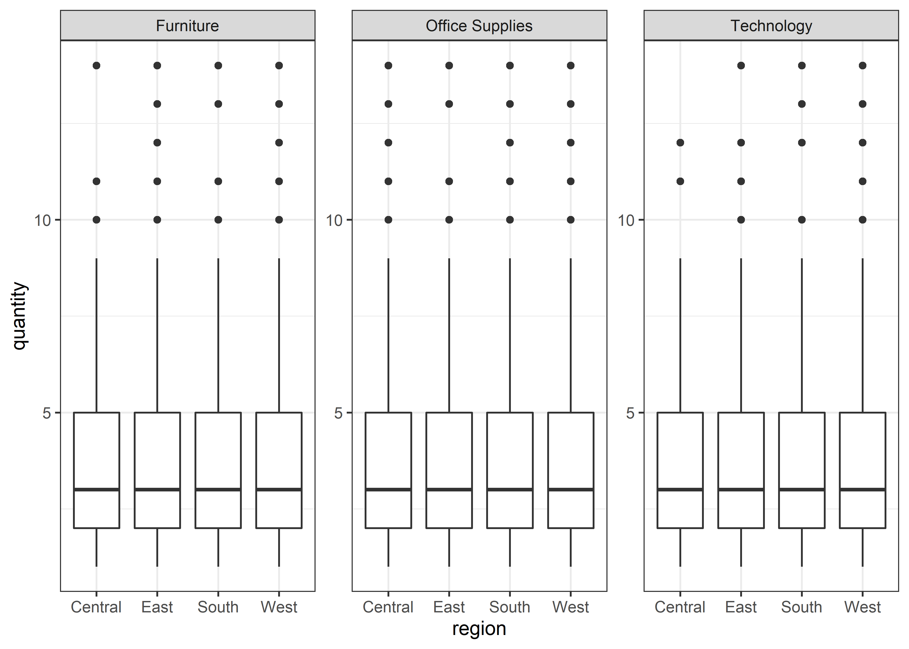
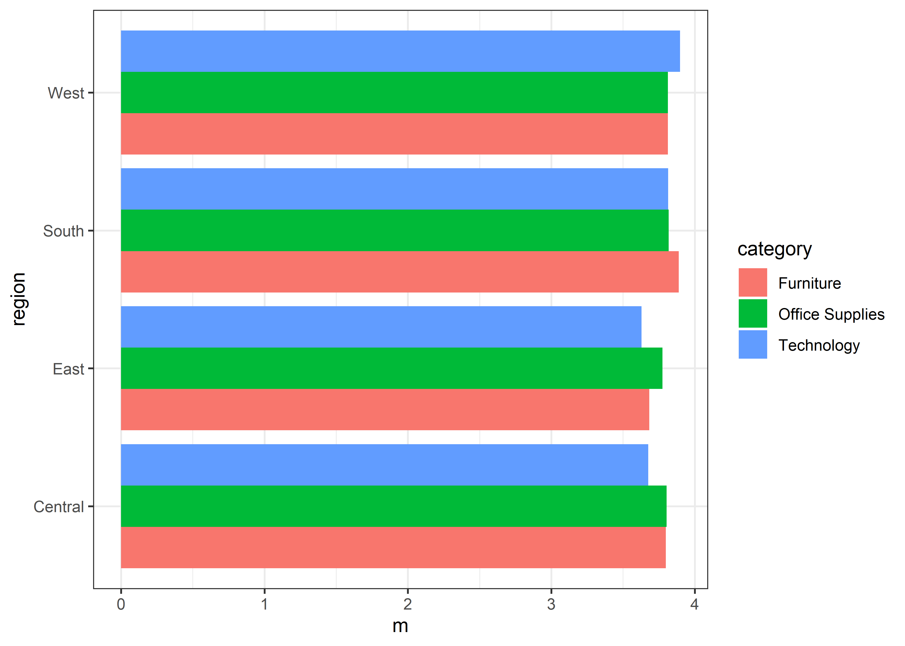
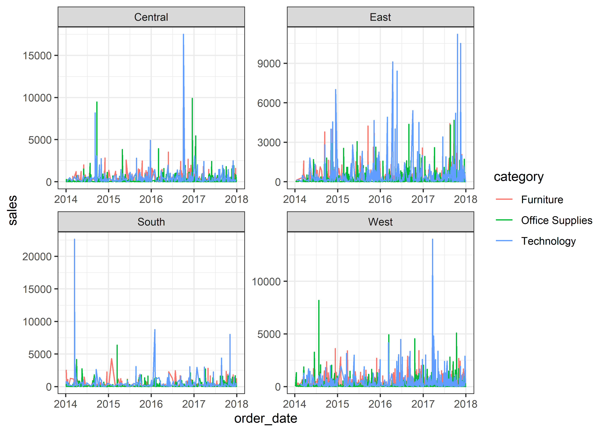
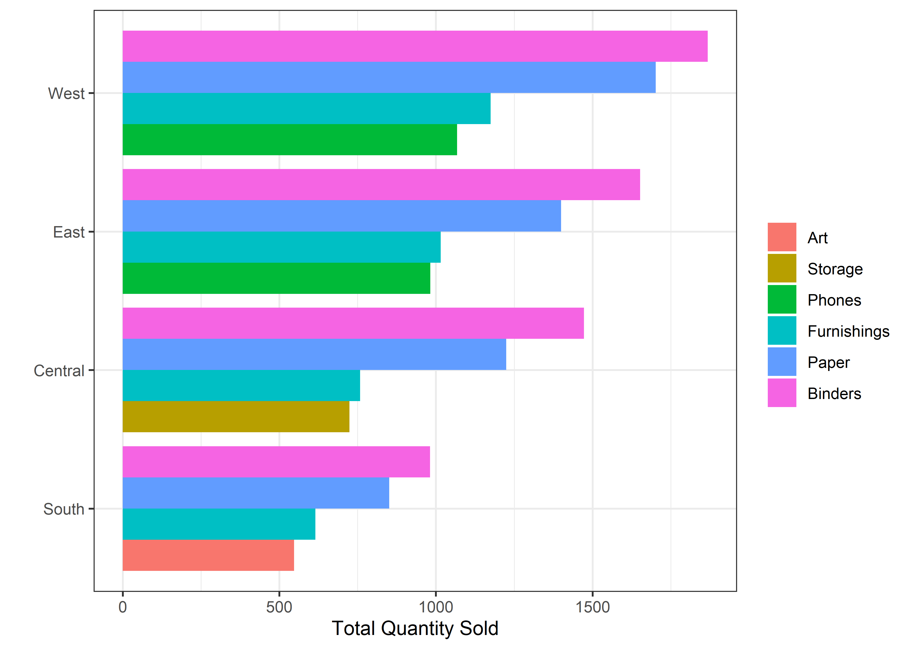
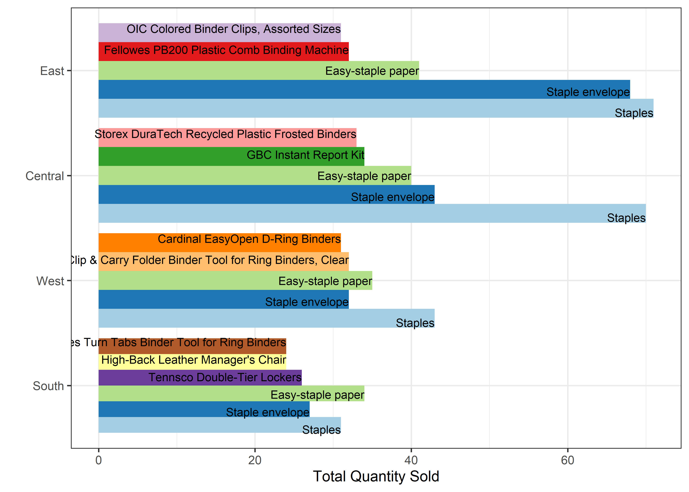

Office
================
Matthew
2022-06-15

``` r
office_supplies <- read_csv("C:/Users/Matthew Hondrakis/Downloads/office_supplies.csv")
```

    ## Rows: 9993 Columns: 12
    ## -- Column specification --------------------------------------------------------
    ## Delimiter: ","
    ## chr  (7): Order ID, Ship Mode, Region, Product ID, Category, Sub-Category, P...
    ## dbl  (4): Sales, Quantity, Discount, Profit
    ## date (1): Order Date
    ## 
    ## i Use `spec()` to retrieve the full column specification for this data.
    ## i Specify the column types or set `show_col_types = FALSE` to quiet this message.

``` r
office_supplies <- office_supplies %>% 
  rename_with(tolower) %>% 
  rename_with(~ gsub(" ", "_", .))
```

``` r
skimr::skim(office_supplies)
```

|                                                  |                 |
|:-------------------------------------------------|:----------------|
| Name                                             | office_supplies |
| Number of rows                                   | 9993            |
| Number of columns                                | 12              |
| \_\_\_\_\_\_\_\_\_\_\_\_\_\_\_\_\_\_\_\_\_\_\_   |                 |
| Column type frequency:                           |                 |
| character                                        | 7               |
| Date                                             | 1               |
| numeric                                          | 4               |
| \_\_\_\_\_\_\_\_\_\_\_\_\_\_\_\_\_\_\_\_\_\_\_\_ |                 |
| Group variables                                  | None            |

Data summary

**Variable type: character**

| skim_variable | n_missing | complete_rate | min | max | empty | n_unique | whitespace |
|:--------------|----------:|--------------:|----:|----:|------:|---------:|-----------:|
| order_id      |         0 |             1 |  14 |  14 |     0 |     5008 |          0 |
| ship_mode     |         0 |             1 |   8 |  14 |     0 |        4 |          0 |
| region        |         0 |             1 |   4 |   7 |     0 |        4 |          0 |
| product_id    |         0 |             1 |  15 |  15 |     0 |     1862 |          0 |
| category      |         0 |             1 |   9 |  15 |     0 |        3 |          0 |
| sub-category  |         0 |             1 |   3 |  11 |     0 |       17 |          0 |
| product_name  |         0 |             1 |   5 | 127 |     0 |     1850 |          0 |

**Variable type: Date**

| skim_variable | n_missing | complete_rate | min        | max        | median     | n_unique |
|:--------------|----------:|--------------:|:-----------|:-----------|:-----------|---------:|
| order_date    |         0 |             1 | 2014-01-03 | 2017-12-30 | 2016-06-26 |     1237 |

**Variable type: numeric**

| skim_variable | n_missing | complete_rate |   mean |     sd |       p0 |   p25 |   p50 |    p75 |     p100 | hist  |
|:--------------|----------:|--------------:|-------:|-------:|---------:|------:|------:|-------:|---------:|:------|
| sales         |         0 |           1.0 | 229.85 | 623.28 |     0.44 | 17.28 | 54.48 | 209.94 | 22638.48 | ▇▁▁▁▁ |
| quantity      |         0 |           1.0 |   3.79 |   2.23 |     1.00 |  2.00 |  3.00 |   5.00 |    14.00 | ▇▅▁▁▁ |
| discount      |         0 |           1.0 |   0.16 |   0.21 |     0.00 |  0.00 |  0.20 |   0.20 |     0.80 | ▇▆▁▁▁ |
| profit        |      1993 |           0.8 |  28.13 | 227.33 | -6599.98 |  1.81 |  8.77 |  29.95 |  8399.98 | ▁▁▇▁▁ |

``` r
office_supplies %>% 
  keep(is.numeric) %>% 
  gather() %>% 
  ggplot(aes(value)) + geom_histogram() + 
  facet_wrap(~key, scales = "free")
```

    ## `stat_bin()` using `bins = 30`. Pick better value with `binwidth`.

<!-- -->

``` r
office_supplies %>% 
  group_by(region) %>% 
  summarize(m = mean(profit, na.rm = TRUE)) %>% 
  arrange(-m)
```

    ## # A tibble: 4 x 2
    ##   region      m
    ##   <chr>   <dbl>
    ## 1 East     31.9
    ## 2 West     30.6
    ## 3 South    29.6
    ## 4 Central  18.8

``` r
office_supplies %>% 
  group_by(region, category) %>% 
  summarize(m = mean(profit, na.rm = TRUE)) %>% 
  arrange(category, -m) %>% 
  knitr::kable()
```

    ## `summarise()` has grouped output by 'region'. You can override using the
    ## `.groups` argument.

| region  | category        |         m |
|:--------|:----------------|----------:|
| South   | Furniture       | 33.354909 |
| West    | Furniture       | 12.356680 |
| East    | Furniture       |  3.386627 |
| Central | Furniture       | -2.523598 |
| West    | Office Supplies | 27.781835 |
| East    | Office Supplies | 22.720393 |
| South   | Office Supplies | 19.157126 |
| Central | Office Supplies |  6.464549 |
| East    | Technology      | 92.678295 |
| Central | Technology      | 83.136934 |
| West    | Technology      | 62.989595 |
| South   | Technology      | 60.515640 |

``` r
ggplot(office_supplies, aes(region, profit)) + geom_boxplot() +
  facet_wrap(~category, scales = "free")
```

<!-- -->

``` r
gplot <- function(x, ...){
office_supplies %>% 
  group_by(region, ...) %>% 
  summarize(m = mean({{x}}, na.rm = TRUE)) %>% 
  ggplot(aes(m, region))
}

gplot(quantity, category) + 
  geom_col(position = "dodge", aes(fill = category))
```

    ## `summarise()` has grouped output by 'region'. You can override using the
    ## `.groups` argument.

<!-- -->

``` r
office_supplies %>% 
  ggplot(aes(order_date, sales, color = category)) + geom_line() +
  facet_wrap(~region, scales = "free")
```

<!-- -->

``` r
gplot2 <- function(x){ 
  office_supplies %>%  
    ggplot(aes(order_date, {{x}})) + geom_line() +
    facet_grid(rows = vars(region), cols = vars(`sub-category`))
}

#gplot2(quantity)
```

``` r
office_supplies %>% 
  group_by(region, `sub-category`) %>% 
  summarize(n = sum(quantity)) %>% 
  arrange(-n) %>% 
  slice_head(n = 4) %>% 
  ggplot(aes(n, fct_reorder(region, n, max), 
             fill = fct_reorder(`sub-category`, n, max))) + 
  geom_col(position = "dodge") + 
  labs(fill = "", x = "Total Quantity Sold", y = "")
```

    ## `summarise()` has grouped output by 'region'. You can override using the
    ## `.groups` argument.

<!-- -->

``` r
office_supplies %>% 
  group_by(region, product_name) %>% 
  summarize(m = sum(quantity)) %>% 
  slice_max(m, n = 5) %>% 
  ggplot(aes(m, label = product_name, 
             fct_reorder(region, m), 
             fill = fct_reorder(product_name, m, max, .desc = TRUE))) +
  geom_col(position = "dodge") + scale_fill_brewer(palette = "Paired") +
  labs(x = "Total Quantity Sold", y = "", fill = "") 
```

    ## `summarise()` has grouped output by 'region'. You can override using the
    ## `.groups` argument.

<!-- -->
