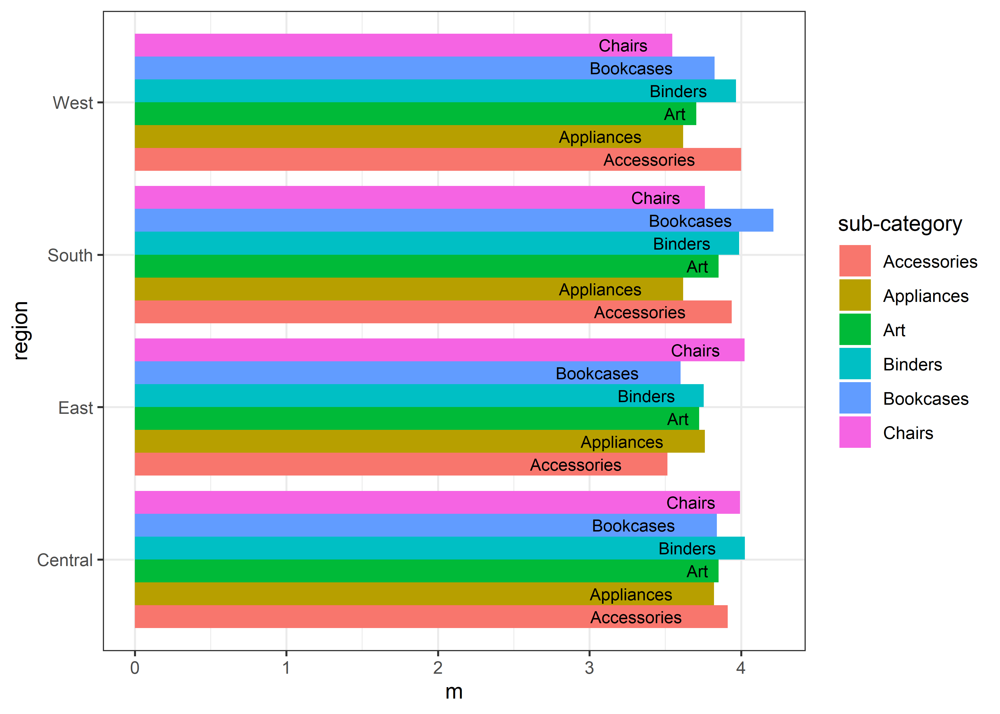
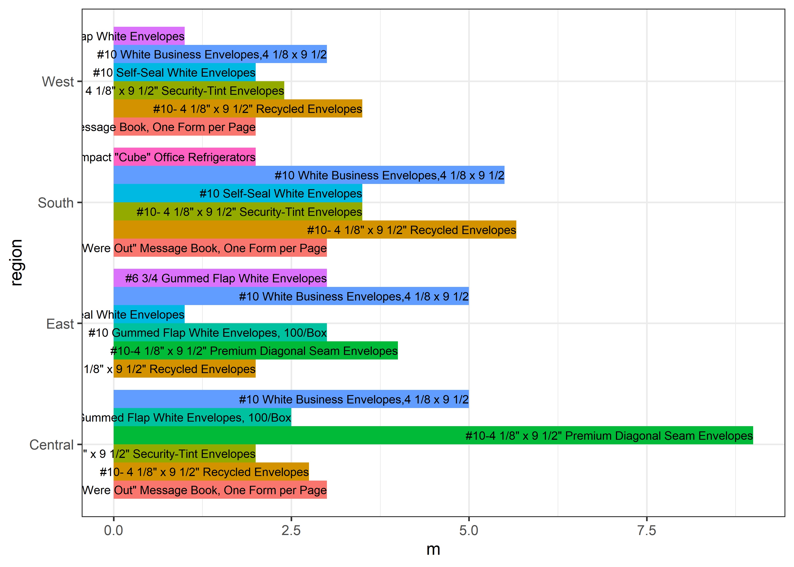
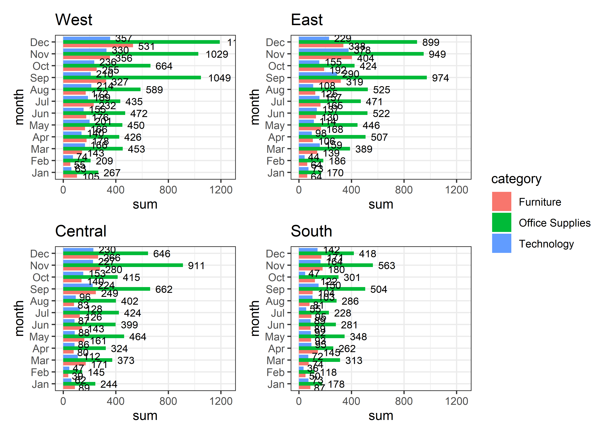
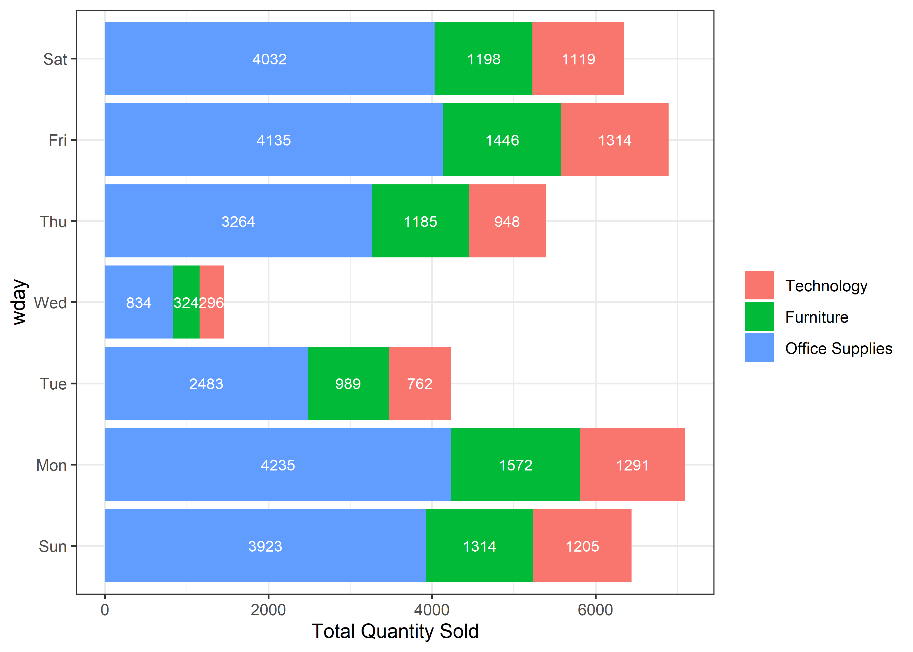
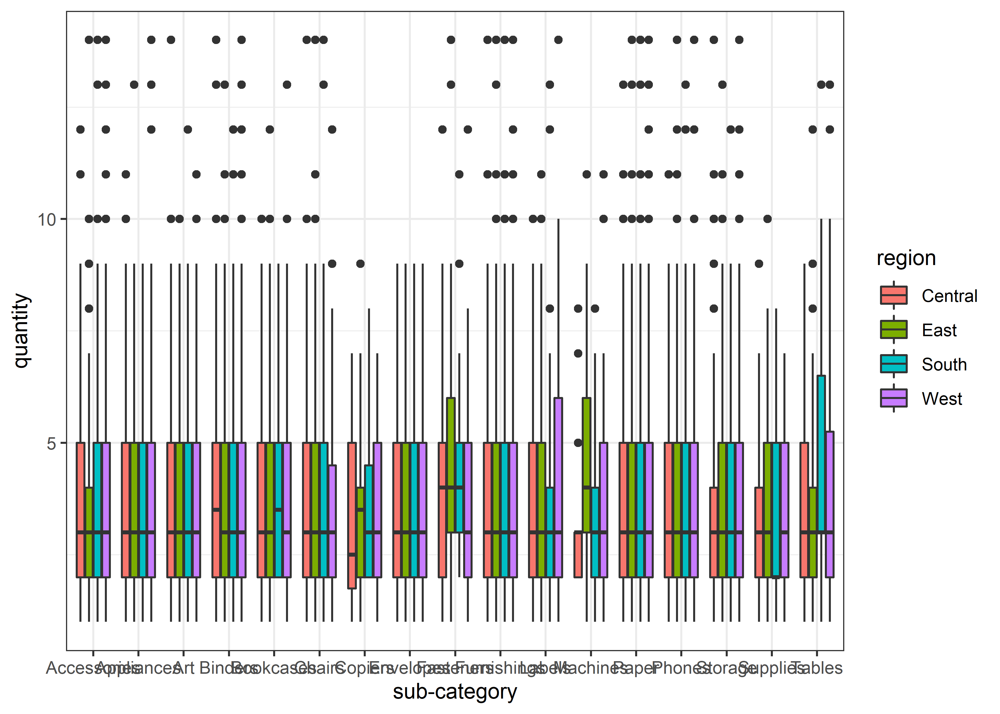
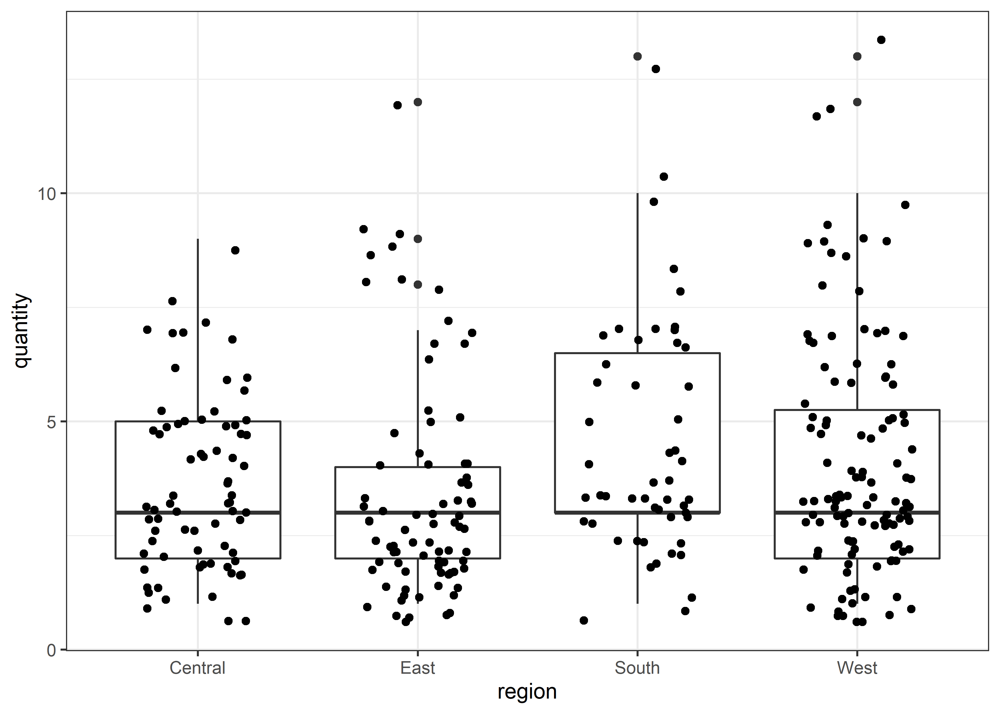
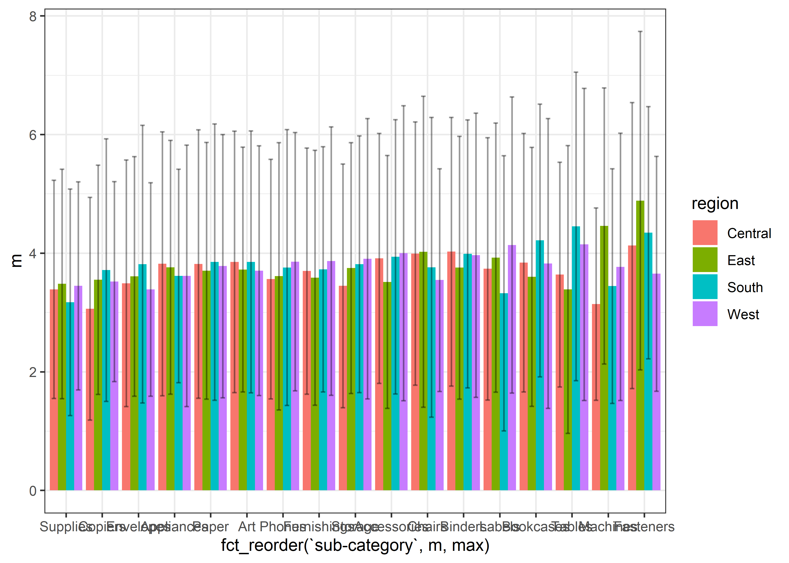
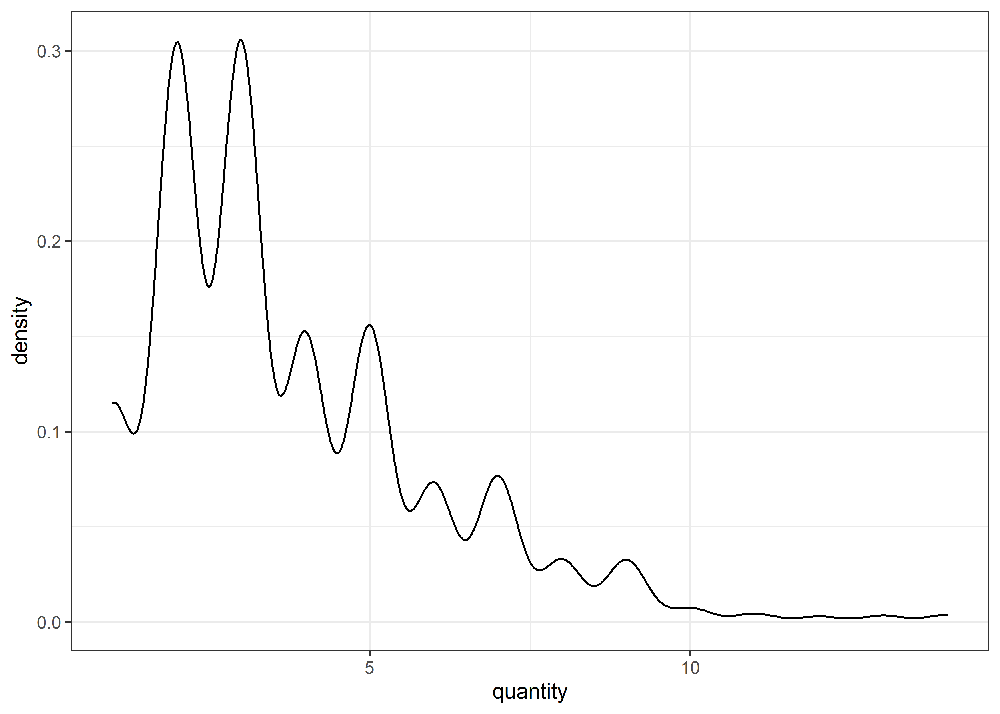
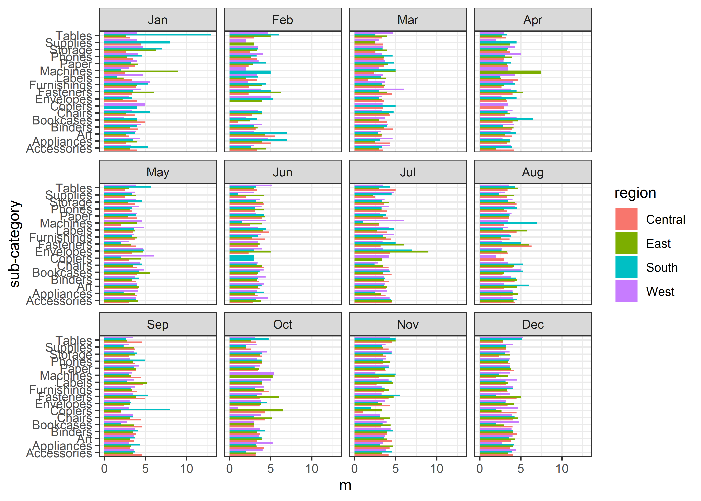
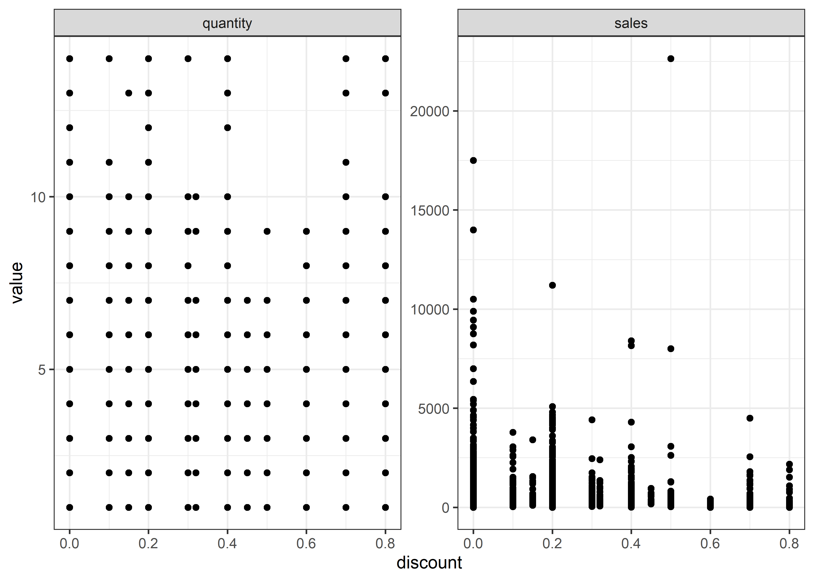

Office
================
Matthew
2022-06-15

# Office Supplies

## Read and Clean Up

``` r
office_supplies <- read_csv("C:/Users/Matthew Hondrakis/Downloads/office_supplies.csv")
```

    ## Rows: 9993 Columns: 12
    ## -- Column specification --------------------------------------------------------
    ## Delimiter: ","
    ## chr  (7): Order ID, Ship Mode, Region, Product ID, Category, Sub-Category, P...
    ## dbl  (4): Sales, Quantity, Discount, Profit
    ## date (1): Order Date
    ## 
    ## i Use `spec()` to retrieve the full column specification for this data.
    ## i Specify the column types or set `show_col_types = FALSE` to quiet this message.

``` r
office_supplies <- office_supplies %>% 
  rename_with(tolower) %>% 
  rename_with(~ gsub(" ", "_", .))
```

## EDA

``` r
skimr::skim(office_supplies)
```

|                                                  |                 |
|:-------------------------------------------------|:----------------|
| Name                                             | office_supplies |
| Number of rows                                   | 9993            |
| Number of columns                                | 12              |
| \_\_\_\_\_\_\_\_\_\_\_\_\_\_\_\_\_\_\_\_\_\_\_   |                 |
| Column type frequency:                           |                 |
| character                                        | 7               |
| Date                                             | 1               |
| numeric                                          | 4               |
| \_\_\_\_\_\_\_\_\_\_\_\_\_\_\_\_\_\_\_\_\_\_\_\_ |                 |
| Group variables                                  | None            |

Data summary

**Variable type: character**

| skim_variable | n_missing | complete_rate | min | max | empty | n_unique | whitespace |
|:--------------|----------:|--------------:|----:|----:|------:|---------:|-----------:|
| order_id      |         0 |             1 |  14 |  14 |     0 |     5008 |          0 |
| ship_mode     |         0 |             1 |   8 |  14 |     0 |        4 |          0 |
| region        |         0 |             1 |   4 |   7 |     0 |        4 |          0 |
| product_id    |         0 |             1 |  15 |  15 |     0 |     1862 |          0 |
| category      |         0 |             1 |   9 |  15 |     0 |        3 |          0 |
| sub-category  |         0 |             1 |   3 |  11 |     0 |       17 |          0 |
| product_name  |         0 |             1 |   5 | 127 |     0 |     1850 |          0 |

**Variable type: Date**

| skim_variable | n_missing | complete_rate | min        | max        | median     | n_unique |
|:--------------|----------:|--------------:|:-----------|:-----------|:-----------|---------:|
| order_date    |         0 |             1 | 2014-01-03 | 2017-12-30 | 2016-06-26 |     1237 |

**Variable type: numeric**

| skim_variable | n_missing | complete_rate |   mean |     sd |       p0 |   p25 |   p50 |    p75 |     p100 | hist  |
|:--------------|----------:|--------------:|-------:|-------:|---------:|------:|------:|-------:|---------:|:------|
| sales         |         0 |           1.0 | 229.85 | 623.28 |     0.44 | 17.28 | 54.48 | 209.94 | 22638.48 | ▇▁▁▁▁ |
| quantity      |         0 |           1.0 |   3.79 |   2.23 |     1.00 |  2.00 |  3.00 |   5.00 |    14.00 | ▇▅▁▁▁ |
| discount      |         0 |           1.0 |   0.16 |   0.21 |     0.00 |  0.00 |  0.20 |   0.20 |     0.80 | ▇▆▁▁▁ |
| profit        |      1993 |           0.8 |  28.13 | 227.33 | -6599.98 |  1.81 |  8.77 |  29.95 |  8399.98 | ▁▁▇▁▁ |

``` r
office_supplies %>% 
  keep(is.numeric) %>% 
  gather() %>% 
  ggplot(aes(value)) + geom_histogram() + 
  facet_wrap(~key, scales = "free")
```

    ## `stat_bin()` using `bins = 30`. Pick better value with `binwidth`.

<!-- -->

``` r
office_supplies %>% 
  group_by(region) %>% 
  summarize(m = mean(profit, na.rm = TRUE)) %>% 
  arrange(-m)
```

    ## # A tibble: 4 x 2
    ##   region      m
    ##   <chr>   <dbl>
    ## 1 East     31.9
    ## 2 West     30.6
    ## 3 South    29.6
    ## 4 Central  18.8

``` r
office_supplies %>% 
  group_by(region, category) %>% 
  summarize(m = mean(profit, na.rm = TRUE)) %>% 
  arrange(category, -m) %>% 
  knitr::kable()
```

    ## `summarise()` has grouped output by 'region'. You can override using the
    ## `.groups` argument.

| region  | category        |         m |
|:--------|:----------------|----------:|
| South   | Furniture       | 33.354909 |
| West    | Furniture       | 12.356680 |
| East    | Furniture       |  3.386627 |
| Central | Furniture       | -2.523598 |
| West    | Office Supplies | 27.781835 |
| East    | Office Supplies | 22.720393 |
| South   | Office Supplies | 19.157126 |
| Central | Office Supplies |  6.464549 |
| East    | Technology      | 92.678295 |
| Central | Technology      | 83.136934 |
| West    | Technology      | 62.989595 |
| South   | Technology      | 60.515640 |

``` r
ggplot(office_supplies, aes(region, quantity)) + geom_boxplot() +
  facet_wrap(~category, scales = "free")
```

<!-- -->

``` r
gplot <- function(x, ...){
office_supplies %>% 
  group_by(region, ...) %>% 
  summarize(m = mean({{x}}, na.rm = TRUE)) %>% 
  slice_head(n = 6) %>% 
  ggplot(aes(m, region))
}

gplot(quantity, category) + 
  geom_col(position = "dodge", aes(fill = category))
```

    ## `summarise()` has grouped output by 'region'. You can override using the
    ## `.groups` argument.

<!-- -->

``` r
gplot(quantity, `sub-category`) + 
  geom_col(position = "dodge", aes(fill = `sub-category`)) + 
  geom_text(aes(label = `sub-category`, group = `sub-category`), position = position_dodge(0.9), size = 3, hjust = 1.5)
```

    ## `summarise()` has grouped output by 'region'. You can override using the
    ## `.groups` argument.

<!-- -->

``` r
gplot(quantity, product_name) + 
  geom_col(position = "dodge", aes(fill = product_name)) + theme(legend.position = "none") +
  geom_text(aes(label = product_name, group = product_name), position = position_dodge(0.9), size = 2.65, hjust = 1) 
```

    ## `summarise()` has grouped output by 'region'. You can override using the
    ## `.groups` argument.

<!-- -->

``` r
office_supplies %>% 
  ggplot(aes(order_date, sales, color = category)) + geom_line() +
  facet_wrap(~region, scales = "free")
```

<!-- -->

``` r
gplot2 <- function(x){ 
  office_supplies %>%  
    ggplot(aes(order_date, {{x}})) + geom_line() +
    facet_grid(rows = vars(region), cols = vars(`sub-category`))
}

#gplot2(quantity)
```

``` r
office_supplies %>% 
  group_by(region, `sub-category`) %>% 
  summarize(n = sum(quantity)) %>% 
  arrange(-n) %>% 
  slice_head(n = 4) %>% 
  ggplot(aes(n, fct_reorder(region, n, max), 
             fill = fct_reorder(`sub-category`, n, max))) + 
  geom_col(position = "dodge") + 
  labs(fill = "", x = "Total Quantity Sold", y = "")
```

    ## `summarise()` has grouped output by 'region'. You can override using the
    ## `.groups` argument.

<!-- -->

``` r
office_supplies %>% 
  group_by(region, product_name) %>% 
  summarize(m = sum(quantity)) %>% 
  slice_max(m, n = 5) %>% 
  ggplot(aes(m, label = product_name, 
             fct_reorder(region, m), 
             fill = fct_reorder(product_name, m, max, .desc = TRUE))) +
  geom_col(position = "dodge") + scale_fill_brewer(palette = "Paired") +
  labs(x = "Total Quantity Sold", y = "", fill = "") 
```

    ## `summarise()` has grouped output by 'region'. You can override using the
    ## `.groups` argument.

<!-- -->

``` r
gplot3 <- function(x){
  office_supplies %>% 
    filter(region == {{x}}) %>% 
    group_by(month = month(order_date, label = TRUE), category) %>% 
    summarize(sum = sum(quantity)) %>% 
    arrange(-sum) %>% 
    slice_max(sum, n = 3) %>% 
    ggplot(aes(sum, month, fill = category)) + geom_col(position = "dodge") +
    geom_text(aes(label = sum), position = position_dodge(width = 1), size = 3, hjust = -0.3)
}
count(office_supplies, region)
```

    ## # A tibble: 4 x 2
    ##   region      n
    ##   <chr>   <int>
    ## 1 Central  2322
    ## 2 East     2848
    ## 3 South    1620
    ## 4 West     3203

``` r
( (gplot3("West") + xlim(0,1250) + labs(title = "West")) + (gplot3("East") + xlim(0,1250) + labs(title = "East"))) /
( (gplot3("Central") + xlim(0,1250) + labs(title = "Central")) + (gplot3("South") + xlim(0,1250) + labs(title = "South"))) + 
 plot_layout(guides = 'collect')
```

    ## `summarise()` has grouped output by 'month'. You can override using the
    ## `.groups` argument.
    ## `summarise()` has grouped output by 'month'. You can override using the
    ## `.groups` argument.
    ## `summarise()` has grouped output by 'month'. You can override using the
    ## `.groups` argument.
    ## `summarise()` has grouped output by 'month'. You can override using the
    ## `.groups` argument.

<!-- -->

``` r
office_supplies %>% 
  group_by(wday = wday(order_date, label = TRUE), category) %>% 
  summarize(sum = sum(quantity)) %>% 
  arrange(-sum) %>% 
  slice_max(sum, n = 3) %>% 
  ggplot(aes(sum, wday, label = sum, fill = fct_reorder2(category, wday, sum, .desc = FALSE))) + geom_col() +
  geom_text(color = "white", position = position_stack(vjust = 0.5), size = 3) +
  labs(fill = "", x = "Total Quantity Sold")
```

    ## `summarise()` has grouped output by 'wday'. You can override using the
    ## `.groups` argument.

<!-- -->

# Rstudio Cloud

``` r
summary(aov(quantity ~ region:`sub-category`, office_supplies))
```

    ##                         Df Sum Sq Mean Sq F value Pr(>F)  
    ## region:`sub-category`   67    452   6.750   1.367 0.0253 *
    ## Residuals             9925  49024   4.939                 
    ## ---
    ## Signif. codes:  0 '***' 0.001 '**' 0.01 '*' 0.05 '.' 0.1 ' ' 1

``` r
office_supplies %>% 
  ggplot(aes(`sub-category`, quantity, fill = region)) + geom_boxplot()
```

<!-- -->

## Check Tables sold

``` r
office_supplies %>% 
  filter(`sub-category` == "Tables") %>% 
  ggplot(aes(region, quantity)) + geom_boxplot() + geom_jitter(width = 0.25)
```

<!-- -->

``` r
office_supplies %>% 
  filter(`sub-category` == "Tables") %>% 
  group_by(region) %>% 
  summarize(n = n()) %>% 
  arrange(-n)
```

    ## # A tibble: 4 x 2
    ##   region      n
    ##   <chr>   <int>
    ## 1 West      116
    ## 2 East       80
    ## 3 Central    72
    ## 4 South      51

``` r
office_supplies %>%
  group_by(region, `sub-category`) %>% 
  summarize(m = mean(quantity, na.rm = TRUE),
            sd = sd(quantity, na.rm = TRUE)) %>% 
  ggplot(aes(fct_reorder(`sub-category`, m, max), m, fill = region)) +
  geom_col(position = "dodge") + 
  geom_errorbar(aes(ymin = m-sd, ymax = m+sd), width = 0.5, 
                position = position_dodge(0.9), alpha = 0.4)
```

    ## `summarise()` has grouped output by 'region'. You can override using the
    ## `.groups` argument.

<!-- -->

``` r
office_supplies %>% 
  ggplot(aes(quantity)) + geom_density()
```

<!-- -->

``` r
office_supplies %>% 
  group_by(month = month(order_date, label = TRUE), `sub-category`, region) %>% 
  summarize(m = mean(quantity)) %>% 
  ggplot(aes(m, `sub-category`, fill = region)) + 
  geom_col(position = "dodge") +
  facet_wrap(~month)
```

    ## `summarise()` has grouped output by 'month', 'sub-category'. You can override
    ## using the `.groups` argument.

<!-- -->

``` r
office_supplies %>% 
  select(discount, sales, quantity) %>% 
  pivot_longer(-discount) %>% 
  ggplot(aes(discount, value)) + geom_point() +
  facet_wrap(~name, scales = "free")
```

<!-- -->

``` r
nested_data <- office_supplies %>% 
  mutate(month = month(order_date, label = TRUE)) %>% 
  select(region, category, `sub-category`, quantity, month) %>% 
  nest(-month) 

nested_data %>% 
  mutate(model = map(data, ~lm(quantity ~ region:`sub-category`, .x)),
         tidy = map(model, broom::tidy)) %>% 
  unnest(tidy) %>% 
  filter(term != "(Intercept)", p.value < 0.05) %>% 
  mutate(term = gsub('region|`sub-category`', '', term)) %>% 
  arrange(-abs(estimate))
```

    ## # A tibble: 59 x 8
    ##    month data                 model  term   estimate std.error statistic p.value
    ##    <ord> <list>               <list> <chr>     <dbl>     <dbl>     <dbl>   <dbl>
    ##  1 Jan   <tibble [381 x 4]>   <lm>   South~     9.00     2.74       3.29 1.12e-3
    ##  2 Jul   <tibble [710 x 4]>   <lm>   East:~     5.50     2.36       2.33 1.99e-2
    ##  3 Sep   <tibble [1,383 x 4]> <lm>   South~     4.50     2.20       2.04 4.13e-2
    ##  4 Apr   <tibble [668 x 4]>   <lm>   East:~     4.50     1.71       2.63 8.85e-3
    ##  5 Jun   <tibble [717 x 4]>   <lm>   South~    -3.72     1.69      -2.20 2.83e-2
    ##  6 Jul   <tibble [710 x 4]>   <lm>   South~     3.50     1.50       2.33 2.03e-2
    ##  7 Apr   <tibble [668 x 4]>   <lm>   South~     3.50     1.35       2.58 1.00e-2
    ##  8 Nov   <tibble [1,470 x 4]> <lm>   Centr~    -3.29     1.43      -2.31 2.13e-2
    ##  9 Mar   <tibble [696 x 4]>   <lm>   Centr~    -3.00     1.53      -1.97 4.98e-2
    ## 10 Dec   <tibble [1,408 x 4]> <lm>   Centr~    -2.94     0.652     -4.51 7.11e-6
    ## # ... with 49 more rows
