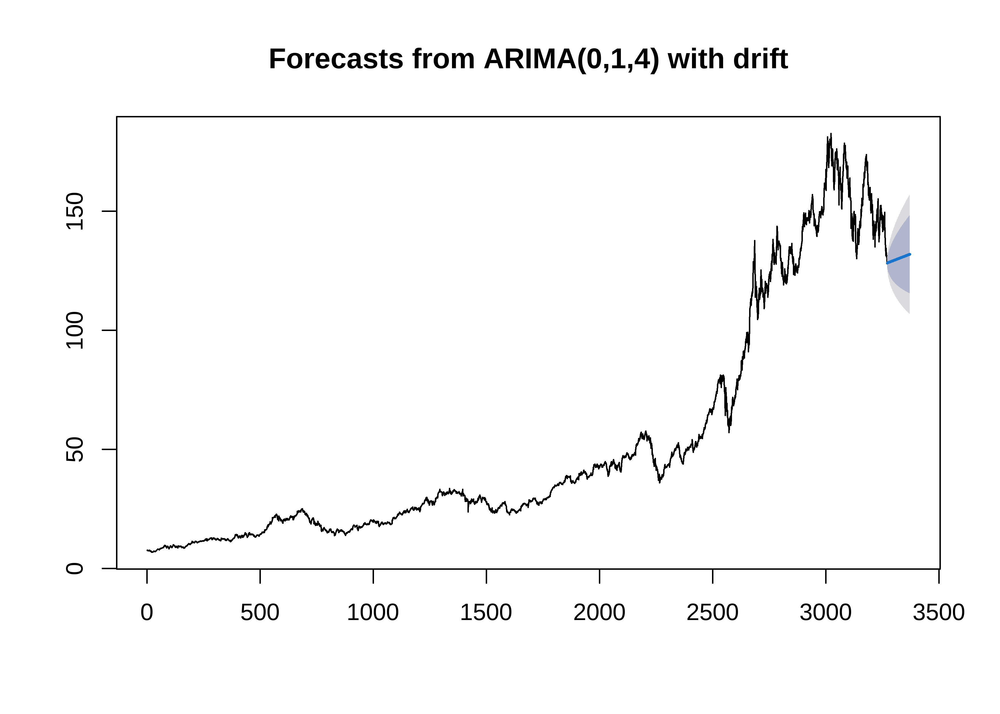
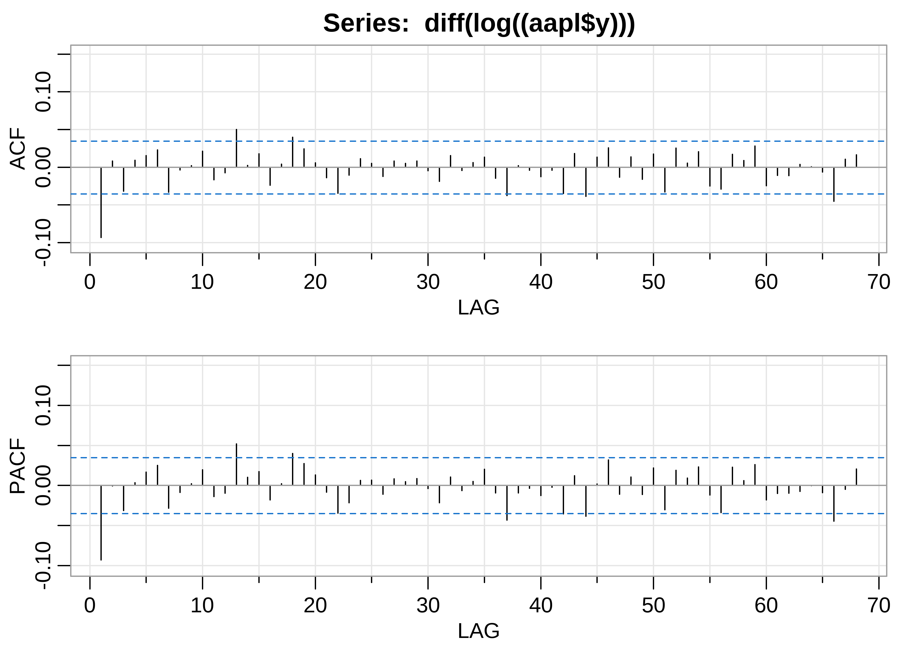
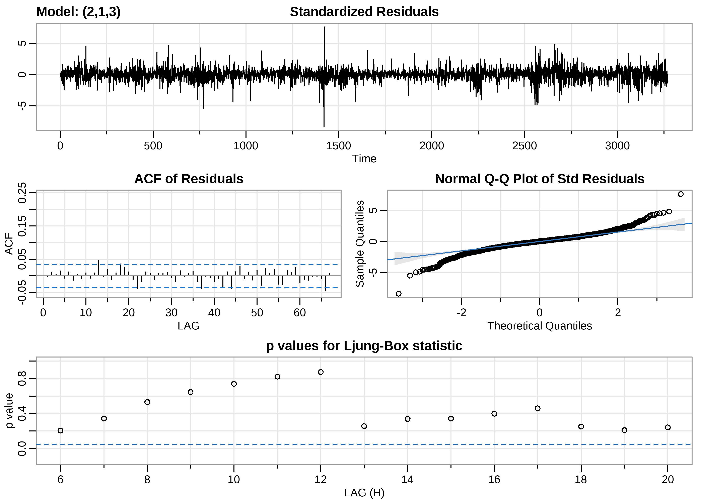

Stock Prices of Popular Tech Companies
================
Matthew
2023-02-02

- <a href="#read-data" id="toc-read-data">Read Data</a>
- <a href="#exploratory-data-analysis"
  id="toc-exploratory-data-analysis">Exploratory Data Analysis</a>
  - <a href="#top-3" id="toc-top-3">Top 3</a>
  - <a href="#peak-month" id="toc-peak-month">Peak Month</a>
  - <a href="#volume" id="toc-volume">Volume</a>
- <a href="#time-series" id="toc-time-series">Time Series</a>
  - <a href="#apple" id="toc-apple">Apple</a>
    - <a href="#prophet" id="toc-prophet">Prophet</a>
    - <a href="#arima" id="toc-arima">ARIMA</a>

*Data from Evan Gower on
[Kaggle](https://www.kaggle.com/datasets/evangower/big-tech-stock-prices?resource=download&select=TSLA.csv)*

# Read Data

``` r
files <- list.files(path = "./Data")

stocks <- read_csv(paste0("./Data/", files), 
                   id = "name") %>% 
  mutate(name = gsub("./Data/", "", name),
         name = gsub("\\.csv","",name)) %>% 
  rename_with(tolower)
```

I’m reading in a list of *csv* files from a directory and creating a
dataframe from them. I’m then cleaning up the “name” column in the
dataframe and storing the cleaned “name” column in the dataframe as the
final output.

``` r
big_tech_companies <- read_csv('https://raw.githubusercontent.com/rfordatascience/tidytuesday/master/data/2023/2023-02-07/big_tech_companies.csv')

stocks <- stocks %>% 
  inner_join(big_tech_companies, by = c("name" = "stock_symbol"))
```

Datasets are joined in order to retrieve the full names of the
companies.

# Exploratory Data Analysis

``` r
end_labels <- 
  (stocks %>% 
  group_by(company) %>% 
  filter(date == max(date)) %>% 
  arrange(-open) %>% 
  select(open, company))[c(1:3,12:14),]

stocks %>% 
  ggplot(aes(date, open)) +
  geom_line(aes(color = company)) +
  scale_y_continuous(sec.axis = sec_axis(~., breaks = end_labels$open, 
                        labels = end_labels$company)) +
  scale_x_date(expand = c(0,0)) +
  labs(x = "", y = "Open", color = "",
       title = "Opening Stock Prices of Major Tech Companies",
       subtitle = "Prices range from Jan 2010 to Jan 2023. The names shown are\nthe top and bottom 3 tech stocks at the most recent date.") +
  theme(legend.position = "none")
```

<!-- -->

## Top 3

``` r
(stocks %>% 
  filter(company %in% end_labels$company[1:3]) %>% 
  ggplot(aes(date, open)) +
  geom_line(aes(color = company)) +
  facet_wrap(~company) +
  theme_bw() +
  theme(legend.position = "none") +
  labs(title = "Top 3", x = "")) /
(stocks %>% 
  filter(company %in% end_labels$company[-(1:3)]) %>% 
  ggplot(aes(date, open)) +
  geom_line(aes(color = company)) +
  facet_wrap(~company) +
  theme_bw() +
  theme(legend.position = "none") +
  labs(title = "Bottom 3", x = ""))
```

<!-- -->

## Peak Month

``` r
stocks %>% 
  group_by(company) %>% 
  slice_max(open) %>% 
  filter(year(date) > 2020) %>% 
  mutate(month = month(date, label = TRUE),
         month = fct_relevel(month, "Jan", after = 12),
         month = fct_relevel(month, "Feb", after = 12)) %>% 
  ggplot(aes(month)) +
  geom_bar(color = "black", fill = "steelblue2") +
  geom_vline(xintercept = 5.5, linetype = "dashed") +
  geom_text(label = "2022", x = 5.8, y = 5, 
            color = "steelblue2", fontface = "bold") +
  geom_text(label = "2021", x = 5.2, y = 5,
            color = "steelblue2", fontface = "bold") +
  labs(title = "Peak Month for Tech Stocks", x = "", y = "Number of Stocks",
       subtitle = "Out of 13 tech stocks, 6 of them reached their peak in November 2021",
       caption = "IBM's peak was in March, 2013 and thus is not included.")
```

<!-- -->

## Volume

``` r
stocks %>% 
  mutate(diff = close - open) %>% 
  ggplot(aes(volume, diff)) +
  geom_point(alpha = 0.2) +
  scale_x_log10()
```

<!-- -->

``` r
cor((stocks %>% mutate(diff = close - open))$diff, stocks$volume)
```

    ## [1] -0.003965457

# Time Series

``` r
library(prophet)
```

    ## Loading required package: Rcpp

    ## Loading required package: rlang

    ## 
    ## Attaching package: 'rlang'

    ## The following objects are masked from 'package:purrr':
    ## 
    ##     %@%, as_function, flatten, flatten_chr, flatten_dbl, flatten_int,
    ##     flatten_lgl, flatten_raw, invoke, splice

``` r
library(astsa)
library(forecast)
```

    ## Registered S3 method overwritten by 'quantmod':
    ##   method            from
    ##   as.zoo.data.frame zoo

    ## 
    ## Attaching package: 'forecast'

    ## The following object is masked from 'package:astsa':
    ## 
    ##     gas

``` r
aapl <- stocks %>% 
  filter(name == "AAPL") %>% 
  select(ds = date, y = open)
```

## Apple

Often, the differences allows us to understand how volatile a trend is.
As can be seen below, the **Apple** stock becomes increasingly more
volatile over time.

``` r
(aapl %>% 
  mutate(diff = c(NA, diff(y))) %>% 
  ggplot(aes(ds, diff)) + 
  geom_point(color = "steelblue4", alpha = 0.7) +
  labs(y = "Difference", x = "Date",
       title = "One Day Returns")
) /
(aapl %>% 
   mutate(diff = c(NA, diff(y))) %>% 
   ggplot(aes(diff)) +
   geom_histogram(bins = 50, fill = "steelblue4", color = "black")
)
```

<!-- -->

### Prophet

``` r
m_aapl <- prophet(aapl)
```

    ## Disabling daily seasonality. Run prophet with daily.seasonality=TRUE to override this.

``` r
future_dates <- make_future_dataframe(m_aapl, periods = 90)

forecast <- predict(m_aapl, future_dates)

plot(m_aapl, forecast)
```

<!-- -->

``` r
prophet_plot_components(m_aapl, forecast)
```

<!-- -->

### ARIMA

``` r
arima_fit <- auto.arima(aapl$y)
plot(forecast(arima_fit, h = 100))
```

<!-- -->

``` r
plot(diff(log(aapl$y)),type = "l")
```

<!-- -->

``` r
acf2(diff(log((aapl$y))))
```

<!-- -->

    ##       [,1] [,2]  [,3] [,4] [,5] [,6]  [,7]  [,8] [,9] [,10] [,11] [,12] [,13]
    ## ACF  -0.09 0.01 -0.03 0.01 0.02 0.02 -0.03  0.00    0  0.02 -0.02 -0.01  0.05
    ## PACF -0.09 0.00 -0.03 0.00 0.02 0.02 -0.03 -0.01    0  0.02 -0.01 -0.01  0.05
    ##      [,14] [,15] [,16] [,17] [,18] [,19] [,20] [,21] [,22] [,23] [,24] [,25]
    ## ACF   0.00  0.02 -0.02     0  0.04  0.02  0.01 -0.01 -0.03 -0.01  0.01  0.01
    ## PACF  0.01  0.02 -0.02     0  0.04  0.03  0.01 -0.01 -0.03 -0.02  0.01  0.01
    ##      [,26] [,27] [,28] [,29] [,30] [,31] [,32] [,33] [,34] [,35] [,36] [,37]
    ## ACF  -0.01  0.01     0  0.01     0 -0.02  0.02  0.00  0.01  0.01 -0.01 -0.04
    ## PACF -0.01  0.01     0  0.01     0 -0.02  0.01 -0.01  0.00  0.02 -0.01 -0.04
    ##      [,38] [,39] [,40] [,41] [,42] [,43] [,44] [,45] [,46] [,47] [,48] [,49]
    ## ACF   0.00     0 -0.01     0 -0.03  0.02 -0.04  0.01  0.03 -0.01  0.01 -0.02
    ## PACF -0.01     0 -0.01     0 -0.04  0.01 -0.04  0.00  0.03 -0.01  0.01 -0.01
    ##      [,50] [,51] [,52] [,53] [,54] [,55] [,56] [,57] [,58] [,59] [,60] [,61]
    ## ACF   0.02 -0.03  0.03  0.01  0.02 -0.02 -0.03  0.02  0.01  0.03 -0.02 -0.01
    ## PACF  0.02 -0.03  0.02  0.01  0.02 -0.01 -0.03  0.02  0.01  0.03 -0.02 -0.01
    ##      [,62] [,63] [,64] [,65] [,66] [,67] [,68]
    ## ACF  -0.01  0.00     0 -0.01 -0.05  0.01  0.02
    ## PACF -0.01 -0.01     0 -0.01 -0.04  0.00  0.02

``` r
sarima(log(aapl$y), 2,1,3)
```

    ## initial  value -3.971507 
    ## iter   2 value -3.971906
    ## iter   3 value -3.976281
    ## iter   4 value -3.976282
    ## iter   5 value -3.976292
    ## iter   6 value -3.976293
    ## iter   7 value -3.976298
    ## iter   8 value -3.976309
    ## iter   9 value -3.976340
    ## iter  10 value -3.976373
    ## iter  11 value -3.976422
    ## iter  12 value -3.976491
    ## iter  13 value -3.976501
    ## iter  14 value -3.976504
    ## iter  15 value -3.976505
    ## iter  16 value -3.976509
    ## iter  17 value -3.976510
    ## iter  18 value -3.976517
    ## iter  19 value -3.976587
    ## iter  20 value -3.976680
    ## iter  21 value -3.976836
    ## iter  22 value -3.977017
    ## iter  23 value -3.977063
    ## iter  24 value -3.977172
    ## iter  25 value -3.977180
    ## iter  26 value -3.977195
    ## iter  27 value -3.977210
    ## iter  28 value -3.977213
    ## iter  29 value -3.977219
    ## iter  30 value -3.977232
    ## iter  31 value -3.977281
    ## iter  32 value -3.977323
    ## iter  33 value -3.977373
    ## iter  34 value -3.977379
    ## iter  35 value -3.977382
    ## iter  36 value -3.977387
    ## iter  37 value -3.977398
    ## iter  38 value -3.977405
    ## iter  39 value -3.977407
    ## iter  40 value -3.977407
    ## iter  40 value -3.977407
    ## final  value -3.977407 
    ## converged
    ## initial  value -3.977707 
    ## iter   2 value -3.977708
    ## iter   3 value -3.977708
    ## iter   4 value -3.977708
    ## iter   5 value -3.977708
    ## iter   6 value -3.977711
    ## iter   7 value -3.977714
    ## iter   8 value -3.977716
    ## iter   9 value -3.977717
    ## iter  10 value -3.977717
    ## iter  11 value -3.977717
    ## iter  12 value -3.977717
    ## iter  13 value -3.977718
    ## iter  14 value -3.977719
    ## iter  15 value -3.977719
    ## iter  16 value -3.977719
    ## iter  16 value -3.977719
    ## iter  16 value -3.977719
    ## final  value -3.977719 
    ## converged

<!-- -->

    ## $fit
    ## 
    ## Call:
    ## arima(x = xdata, order = c(p, d, q), seasonal = list(order = c(P, D, Q), period = S), 
    ##     xreg = constant, transform.pars = trans, fixed = fixed, optim.control = list(trace = trc, 
    ##         REPORT = 1, reltol = tol))
    ## 
    ## Coefficients:
    ##          ar1      ar2      ma1     ma2      ma3  constant
    ##       0.1970  -0.8030  -0.2890  0.8199  -0.1066     9e-04
    ## s.e.  0.2178   0.1149   0.2166  0.1174   0.0175     3e-04
    ## 
    ## sigma^2 estimated as 0.0003507:  log likelihood = 8367.21,  aic = -16720.43
    ## 
    ## $degrees_of_freedom
    ## [1] 3264
    ## 
    ## $ttable
    ##          Estimate     SE t.value p.value
    ## ar1        0.1970 0.2178  0.9047  0.3657
    ## ar2       -0.8030 0.1149 -6.9911  0.0000
    ## ma1       -0.2890 0.2166 -1.3342  0.1822
    ## ma2        0.8199 0.1174  6.9823  0.0000
    ## ma3       -0.1066 0.0175 -6.0832  0.0000
    ## constant   0.0009 0.0003  3.0060  0.0027
    ## 
    ## $AIC
    ## [1] -5.11328
    ## 
    ## $AICc
    ## [1] -5.113272
    ## 
    ## $BIC
    ## [1] -5.100238

``` r
ts_aapl <- ts(aapl$y, start = c(2010, 4), frequency = 365)
aapl_fit <- window(ts_aapl, end = 2018)
sarima.for(aapl_fit, 
           n.ahead = 365,
           2,1,3, 
           plot.all = TRUE)
```

    ## $pred
    ## Time Series:
    ## Start = c(2018, 2) 
    ## End = c(2019, 1) 
    ## Frequency = 365 
    ##   [1] 146.9878 147.0354 147.1352 147.1357 147.2004 147.2647 147.2892 147.3528
    ##   [9] 147.4032 147.4419 147.5003 147.5468 147.5926 147.6465 147.6929 147.7416
    ##  [17] 147.7928 147.8401 147.8896 147.9394 147.9875 148.0371 148.0863 148.1350
    ##  [25] 148.1844 148.2334 148.2824 148.3317 148.3807 148.4297 148.4789 148.5279
    ##  [33] 148.5770 148.6261 148.6752 148.7243 148.7734 148.8225 148.8716 148.9207
    ##  [41] 148.9697 149.0188 149.0679 149.1170 149.1661 149.2152 149.2643 149.3134
    ##  [49] 149.3625 149.4116 149.4606 149.5097 149.5588 149.6079 149.6570 149.7061
    ##  [57] 149.7552 149.8043 149.8534 149.9024 149.9515 150.0006 150.0497 150.0988
    ##  [65] 150.1479 150.1970 150.2461 150.2952 150.3443 150.3933 150.4424 150.4915
    ##  [73] 150.5406 150.5897 150.6388 150.6879 150.7370 150.7861 150.8352 150.8842
    ##  [81] 150.9333 150.9824 151.0315 151.0806 151.1297 151.1788 151.2279 151.2770
    ##  [89] 151.3260 151.3751 151.4242 151.4733 151.5224 151.5715 151.6206 151.6697
    ##  [97] 151.7188 151.7679 151.8169 151.8660 151.9151 151.9642 152.0133 152.0624
    ## [105] 152.1115 152.1606 152.2097 152.2588 152.3078 152.3569 152.4060 152.4551
    ## [113] 152.5042 152.5533 152.6024 152.6515 152.7006 152.7496 152.7987 152.8478
    ## [121] 152.8969 152.9460 152.9951 153.0442 153.0933 153.1424 153.1915 153.2405
    ## [129] 153.2896 153.3387 153.3878 153.4369 153.4860 153.5351 153.5842 153.6333
    ## [137] 153.6824 153.7314 153.7805 153.8296 153.8787 153.9278 153.9769 154.0260
    ## [145] 154.0751 154.1242 154.1732 154.2223 154.2714 154.3205 154.3696 154.4187
    ## [153] 154.4678 154.5169 154.5660 154.6151 154.6641 154.7132 154.7623 154.8114
    ## [161] 154.8605 154.9096 154.9587 155.0078 155.0569 155.1060 155.1550 155.2041
    ## [169] 155.2532 155.3023 155.3514 155.4005 155.4496 155.4987 155.5478 155.5968
    ## [177] 155.6459 155.6950 155.7441 155.7932 155.8423 155.8914 155.9405 155.9896
    ## [185] 156.0387 156.0877 156.1368 156.1859 156.2350 156.2841 156.3332 156.3823
    ## [193] 156.4314 156.4805 156.5295 156.5786 156.6277 156.6768 156.7259 156.7750
    ## [201] 156.8241 156.8732 156.9223 156.9714 157.0204 157.0695 157.1186 157.1677
    ## [209] 157.2168 157.2659 157.3150 157.3641 157.4132 157.4623 157.5113 157.5604
    ## [217] 157.6095 157.6586 157.7077 157.7568 157.8059 157.8550 157.9041 157.9531
    ## [225] 158.0022 158.0513 158.1004 158.1495 158.1986 158.2477 158.2968 158.3459
    ## [233] 158.3950 158.4440 158.4931 158.5422 158.5913 158.6404 158.6895 158.7386
    ## [241] 158.7877 158.8368 158.8859 158.9349 158.9840 159.0331 159.0822 159.1313
    ## [249] 159.1804 159.2295 159.2786 159.3277 159.3767 159.4258 159.4749 159.5240
    ## [257] 159.5731 159.6222 159.6713 159.7204 159.7695 159.8186 159.8676 159.9167
    ## [265] 159.9658 160.0149 160.0640 160.1131 160.1622 160.2113 160.2604 160.3095
    ## [273] 160.3585 160.4076 160.4567 160.5058 160.5549 160.6040 160.6531 160.7022
    ## [281] 160.7513 160.8003 160.8494 160.8985 160.9476 160.9967 161.0458 161.0949
    ## [289] 161.1440 161.1931 161.2422 161.2912 161.3403 161.3894 161.4385 161.4876
    ## [297] 161.5367 161.5858 161.6349 161.6840 161.7331 161.7821 161.8312 161.8803
    ## [305] 161.9294 161.9785 162.0276 162.0767 162.1258 162.1749 162.2239 162.2730
    ## [313] 162.3221 162.3712 162.4203 162.4694 162.5185 162.5676 162.6167 162.6658
    ## [321] 162.7148 162.7639 162.8130 162.8621 162.9112 162.9603 163.0094 163.0585
    ## [329] 163.1076 163.1567 163.2057 163.2548 163.3039 163.3530 163.4021 163.4512
    ## [337] 163.5003 163.5494 163.5985 163.6475 163.6966 163.7457 163.7948 163.8439
    ## [345] 163.8930 163.9421 163.9912 164.0403 164.0894 164.1384 164.1875 164.2366
    ## [353] 164.2857 164.3348 164.3839 164.4330 164.4821 164.5312 164.5803 164.6293
    ## [361] 164.6784 164.7275 164.7766 164.8257 164.8748
    ## 
    ## $se
    ## Time Series:
    ## Start = c(2018, 2) 
    ## End = c(2019, 1) 
    ## Frequency = 365 
    ##   [1]  1.036850  1.428150  1.687156  1.915339  2.138467  2.321091  2.497526
    ##   [8]  2.666250  2.817276  2.965470  3.106407  3.238607  3.368187  3.492064
    ##  [15]  3.611039  3.727365  3.839468  3.948375  4.054788  4.158077  4.258988
    ##  [22]  4.357682  4.454001  4.548389  4.640868  4.731464  4.820424  4.907754
    ##  [29]  4.993534  5.077898  5.160866  5.242517  5.322930  5.402135  5.480197
    ##  [36]  5.557168  5.633081  5.707988  5.781925  5.854926  5.927029  5.998266
    ##  [43]  6.068666  6.138259  6.207072  6.275130  6.342458  6.409078  6.475014
    ##  [50]  6.540284  6.604910  6.668909  6.732300  6.795100  6.857324  6.918989
    ##  [57]  6.980109  7.040699  7.100772  7.160340  7.219418  7.278015  7.336145
    ##  [64]  7.393818  7.451044  7.507834  7.564198  7.620145  7.675684  7.730824
    ##  [71]  7.785573  7.839940  7.893933  7.947559  8.000826  8.053740  8.106309
    ##  [78]  8.158539  8.210437  8.262009  8.313261  8.364199  8.414829  8.465155
    ##  [85]  8.515185  8.564922  8.614372  8.663540  8.712430  8.761047  8.809396
    ##  [92]  8.857482  8.905307  8.952877  9.000196  9.047267  9.094095  9.140683
    ##  [99]  9.187034  9.233153  9.279042  9.324706  9.370147  9.415369  9.460375
    ## [106]  9.505167  9.549750  9.594125  9.638296  9.682266  9.726036  9.769611
    ## [113]  9.812992  9.856182  9.899184  9.942000  9.984632 10.027083 10.069355
    ## [120] 10.111450 10.153371 10.195119 10.236697 10.278107 10.319351 10.360430
    ## [127] 10.401348 10.442105 10.482703 10.523145 10.563432 10.603566 10.643549
    ## [134] 10.683382 10.723067 10.762606 10.802000 10.841250 10.880360 10.919329
    ## [141] 10.958159 10.996853 11.035411 11.073834 11.112125 11.150284 11.188313
    ## [148] 11.226213 11.263986 11.301633 11.339154 11.376552 11.413827 11.450981
    ## [155] 11.488015 11.524929 11.561726 11.598406 11.634971 11.671421 11.707757
    ## [162] 11.743981 11.780094 11.816096 11.851989 11.887773 11.923450 11.959021
    ## [169] 11.994486 12.029847 12.065104 12.100258 12.135311 12.170262 12.205113
    ## [176] 12.239866 12.274519 12.309076 12.343535 12.377899 12.412167 12.446341
    ## [183] 12.480422 12.514409 12.548305 12.582109 12.615823 12.649447 12.682981
    ## [190] 12.716428 12.749786 12.783058 12.816243 12.849342 12.882357 12.915287
    ## [197] 12.948133 12.980896 13.013577 13.046175 13.078693 13.111130 13.143487
    ## [204] 13.175764 13.207962 13.240083 13.272125 13.304090 13.335979 13.367791
    ## [211] 13.399529 13.431191 13.462778 13.494292 13.525732 13.557099 13.588394
    ## [218] 13.619617 13.650769 13.681850 13.712860 13.743800 13.774671 13.805472
    ## [225] 13.836206 13.866871 13.897468 13.927998 13.958462 13.988859 14.019190
    ## [232] 14.049455 14.079656 14.109792 14.139864 14.169872 14.199816 14.229698
    ## [239] 14.259516 14.289273 14.318968 14.348601 14.378173 14.407685 14.437136
    ## [246] 14.466528 14.495859 14.525132 14.554345 14.583500 14.612597 14.641636
    ## [253] 14.670618 14.699542 14.728410 14.757221 14.785976 14.814675 14.843319
    ## [260] 14.871908 14.900441 14.928921 14.957346 14.985717 15.014034 15.042298
    ## [267] 15.070509 15.098668 15.126774 15.154828 15.182830 15.210780 15.238679
    ## [274] 15.266527 15.294325 15.322072 15.349769 15.377416 15.405013 15.432562
    ## [281] 15.460061 15.487511 15.514912 15.542266 15.569571 15.596828 15.624038
    ## [288] 15.651201 15.678316 15.705385 15.732407 15.759383 15.786312 15.813196
    ## [295] 15.840035 15.866827 15.893575 15.920278 15.946936 15.973549 16.000118
    ## [302] 16.026644 16.053125 16.079563 16.105957 16.132308 16.158616 16.184882
    ## [309] 16.211105 16.237285 16.263424 16.289520 16.315575 16.341588 16.367560
    ## [316] 16.393490 16.419380 16.445229 16.471037 16.496805 16.522533 16.548221
    ## [323] 16.573869 16.599477 16.625046 16.650576 16.676067 16.701518 16.726931
    ## [330] 16.752306 16.777642 16.802940 16.828199 16.853421 16.878606 16.903752
    ## [337] 16.928862 16.953934 16.978969 17.003967 17.028929 17.053854 17.078743
    ## [344] 17.103595 17.128412 17.153192 17.177937 17.202646 17.227320 17.251958
    ## [351] 17.276562 17.301130 17.325663 17.350162 17.374626 17.399056 17.423452
    ## [358] 17.447813 17.472141 17.496435 17.520695 17.544921 17.569114 17.593274
    ## [365] 17.617401

``` r
lines(ts_aapl)
```

<!-- -->
