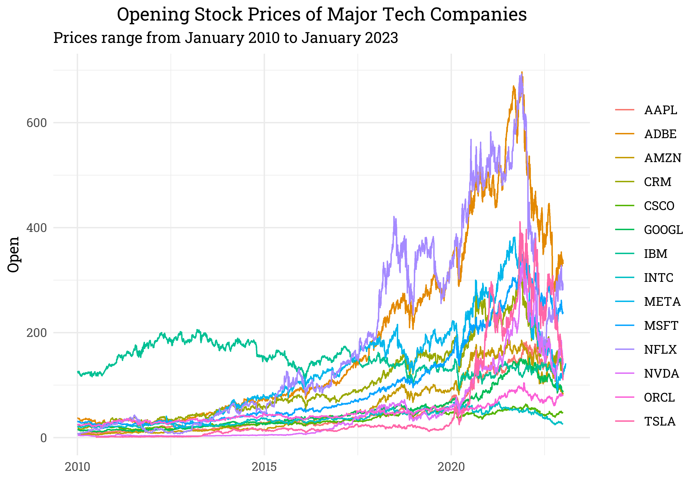

Stock Prices of Popular Tech Companies
================
Matthew
2023-02-02

- <a href="#read-data" id="toc-read-data">Read Data</a>
- <a href="#exploratory-data-analysis"
  id="toc-exploratory-data-analysis">Exploratory Data Analysis</a>

*Data from Evan Gower on
[Kaggle](https://www.kaggle.com/datasets/evangower/big-tech-stock-prices?resource=download&select=TSLA.csv)*

# Read Data

``` r
files <- list.files(path = "./Data")

stocks <- read_csv(paste0("./Data/", files), 
                   id = "name") %>% 
  mutate(name = gsub("./Data/", "", name),
         name = gsub("\\.csv","",name)) %>% 
  rename_with(tolower)
```

I’m reading in a list of *csv* files from a directory and creating a
dataframe from them. I’m then cleaning up the “name” column in the
dataframe and storing the cleaned “name” column in the dataframe as the
final output.

# Exploratory Data Analysis

``` r
stocks %>% 
  ggplot(aes(date, open)) +
  geom_line(aes(color = name)) +
  labs(x = "", y = "Open", color = "",
       title = "Opening Stock Prices of Major Tech Companies",
       subtitle = "These prices range from January 2010 to January 2023")
```

<!-- -->
