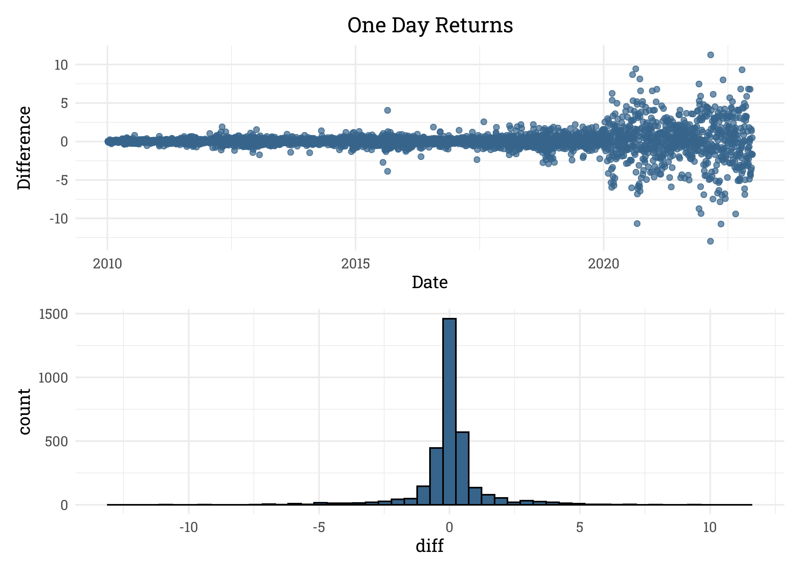

Stock Prices of Popular Tech Companies
================
Matthew
2023-02-02

- <a href="#read-data" id="toc-read-data">Read Data</a>
- <a href="#exploratory-data-analysis"
  id="toc-exploratory-data-analysis">Exploratory Data Analysis</a>
  - <a href="#top-3" id="toc-top-3">Top 3</a>
  - <a href="#peak-month" id="toc-peak-month">Peak Month</a>
  - <a href="#volume" id="toc-volume">Volume</a>
- <a href="#time-series" id="toc-time-series">Time Series</a>
  - <a href="#apple" id="toc-apple">Apple</a>

*Data from Evan Gower on
[Kaggle](https://www.kaggle.com/datasets/evangower/big-tech-stock-prices?resource=download&select=TSLA.csv)*

# Read Data

``` r
files <- list.files(path = "./Data")

stocks <- read_csv(paste0("./Data/", files), 
                   id = "name") %>% 
  mutate(name = gsub("./Data/", "", name),
         name = gsub("\\.csv","",name)) %>% 
  rename_with(tolower)
```

I’m reading in a list of *csv* files from a directory and creating a
dataframe from them. I’m then cleaning up the “name” column in the
dataframe and storing the cleaned “name” column in the dataframe as the
final output.

``` r
big_tech_companies <- read_csv('https://raw.githubusercontent.com/rfordatascience/tidytuesday/master/data/2023/2023-02-07/big_tech_companies.csv')

stocks <- stocks %>% 
  inner_join(big_tech_companies, by = c("name" = "stock_symbol"))
```

Datasets are joined in order to retrieve the full names of the
companies.

# Exploratory Data Analysis

``` r
end_labels <- 
  (stocks %>% 
  group_by(company) %>% 
  filter(date == max(date)) %>% 
  arrange(-open) %>% 
  select(open, company))[c(1:3,12:14),]

stocks %>% 
  ggplot(aes(date, open)) +
  geom_line(aes(color = company)) +
  scale_y_continuous(sec.axis = sec_axis(~., breaks = end_labels$open, 
                        labels = end_labels$company)) +
  scale_x_date(expand = c(0,0)) +
  labs(x = "", y = "Open", color = "",
       title = "Opening Stock Prices of Major Tech Companies",
       subtitle = "Prices range from Jan 2010 to Jan 2023. The names shown are\nthe top and bottom 3 tech stocks at the most recent date.") +
  theme(legend.position = "none")
```

<!-- -->

## Top 3

``` r
(stocks %>% 
  filter(company %in% end_labels$company[1:3]) %>% 
  ggplot(aes(date, open)) +
  geom_line(aes(color = company)) +
  facet_wrap(~company) +
  theme_bw() +
  theme(legend.position = "none") +
  labs(title = "Top 3", x = "")) /
(stocks %>% 
  filter(company %in% end_labels$company[-(1:3)]) %>% 
  ggplot(aes(date, open)) +
  geom_line(aes(color = company)) +
  facet_wrap(~company) +
  theme_bw() +
  theme(legend.position = "none") +
  labs(title = "Bottom 3", x = ""))
```

<!-- -->

## Peak Month

``` r
stocks %>% 
  group_by(company) %>% 
  slice_max(open) %>% 
  filter(year(date) > 2020) %>% 
  mutate(month = month(date, label = TRUE),
         month = fct_relevel(month, "Jan", after = 12),
         month = fct_relevel(month, "Feb", after = 12)) %>% 
  ggplot(aes(month)) +
  geom_bar(color = "black", fill = "steelblue2") +
  geom_vline(xintercept = 5.5, linetype = "dashed") +
  geom_text(label = "2022", x = 5.8, y = 5, 
            color = "steelblue2", fontface = "bold") +
  geom_text(label = "2021", x = 5.2, y = 5,
            color = "steelblue2", fontface = "bold") +
  labs(title = "Peak Month for Tech Stocks", x = "", y = "Number of Stocks",
       subtitle = "Out of 13 tech stocks, 6 of them reached their peak in November 2021",
       caption = "IBM's peak was in March, 2013 and thus is not included.")
```

<!-- -->

## Volume

``` r
stocks %>% 
  mutate(diff = close - open) %>% 
  ggplot(aes(volume, diff)) +
  geom_point(alpha = 0.2) +
  scale_x_log10()
```

<!-- -->

``` r
cor((stocks %>% mutate(diff = close - open))$diff, stocks$volume)
```

    ## [1] -0.003965457

# Time Series

``` r
library(prophet)
```

    ## Loading required package: Rcpp

    ## Loading required package: rlang

    ## 
    ## Attaching package: 'rlang'

    ## The following objects are masked from 'package:purrr':
    ## 
    ##     %@%, as_function, flatten, flatten_chr, flatten_dbl, flatten_int,
    ##     flatten_lgl, flatten_raw, invoke, splice

``` r
ts_data_aapl <- stocks %>% 
  filter(name == "AAPL") %>% 
  select(ds = date, y = open)
```

## Apple

``` r
plot(diff(ts_data_aapl$y))
```

<!-- -->

``` r
m_aapl <- prophet(ts_data_aapl)
```

    ## Disabling daily seasonality. Run prophet with daily.seasonality=TRUE to override this.

``` r
future_dates <- make_future_dataframe(m_aapl, periods = 90)

forecast <- predict(m_aapl, future_dates)

plot(m_aapl, forecast)
```

<!-- -->

``` r
prophet_plot_components(m_aapl, forecast)
```

<!-- -->
