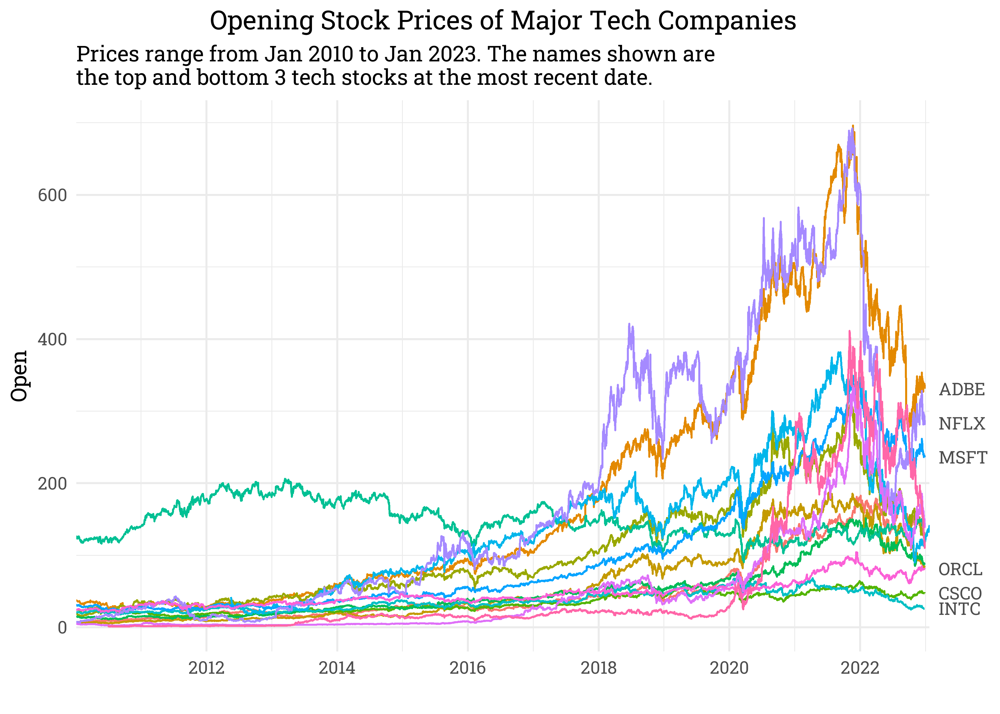

Stock Prices of Popular Tech Companies
================
Matthew
2023-02-02

- <a href="#read-data" id="toc-read-data">Read Data</a>
- <a href="#exploratory-data-analysis"
  id="toc-exploratory-data-analysis">Exploratory Data Analysis</a>

# Read Data

``` r
files <- list.files(path = "./Data")

stocks <- read_csv(paste0("./Data/", files), 
                   id = "name") %>% 
  mutate(name = gsub("./Data/", "", name),
         name = gsub("\\.csv","",name)) %>% 
  rename_with(tolower)
```

    ## Rows: 45088 Columns: 8
    ## -- Column specification --------------------------------------------------------
    ## Delimiter: ","
    ## dbl  (6): Open, High, Low, Close, Adj Close, Volume
    ## date (1): Date
    ## 
    ## i Use `spec()` to retrieve the full column specification for this data.
    ## i Specify the column types or set `show_col_types = FALSE` to quiet this message.

The code starts by creating a list of files in the directory
**`"./Data"`** using the **`list.files`** function and storing it in the
object **`files`**.

Next, the **`read_csv`** function is used to read in each file in the
**`files`** list and create a new dataframe called **`stocks`**. The
**`paste0`** function is used to concatenate the path **`"./Data/"`**
with each file name in the **`files`** list.

The **`stocks`** dataframe is then processed further using the
**`mutate`** function to modify the “name” column. The first call to
**`gsub`** uses the **`gsub`** function to replace the string
**`"./Data/"`** in the “name” column with an empty string. The second
call to **`gsub`** uses the **`gsub`** function to remove the
**`".csv"`** extension from each string in the “name” column.

Finally, the modified “name” column is stored back in the **`stocks`**
dataframe.

# Exploratory Data Analysis

``` r
stocks %>% 
  ggplot(aes(date, open)) +
  geom_line(aes(color = name)) +
  labs(x = "", y = "Open", color = "",
       title = "Opening Stock Prices of 14 Popular Tech Companies",
       subtitle = "")
```

<!-- -->
