Stock Prices of Popular Tech Companies
================
Matthew
2023-02-02

- <a href="#read-data" id="toc-read-data">Read Data</a>
- <a href="#exploratory-data-analysis"
  id="toc-exploratory-data-analysis">Exploratory Data Analysis</a>
  - <a href="#top-and-bottom-3-most-recent-open-values"
    id="toc-top-and-bottom-3-most-recent-open-values">Top and Bottom 3 Most
    Recent Open Values</a>
  - <a href="#peak-month" id="toc-peak-month">Peak Month</a>
- <a href="#time-series" id="toc-time-series">Time Series</a>
  - <a href="#apple" id="toc-apple">Apple</a>
    - <a href="#prophet" id="toc-prophet">Prophet</a>
    - <a href="#arima" id="toc-arima">ARIMA</a>
  - <a href="#ibm" id="toc-ibm">IBM</a>
    - <a href="#prophet-1" id="toc-prophet-1">Prophet</a>
    - <a href="#arima-1" id="toc-arima-1">ARIMA</a>
- <a href="#correlated-stocks" id="toc-correlated-stocks">Correlated
  Stocks</a>
  - <a href="#ibm-the-outlier" id="toc-ibm-the-outlier">IBM, The Outlier</a>
  - <a href="#positively-correlated"
    id="toc-positively-correlated">Positively Correlated</a>
  - <a href="#negatively-correlated"
    id="toc-negatively-correlated">Negatively Correlated</a>
- <a href="#volatility" id="toc-volatility">Volatility</a>
- <a href="#volume" id="toc-volume">Volume</a>

*Data from Evan Gower on
[Kaggle](https://www.kaggle.com/datasets/evangower/big-tech-stock-prices?resource=download&select=TSLA.csv)*

# Read Data

``` r
files <- list.files(path = "./Data")

stocks <- read_csv(paste0("./Data/", files), 
                   id = "name") %>% 
  mutate(name = gsub("./Data/", "", name),
         name = gsub("\\.csv","",name)) %>% 
  rename_with(tolower)
```

I’m reading in a list of *csv* files from a directory and creating a
dataframe from them. I’m then cleaning up the “name” column in the
dataframe and storing the cleaned “name” column in the dataframe as the
final output.

``` r
big_tech_companies <- read_csv('https://raw.githubusercontent.com/rfordatascience/tidytuesday/master/data/2023/2023-02-07/big_tech_companies.csv')

stocks <- stocks %>% 
  inner_join(big_tech_companies, by = c("name" = "stock_symbol"))
```

Datasets are joined in order to retrieve the full names of the
companies.

# Exploratory Data Analysis

``` r
end_labels <- 
  (stocks %>% 
  group_by(company) %>% 
  filter(date == max(date)) %>% 
  arrange(-open) %>% 
  select(open, company))[c(1:3,12:14),]

stocks %>% 
  ggplot(aes(date, open)) +
  geom_line(aes(color = company)) +
  scale_y_continuous(sec.axis = sec_axis(~., breaks = end_labels$open, 
                        labels = end_labels$company)) +
  scale_x_date(expand = c(0,0)) +
  labs(x = "", y = "Open", color = "",
       title = "Opening Stock Prices of Major Tech Companies",
       subtitle = "Prices range from Jan 2010 to Jan 2023. The names shown are\nthe top and bottom 3 tech stocks at the most recent date.") +
  theme(legend.position = "none")
```

<!-- -->

## Top and Bottom 3 Most Recent Open Values

``` r
(stocks %>% 
  filter(company %in% end_labels$company[1:3]) %>% 
  ggplot(aes(date, open)) +
  geom_line(aes(color = company)) +
  facet_wrap(~company) +
  theme_bw() +
  theme(legend.position = "none") +
  labs(title = "Top 3", x = "")) /
(stocks %>% 
  filter(company %in% end_labels$company[-(1:3)]) %>% 
  ggplot(aes(date, open)) +
  geom_line(aes(color = company)) +
  facet_wrap(~company) +
  theme_bw() +
  theme(legend.position = "none") +
  labs(title = "Bottom 3", x = ""))
```

<!-- -->

## Peak Month

``` r
stocks %>% 
  group_by(company) %>% 
  slice_max(open) %>% 
  filter(year(date) > 2020) %>% 
  mutate(month = month(date, label = TRUE),
         month = fct_relevel(month, "Jan", after = 12),
         month = fct_relevel(month, "Feb", after = 12)) %>% 
  ggplot(aes(month)) +
  geom_bar(color = "black", fill = "steelblue2") +
  geom_vline(xintercept = 5.5, linetype = "dashed") +
  geom_text(label = "2022", x = 5.8, y = 5, 
            color = "steelblue2", fontface = "bold") +
  geom_text(label = "2021", x = 5.2, y = 5,
            color = "steelblue2", fontface = "bold") +
  labs(title = "Peak Month for Tech Stocks", x = "", y = "Number of Stocks",
       subtitle = "Out of 13 tech stocks, 6 of them reached their peak in November 2021",
       caption = "IBM's peak was in March, 2013 and thus is not included.")
```

<!-- -->

# Time Series

## Apple

``` r
aapl <- stocks %>% 
  filter(name == "AAPL") %>% 
  select(ds = date, y = open)
```

Often, the differences allows us to understand how volatile a trend is.
As can be seen below, the **Apple** stock becomes increasingly more
volatile over time.

``` r
(aapl %>% 
  mutate(diff = c(NA, diff(y))) %>% 
  ggplot(aes(ds, diff)) + 
  geom_point(color = "steelblue4", alpha = 0.7) +
  labs(y = "Difference", x = "Date",
       title = "One Day Returns")
) /
(aapl %>% 
   mutate(diff = c(NA, diff(y))) %>% 
   ggplot(aes(diff)) +
   geom_histogram(bins = 50, fill = "steelblue4", color = "black")
)
```

<!-- -->

### Prophet

``` r
m_aapl <- prophet(aapl)
```

    ## Disabling daily seasonality. Run prophet with daily.seasonality=TRUE to override this.

``` r
forecast <- predict(m_aapl, 
                    make_future_dataframe(m_aapl, periods = 140))

plot(m_aapl, forecast)
```

<!-- -->

``` r
prophet_plot_components(m_aapl, forecast)
```

<!-- -->

### ARIMA

First, we begin with fitting an “auto.arima”, which automatically fits
an ARIMA model with by choosing optimal ARIMA terms.

``` r
ts_aapl <- ts(aapl$y, start = c(2010, 4), frequency = 365)
aapl_fit <- window(ts_aapl, end = 2018)
```

``` r
auto_arima_fit <- auto.arima(aapl_fit)
plot(forecast(auto_arima_fit, h = 365), ylim = c(0,200))
lines(window(ts_aapl, start = 2018), col = "red")
```

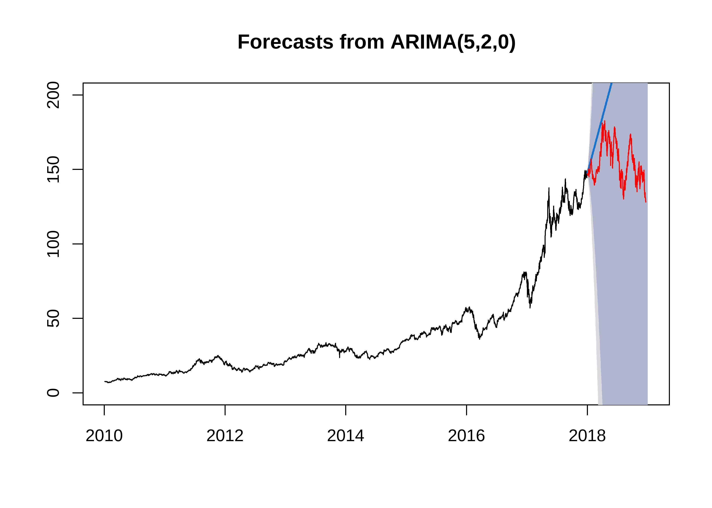<!-- -->

Clearly, we can see that an ARIMA(5,2,0) expects it to keep increasing.
This is because of the 5 AR terms, strongly predicting it will keep the
same trend it had. Now, we will try to fit an ARIMA by looking at a
stationary version of the time series. It appears as though the best fit
in an ARIMA(2,1,3), although this is of course not the true model for
the stock. ARIMA models are not great at modeling stock prices, as their
prices are often a product of unknown variables.

*I have removed the diagnostic plots from the output of this markdown
file.*

``` r
plot(diff(log(aapl$y)),type = "l")
```

<!-- -->

``` r
acf2(diff(log((aapl$y))))
```

<!-- -->

    ##       [,1] [,2]  [,3] [,4] [,5] [,6]  [,7]  [,8] [,9] [,10] [,11] [,12] [,13]
    ## ACF  -0.09 0.01 -0.03 0.01 0.02 0.02 -0.03  0.00    0  0.02 -0.02 -0.01  0.05
    ## PACF -0.09 0.00 -0.03 0.00 0.02 0.02 -0.03 -0.01    0  0.02 -0.01 -0.01  0.05
    ##      [,14] [,15] [,16] [,17] [,18] [,19] [,20] [,21] [,22] [,23] [,24] [,25]
    ## ACF   0.00  0.02 -0.02     0  0.04  0.02  0.01 -0.01 -0.03 -0.01  0.01  0.01
    ## PACF  0.01  0.02 -0.02     0  0.04  0.03  0.01 -0.01 -0.03 -0.02  0.01  0.01
    ##      [,26] [,27] [,28] [,29] [,30] [,31] [,32] [,33] [,34] [,35] [,36] [,37]
    ## ACF  -0.01  0.01     0  0.01     0 -0.02  0.02  0.00  0.01  0.01 -0.01 -0.04
    ## PACF -0.01  0.01     0  0.01     0 -0.02  0.01 -0.01  0.00  0.02 -0.01 -0.04
    ##      [,38] [,39] [,40] [,41] [,42] [,43] [,44] [,45] [,46] [,47] [,48] [,49]
    ## ACF   0.00     0 -0.01     0 -0.03  0.02 -0.04  0.01  0.03 -0.01  0.01 -0.02
    ## PACF -0.01     0 -0.01     0 -0.04  0.01 -0.04  0.00  0.03 -0.01  0.01 -0.01
    ##      [,50] [,51] [,52] [,53] [,54] [,55] [,56] [,57] [,58] [,59] [,60] [,61]
    ## ACF   0.02 -0.03  0.03  0.01  0.02 -0.02 -0.03  0.02  0.01  0.03 -0.02 -0.01
    ## PACF  0.02 -0.03  0.02  0.01  0.02 -0.01 -0.03  0.02  0.01  0.03 -0.02 -0.01
    ##      [,62] [,63] [,64] [,65] [,66] [,67] [,68]
    ## ACF  -0.01  0.00     0 -0.01 -0.05  0.01  0.02
    ## PACF -0.01 -0.01     0 -0.01 -0.04  0.00  0.02

``` r
sarima.for(aapl_fit, 
           n.ahead = 365,
           2,1,3, 
           plot.all = TRUE)$plot
```

    ## NULL

``` r
lines(window(ts_aapl, start = 2018), col = "red")
```

<!-- -->

## IBM

### Prophet

``` r
ibm <- stocks %>% 
  filter(name == "IBM") %>% 
  select(ds = date, y = open)
```

``` r
m_ibm <- prophet(ibm)
```

    ## Disabling daily seasonality. Run prophet with daily.seasonality=TRUE to override this.

``` r
forecast_ibm <- predict(m_ibm, 
                    make_future_dataframe(m_ibm, periods = 140))

plot(m_ibm, forecast_ibm)
```

<!-- -->

``` r
prophet_plot_components(m_ibm, forecast_ibm)
```

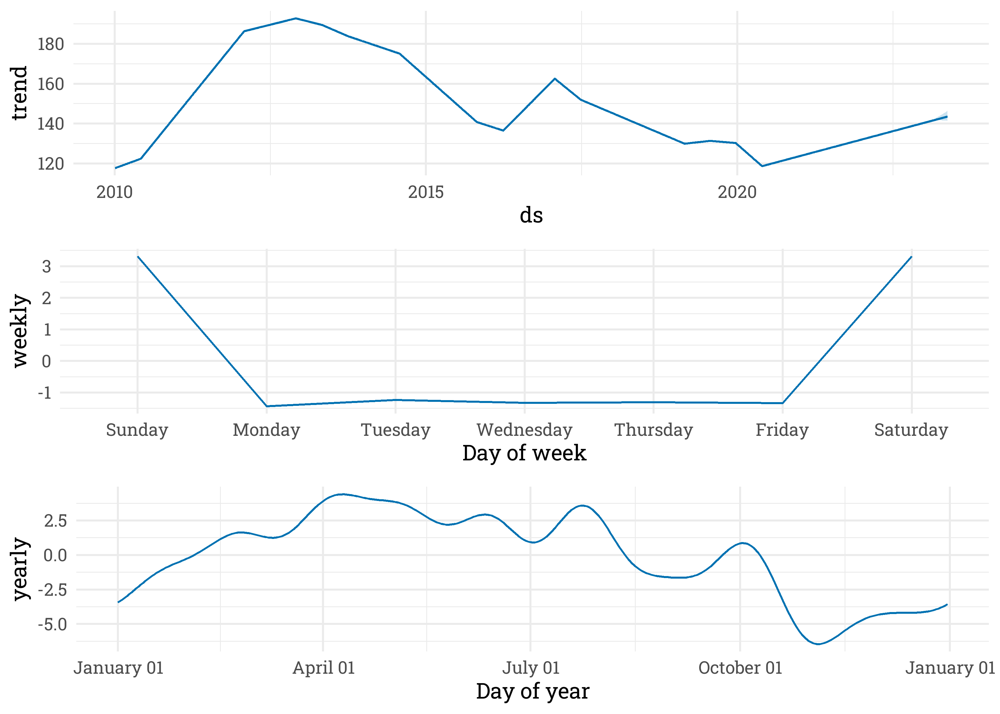<!-- -->

### ARIMA

``` r
plot(forecast(auto.arima(ibm$y), h = 365), ylim = c(0,250))
```

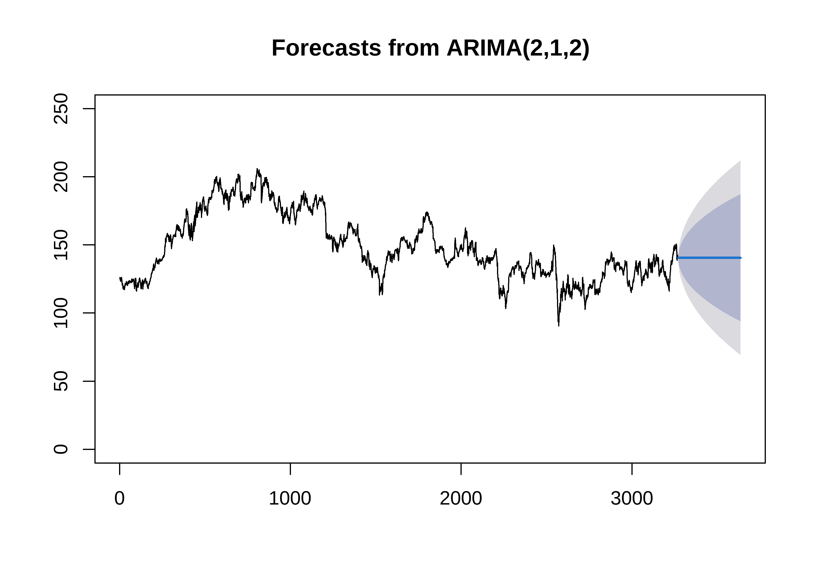<!-- -->

# Correlated Stocks

``` r
(stock_corr <- stocks %>% 
  widyr::pairwise_cor(company, date, open) %>% 
  filter(item1 > item2) %>% 
  mutate(corrstr = ifelse(abs(correlation > 0.5), "Strong", "Weak"),
         type = ifelse(correlation > 0, "Positive", "Negative")) %>% 
  arrange(-abs(correlation)))
```

    ## # A tibble: 91 x 5
    ##    item1                 item2                 correlation corrstr type    
    ##    <chr>                 <chr>                       <dbl> <chr>   <chr>   
    ##  1 Amazon.com, Inc.      Adobe Inc.                  0.988 Strong  Positive
    ##  2 Salesforce, Inc.      Adobe Inc.                  0.985 Strong  Positive
    ##  3 Microsoft Corporation Apple Inc.                  0.984 Strong  Positive
    ##  4 Salesforce, Inc.      Amazon.com, Inc.            0.983 Strong  Positive
    ##  5 Microsoft Corporation Alphabet Inc.               0.981 Strong  Positive
    ##  6 Oracle Corporation    Alphabet Inc.               0.969 Strong  Positive
    ##  7 Microsoft Corporation Adobe Inc.                  0.968 Strong  Positive
    ##  8 Salesforce, Inc.      Netflix, Inc.               0.968 Strong  Positive
    ##  9 NVIDIA Corporation    Microsoft Corporation       0.965 Strong  Positive
    ## 10 Apple Inc.            Alphabet Inc.               0.965 Strong  Positive
    ## # ... with 81 more rows

``` r
stock_corr %>% 
  ggplot(aes(correlation)) +
  geom_histogram(aes(fill = type), 
                 alpha = 0.7, binwidth = 0.05) +
  xlim(c(-1,1)) +
  labs(title = "Distribution of Correlation Values",
       subtitle = "The majority of companies have a strong positive correlation",
       fill = "Positive Correlation") +
  theme(legend.position = c(0.2,0.8),
        legend.background = element_rect(fill = "white", color = "white"))
```

<!-- -->

## IBM, The Outlier

``` r
(stocks %>% 
  widyr::pairwise_cor(name, date, open) %>% 
  rename(var1 = item1, var2 = item2) %>% 
  cor_spread(value = "correlation") %>% 
  rename(term = rowname))[c(14,1:13),] %>% 
  network_plot() +
  labs(title = "Correlation of Tech Stocks") +
  theme(plot.title = element_text(hjust = 0.5),
        text = element_text(family = "Roboto"))
```

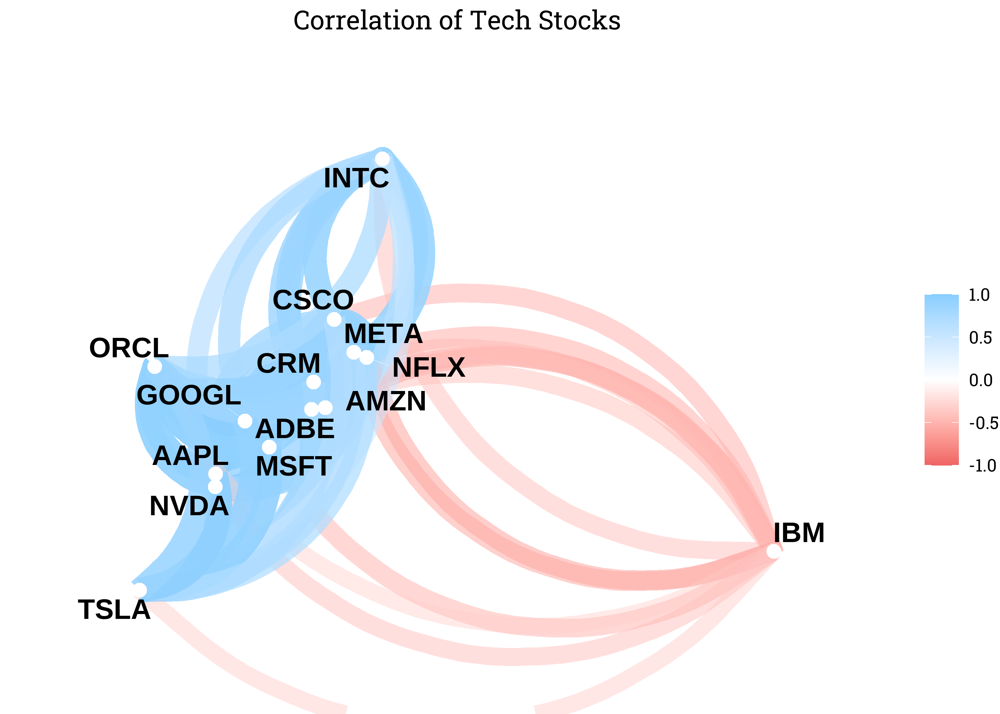<!-- -->

``` r
stocks %>% 
  ggplot(aes(date, open, color = name)) +
  geom_line() +
  gghighlight::gghighlight(name == "IBM", use_direct_label = FALSE) +
  labs(x = "", y = "", color = "",
       title = "IBM is an Outlier Among Tech Stocks")
```

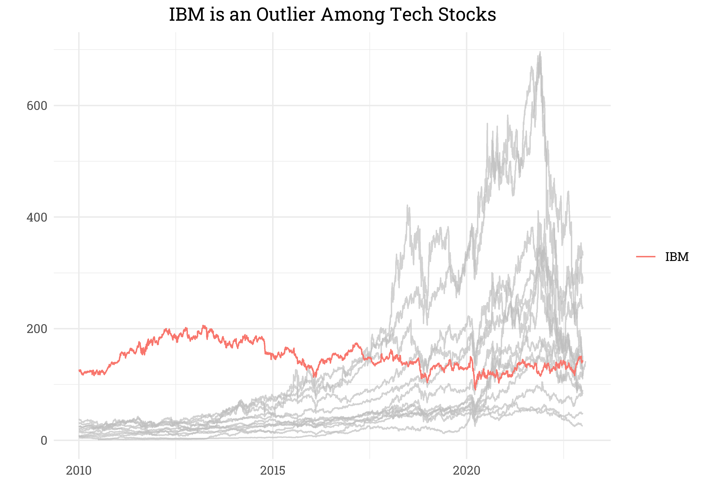<!-- -->

## Positively Correlated

``` r
stocks %>% 
  filter(company %in% 
           c(stock_corr[1:5,]$item1, stock_corr[1:5,]$item2)) %>% 
  ggplot(aes(date, open, color = company)) + 
  geom_line() +
  labs(x = "", y = "Open Price", color = "",
       title = "The 6 Most Correlated Stocks Have Nearly Identical Trends") +
  theme(legend.position = c(0.2,0.75),
        legend.background = element_rect(fill = "white",
                                         color = "white"))
```

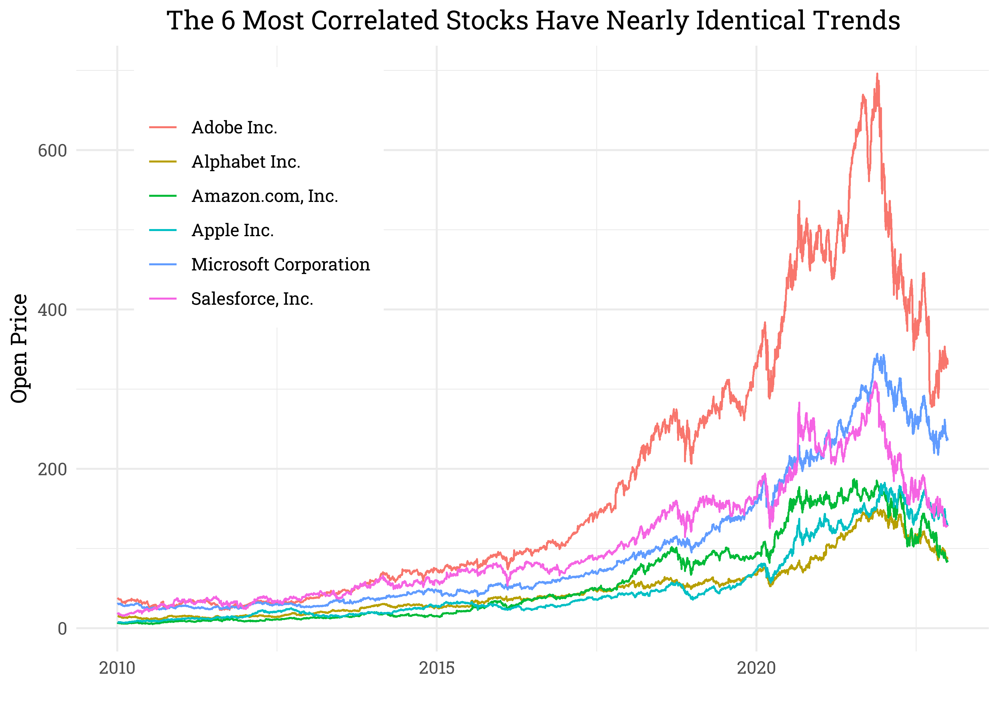<!-- -->

``` r
stocks %>% 
  filter(company %in% c(stock_corr[1,1:2])) %>% 
  select(date, company, open) %>% 
  pivot_wider(names_from = company, values_from = open) %>% 
  ggplot(aes(`Adobe Inc.`, `Amazon.com, Inc.`)) +
  geom_point(alpha = 0.7, color = "steelblue2") +
  geom_smooth(method = "lm", se = FALSE, color = "black",
              linetype = "dashed") +
  labs(title = "Amazon and Adobe Trend")
```

    ## `geom_smooth()` using formula 'y ~ x'

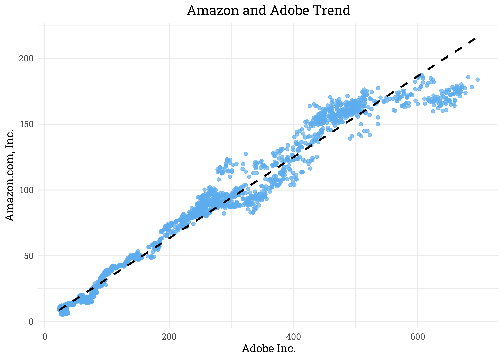<!-- -->

## Negatively Correlated

``` r
stock_corr %>% 
  filter(str_detect(item1, "Netflix") & str_detect(item2, "Machine"))
```

    ## # A tibble: 1 x 5
    ##   item1         item2                                  correlation corrstr type 
    ##   <chr>         <chr>                                        <dbl> <chr>   <chr>
    ## 1 Netflix, Inc. International Business Machines Corpo~      -0.546 Weak    Nega~

``` r
stocks %>% 
  filter(str_detect(company, "Netflix|Machine")) %>% 
  ggplot(aes(date, open, color = name)) + 
  geom_line() +
  labs(x = "", y = "Open Price", color = "",
       title = "IBM and Netflix Have Very Different Trends") +
  theme(legend.position = c(0.45,0.8))
```

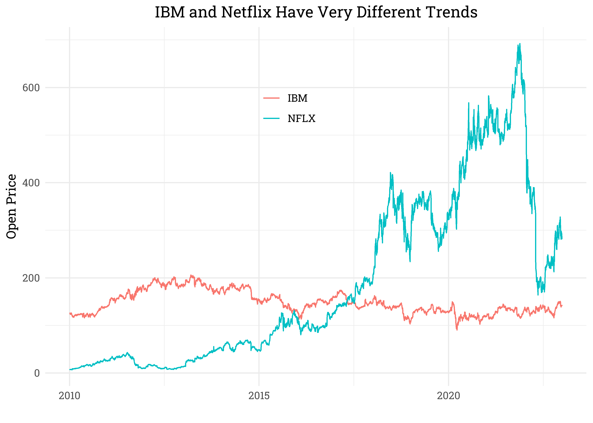<!-- -->

``` r
stocks %>% 
  filter(str_detect(company, "Netflix|Machine")) %>% 
  select(date, name, open) %>% 
  pivot_wider(names_from = name, values_from = open) %>% 
  ggplot(aes(`IBM`, `NFLX`)) +
  geom_point(alpha = 0.7, color = "steelblue2") +
  geom_smooth(method = "lm", se = FALSE, color = "black",
              linetype = "dashed") +
  labs(title = "IBM and Netflix")
```

    ## `geom_smooth()` using formula 'y ~ x'

<!-- -->

# Volatility

``` r
stocks %>% 
  mutate(diff = close - open,
         col = ifelse(name == "IBM", "Yes", "No")) %>% 
  ggplot(aes(date, diff)) +
  geom_line(aes(color = col)) +
  facet_wrap(~name, scales = "free") +
  scale_color_manual(values = c("steelblue4", "red4")) +
  theme(legend.position = "none", plot.subtitle = element_text(hjust = 0.5)) +
  labs(title = 
         "IBM's Same Day Volatility is Unique with Respect to Other Tech Stocks",
       subtitle = "Difference = (Close - Open)")
```

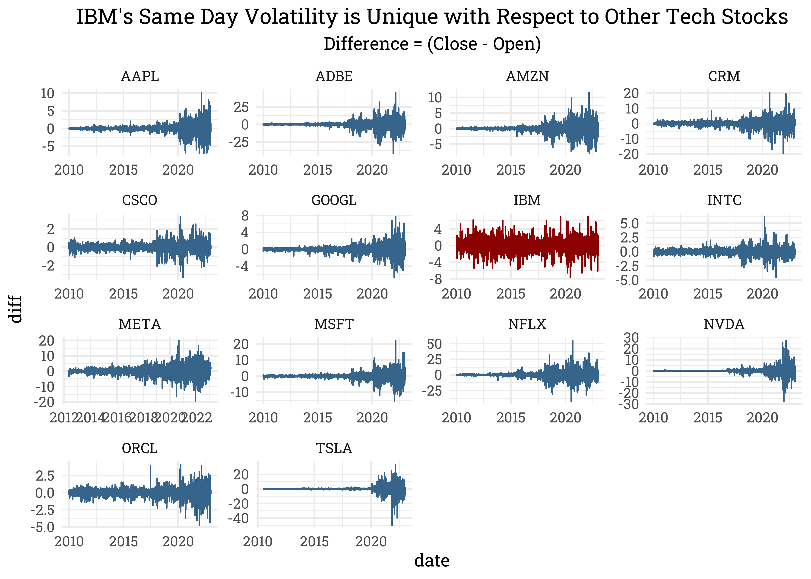<!-- -->

``` r
(stocks %>% 
  filter(name == "IBM") %>% 
  mutate(diff = close - open) %>% 
  ggplot(aes(date, diff)) +
  geom_line(color = "steelblue4") +
  labs(y = "Difference",
       title = "IBM's Open vs Close Difference")) /
(stocks %>% 
  filter(name == "AAPL") %>% 
  mutate(diff = close - open) %>% 
  ggplot(aes(date, diff)) +
  geom_line(color = "steelblue4") +
  labs(y = "Difference",
       title = "AAPL's Open vs Close Difference")) +
plot_annotation(title = "IBM's Volatility has Been Higher than Other Tech Stocks")
```

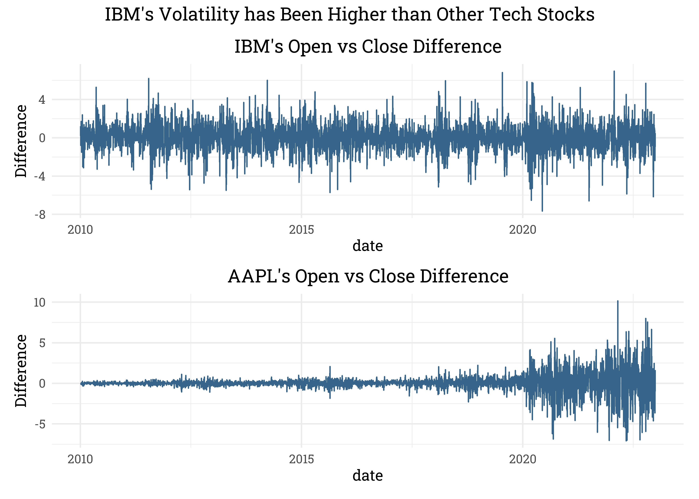<!-- -->

# Volume

``` r
stocks %>% 
  mutate(volume = log(volume)) %>% 
  group_by(name) %>% 
  summarize(lm(close ~ volume, cur_data()) %>% tidy) %>% 
  filter(term == "volume", p.value < 0.01) %>% 
  arrange(-abs(estimate))
```

    ## `summarise()` has grouped output by 'name'. You can override using the
    ## `.groups` argument.

    ## # A tibble: 13 x 6
    ## # Groups:   name [13]
    ##    name  term   estimate std.error statistic   p.value
    ##    <chr> <chr>     <dbl>     <dbl>     <dbl>     <dbl>
    ##  1 NFLX  volume   -145.      2.56     -56.5  0        
    ##  2 ADBE  volume   -102.      5.14     -19.8  1.28e- 82
    ##  3 META  volume    -70.6     2.41     -29.3  2.30e-164
    ##  4 MSFT  volume    -65.0     3.09     -21.1  1.98e- 92
    ##  5 AAPL  volume    -39.5     0.857    -46.1  0        
    ##  6 GOOGL volume    -32.0     0.801    -39.9  2.12e-284
    ##  7 TSLA  volume     20.3     1.76      11.5  4.38e- 30
    ##  8 ORCL  volume    -18.4     0.419    -43.9  0        
    ##  9 CRM   volume    -16.2     2.29      -7.09 1.67e- 12
    ## 10 CSCO  volume    -14.6     0.330    -44.2  0        
    ## 11 IBM   volume    -12.5     0.982    -12.7  2.82e- 36
    ## 12 INTC  volume    -11.9     0.403    -29.5  2.72e-170
    ## 13 AMZN  volume    -10.7     2.05      -5.22 1.86e-  7

``` r
stocks %>% 
  ggplot(aes(volume, close, color = name)) +
  geom_point(alpha = 0.1) +
  geom_smooth(method = "lm", se = FALSE) +
  scale_x_log10() +
  scale_y_log10()
```

    ## `geom_smooth()` using formula 'y ~ x'

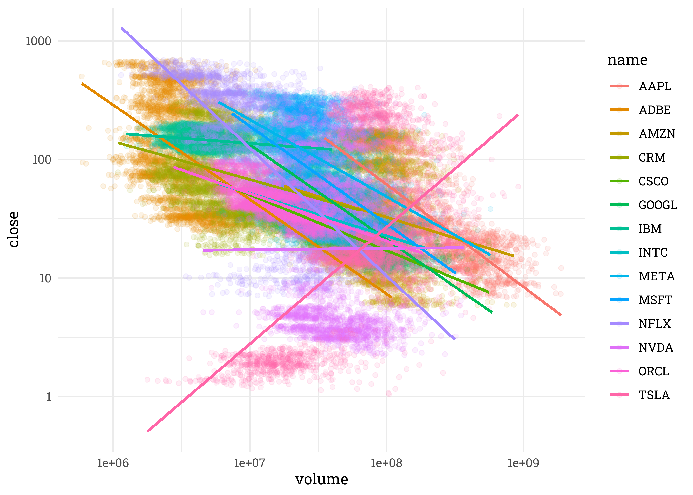<!-- -->
